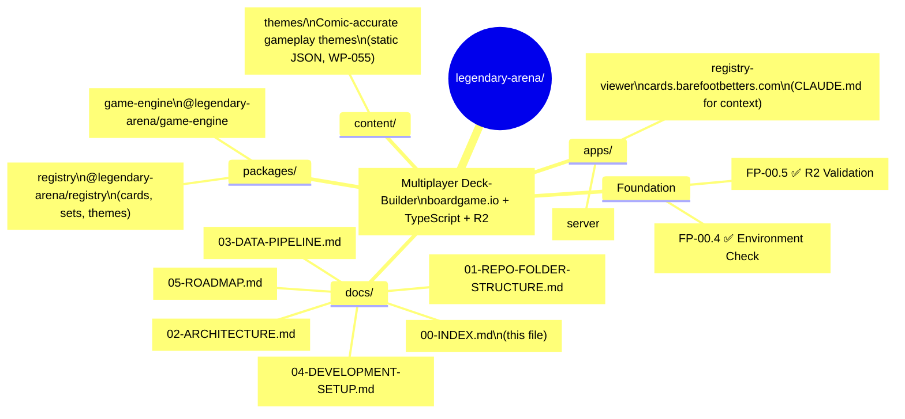

# Legendary Arena — Documentation Index

> A modern multiplayer evolution of the Marvel Legendary deck-building card game.  
> Built with **boardgame.io**, **TypeScript**, **Cloudflare R2**, and **PostgreSQL**.

**Status:** Foundation complete • Core gameplay loop complete (Phase 4) • Card mechanics & abilities complete (Phase 5) • **Phase 6 (Verification, UI & Production) complete — tagged `phase-6-complete` at commit `c376467` on 2026-04-19** • **Phase 7 closed 2026-04-23** (launch-readiness quartet + growth governance + system architecture + PAR pipeline) • **Beta-Launch Pillar fully shipped 2026-04-25..2026-05-01** (WP-052 identity / WP-053a PAR scoring config / WP-053 competitive submission / WP-054 leaderboard library / WP-103 replay storage / WP-115 leaderboard HTTP routes) • **Profile-page surface shipped 2026-04-28..2026-05-03** (WP-099 Hanko auth selection / WP-101 handle claim / WP-102 public profile page / WP-104 owner profile + `/me` edit / WP-109 team affiliation / WP-111 UIState card display) • **Auth stack complete 2026-05-02..2026-05-03** (WP-112 broker-agnostic session-verifier orchestrator + `findAccountByAuthProviderSub` lookup + caller-injected provider pattern, **WP-126 ✅ Hanko session verifier landed 2026-05-03 at `2aa7690` under `EC-130:`** — `apps/server/src/auth/hanko/` with built-ins-only RS256 verification via Node v22 `node:crypto`, per-instance JWKS cache with single-flight refresh + one-shot retry + graceful degradation + insertion-time `Object.freeze`, closed-set `amr` claim mapping per Hanko docs; D-12601..D-12604 + D-11201 flipped Active→Resolved; `requireAuthenticatedSession` continues to fail-closed with `'session_verifier_not_configured'` until a future request-handler WP wires the verifier per D-11204) • Registry viewer enhancements (WP-114 URL-parameterized setup preview / WP-121 card zoom / WP-122 henchman flattenSet fix / WP-123 cardType widening / WP-124 theme zoom / WP-125 ability filter / WP-127 grid tile team+ability) • **Drafted-and-pending:** WP-054 (drafted; superseded by WP-115 wiring) / WP-059 pre-plan UI integration / WP-097..098 funding policy + lint-gate trigger / WP-105..108 profile follow-ups • Theme data model ready • Registry viewer with keyword/rule tooltips

---

## 📍 Quick Navigation

- [Repository Structure](01-REPO-FOLDER-STRUCTURE.md)
- [System Architecture](02-ARCHITECTURE.md)
- [Data Pipeline](03-DATA-PIPELINE.md)
- [Development Setup](04-DEVELOPMENT-SETUP.md) ← **Start here**
- [Roadmap](05-ROADMAP.md)
- [Roadmap (Mindmap)](05-ROADMAP-MINDMAP.md)

---

## Repository Overview

---

## 📚 Full Documentation Table of Contents

| # | Document | Description |
|---|----------|-------------|
| 00 | [INDEX](00-INDEX.md) | This landing page |
| 01 | [REPO-FOLDER-STRUCTURE](01-REPO-FOLDER-STRUCTURE.md) | Full directory layout |
| 02 | [ARCHITECTURE](02-ARCHITECTURE.md) | Authoritative package boundaries, data flow, persistence rules |
| 03 | [DATA-PIPELINE](03-DATA-PIPELINE.md) | R2 → metadata → validation → PostgreSQL + PAR artifact pipeline |
| 03.1 | [DATA-SOURCES](03.1-DATA-SOURCES.md) | Authoritative input data inventory — provenance, storage, trust model |
| 04 | [DEVELOPMENT-SETUP](04-DEVELOPMENT-SETUP.md) | Local development guide (you are here) |
| 05 | [ROADMAP](05-ROADMAP.md) | Current Work Packets & phases |
| 05M | [ROADMAP-MINDMAP](05-ROADMAP-MINDMAP.md) | Visual overview |
| — | [devlog/](devlog/) | Weekly development journal |
| — | [screenshots/](screenshots/) | All UI & validation screenshots |
| 12 | [SCORING-REFERENCE](12-SCORING-REFERENCE.md) | PAR-based scoring formula & leaderboard rules |
| 12.1 | [PAR-ARTIFACT-INTEGRITY](12.1-PAR-ARTIFACT-INTEGRITY.md) | Why PAR artifacts are hashed (rationale) |
| 13 | [REPLAYS-REFERENCE](13-REPLAYS-REFERENCE.md) | Replay & game saving system (governance reference) |
| — | [ai/](ai/) | AI coordination system, Work Packets, ECs |
| — | [ai/work-packets/WORK_INDEX](ai/work-packets/WORK_INDEX.md) | Authoritative Work Packet index — execution order, dependencies, status |
| — | [ai/execution-checklists/EC_INDEX](ai/execution-checklists/EC_INDEX.md) | Execution Checklist index — per-WP contracts plus ad-hoc ECs (R-EC hygiene, EC-101+ viewer series) |
| — | [ai/REFERENCE/02-CODE-CATEGORIES](ai/REFERENCE/02-CODE-CATEGORIES.md) | Code categories — what each file type may do, import rules, failure modes |
| — | [ai/DESIGN-CONSTRAINTS-PREPLANNING](ai/DESIGN-CONSTRAINTS-PREPLANNING.md) | Pre-planning system: problem statement, goal, and 12 design constraints |
| — | [ai/DESIGN-PREPLANNING](ai/DESIGN-PREPLANNING.md) | Pre-planning system: sandbox architecture and data model |
| — | [ai/MOVE_LOG_FORMAT](ai/MOVE_LOG_FORMAT.md) | Definitive replay & verification event schema (forensics report; source of D-0203, D-0204, D-0205 / Gap #4) |
| — | content/themes/ | Comic-accurate gameplay theme definitions (WP-055) |

---

## Additional Resources

- **Live R2 Data** → [https://images.barefootbetters.com](https://images.barefootbetters.com)
- **Marvel Legendary Universal Rules** → `Marvel Legendary Universal Rules v23 (hyperlinks).pdf`
- **Governance** → `docs/ai/ARCHITECTURE.md` + `docs/ai/DECISIONS.md`
- **Theme Data Model** → `docs/ai/work-packets/WP-055-theme-data-model.md`
- **Keyword & Rule Glossary** → `docs/ai/work-packets/WP-060-keyword-rule-glossary-data.md`
- **Registry Viewer** → `apps/registry-viewer/CLAUDE.md` (architecture) + `HISTORY-modern-master-strike.md` (predecessor)
- **Local tooling & smoke tests** → [`scripts/README.md`](../scripts/README.md) — PowerShell helpers (`Start-SmokeTest.ps1`, `Start-DevClient.ps1`) + diagnostics; full descriptions in [07-CLI-REFERENCE.md §Local Smoke Test Scripts](07-CLI-REFERENCE.md#local-smoke-test-scripts).

---

**Last updated:** 2026-05-03 (**WP-126 / EC-130 — External Authentication Integration (Hanko Session Verifier) landed**) — Single `EC-130:` commit at `2aa7690` lands 12 files: 5 new under `apps/server/src/auth/hanko/` (`hankoVerifier.types.ts` with closed-set `HANKO_IDP_TO_AUTH_PROVIDER` lookup + `JwksFetcher` injection seam; `hankoVerifier.logic.ts` with `createHankoSessionVerifier(config): SessionVerifier` factory + 8-step `verify(token)` closure; `hankoVerifier.logic.test.ts` 17 cases; `jwksCache.logic.ts` per-instance cache with single-flight refresh + one-shot retry + graceful degradation + `Object.freeze` at insertion; `jwksCache.logic.test.ts` 8 cases) + 3 modified config/reference (`render.yaml` + `.env.example` `HANKO_TENANT_BASE_URL` / `HANKO_EXPECTED_AUDIENCE` / `HANKO_JWKS_REFRESH_INTERVAL_MS` declarations + `docs/ai/REFERENCE/api-endpoints.md` 1 new `Library-only` row per D-11804) + 4 governance ledgers. **Four DECISIONS land in numeric order:** D-12601 (built-ins-only — RS256 via Node v22 `node:crypto`; zero new npm dep; `apps/server/package.json` UNCHANGED) + D-12602 (4-field `HankoVerifierConfig`; tenant-scoped origin per Hanko Cloud's documented `/{tenant_id}/.well-known/jwks.json` shape; verifier appends suffix programmatically) + D-12603 (300_000 ms default; per-instance state lock; single-flight; one-shot retry; insertion-time aliasing defense) + D-12604 (federation claim = `amr` array per Hanko docs `https://docs.hanko.io/guides/session-management` + Hanko source `backend/flow_api/flow/shared/hook_determine_amr_values.go` literal `amr = append(amr, "ext:"+thirdPartyProvider)`; closed-set table `{'ext:google':'google', 'ext:discord':'discord', 'pwd':'email', 'passkey':'email', 'otp':'email', 'totp':'email', 'security_key':'email'}`; two-pass priority scan; no string-prefix check, no regex). **D-11201 status flips Active → Resolved.** **F-1..F-7 Future-Auth Gates PASS by construction.** Single-parameter `Result<T>` lock preserved (PS-1; verifier emits `SessionVerificationErrorCode` strings into the structurally-typed `code` field via `as never` mirroring `sessionToken.logic.test.ts:84`'s settled pattern; orchestrator translates at the existing `sessionToken.logic.ts:191-193` cast site, untouched). Server test baseline `99/0/54 → 124/0/54` (+25 logic-pure tests, all always-runs). Engine baseline `604/0` UNCHANGED. **Companion** `SPEC: WP-126 / EC-130 — pre-flight PS-1..PS-4 reconciliation` at `1e9c629` lands the in-place reconciliation (single-param Result lock, JWKS fetcher injection seam, single-site default substitution, JWKS aliasing defense — 251 inserts across WP-126.md + EC-130.checklist.md). **Original 2026-04-26 footer preserved below.** ---- 2026-04-26 (**Beta-Launch Pillar half-shipped + WP-103 replay loader landed + WP-109 / EC-109 drafted**) — Beta-Launch Pillar partially executed: WP-052 ✅ player identity & replay ownership at `cf4e111` 2026-04-25 (EC-052; `apps/server/src/identity/`; D-5201..D-5203 + D-8701; migrations `004_create_players_table.sql` + `005_create_replay_ownership_table.sql`; server 19/3/0 → 31/5/0) + WP-053a ✅ PAR artifact `ScenarioScoringConfig` extension at `d896690` 2026-04-25 (EC-053a, execution `e5b9d15`; engine 513/115/0 → 522/116/0; `data/scoring-configs/` authoring origin per D-5306a; INFRA hook fix `fbbedb5` accepting lowercase letter suffix in EC-### prefix) + WP-053 ✅ competitive score submission & verification at `26e122f` 2026-04-26 (EC-053, execution `56e8134`, A0 SPEC v1.5 `27d3004`; `apps/server/src/competition/`; migration `007_create_competitive_scores_table.sql` with `IF NOT EXISTS`; D-5301..D-5305; server 38/6/0 → 47/7/0). WP-103 ✅ server-side replay storage & loader at `f74d180` 2026-04-25 (EC-111, execution `fe7db3e`; `apps/server/src/replay/`; migration `006_create_replay_blobs_table.sql` with `text replay_hash PRIMARY KEY` + `jsonb replay_input`; D-10301..D-10303; server +5/+1; predecessor for WP-053). WP-096 ✅ registry viewer grid data view at `811114a` 2026-04-25 (EC-096, execution `4fe8382`; `CardDataTile.vue` + `CardGrid.vue` consumes `useCardViewMode` directly; D-9601 `Set`/`setAbbr` divergence from sidebar). **Governance drafts 2026-04-25** (`c33d42b`): WP-097 / EC-097 (Tournament Funding Policy), WP-098 / EC-098 (Funding Surface Gate Trigger; blocked on WP-097 execution), WP-099 / EC-099 (Auth Provider Selection — Hanko), WP-101 / EC-101 (Handle Claim Flow with migration slot `007_add_handle_to_players.sql`). **WP-102 + WP-104..108 placeholder rows 2026-04-25** at `75186ce` (public profile page; placeholders pending WP-101). **VISION §25 amendment 2026-04-26** at `00f0a38` (badges issuer model; D-0006 / D-0007 / D-1004) + **PROPOSAL-BADGES.md addendum polish** at `4d419a4` (A1-A6). **WP-109 / EC-109 drafted 2026-04-26 (this session, uncommitted)** — Team Affiliation (Profile-Level Cooperative Cohorts); variable team size 3/4/5 declared at creation and immutable; sub cap = `min(2, teamSize − 2)`; validity rule `liveMembers ≥ teamSize − 2 AND liveMembers + liveSubs ≥ teamSize − 1`; lint-PASS; blocked on WP-104 placeholder. **Original 2026-04-24 footer preserved below.** ---- 2026-04-24 (**Phase 7 closed + first browser gameplay client + WP-059 deferral lifted**) — Phase 7 main sequence sealed 2026-04-23 with WP-041 ✅ system architecture at `0e8e8b1` alongside the PAR pipeline closure (WP-049 ✅ `021555e` → WP-050 ✅ `ccdf44e` → WP-051 ✅ `ce3bffb`). Engine hardening pass 2026-04-23: WP-087 ✅ `73aeada` + WP-088 ✅ `d183991` (engine 507/114/0; repo-wide 672/128/0). Client integration cluster 2026-04-24: WP-089 ✅ engine PlayerView wiring + WP-090 ✅ live match client wiring at `54b266a` (first browser gameplay client) + WP-091 ✅ loadout builder in registry viewer (D-9101) + WP-092 ✅ lobby loadout intake at `cb982ff` (D-9201) + WP-093 ✅ match-setup rule-mode envelope (D-9301; governance-only) + WP-094 ✅ viewer hero FlatCard key uniqueness at `eac678c`. **WP-059 deferral lifted 2026-04-24** — WP-028 done 2026-04-14, framework settled by WP-061; WP-059 + EC-059 drafted, awaiting Lint Gate. **WP-052/053/054 contract tightening pass at `729f056`** (pre-execution surgical clarifications). **WP-055 / EC-055 doc polish at `b24b589`**. **Original 2026-04-23 footer preserved below.** ---- 2026-04-23 (**Phase 7 launch-readiness quartet + growth-governance complete** — WP-040 ✅ growth governance & change budget at `6faaf3b` (EC-040; governance close `bd5bec0`; pre-flight bundle `5e1a0fa` + tightening `c861b24`) — first code-landing Phase-7 WP after the launch-readiness quartet; adds `docs/governance/CHANGE_GOVERNANCE.md` (new framework doc — five change categories ENGINE / RULES / CONTENT / UI / OPS with layer-boundary mapping, versionImpact axis, five immutable surfaces, per-release change-budget template, growth-vector policy) + `packages/game-engine/src/governance/governance.types.ts` (new — three readonly metadata types: `ChangeCategory` + `ChangeBudget` + `ChangeClassification`; additive re-exports only, never members of `LegendaryGameState`) + `docs/ai/post-mortems/01.6-WP-040-growth-governance-change-budget.md` (01.6 MANDATORY); D-4001 engine code category for `packages/game-engine/src/governance/` + D-4002 five-categories-map-to-layer-partition + D-4003 content-and-UI-are-primary-growth-vectors + D-4004 five-immutable-surfaces-require-major-bump; consumes `LIVE_OPS_FRAMEWORK.md` §8 Change Management directly; engine 444/110/0 + repo-wide 596/0 UNCHANGED (zero new tests). Joins the prior launch-readiness quartet closed same day: WP-039 ✅ post-launch metrics & live ops at `4b1cf5c` (EC-039; governance close `ee5e1d5`; A0 SPEC pre-flight bundle `9e7d9bd` with v1+v2 preflights + copilot check + Path A tightening; documentation-only — `docs/ops/LIVE_OPS_FRAMEWORK.md` 11 top-level sections binding 8 foundational constraints + 6 data collection rules + daily/weekly/monthly cadence + 6 success criteria + 9 explicit non-goals; Path A reuses landed `IncidentSeverity` + `OpsCounters` from `ops.types.ts` rather than defining parallel types — resolves all three v1 pre-flight blockers by construction; §3 cross-links to `INCIDENT_RESPONSE.md` for severity semantics (not restated); §4 cross-links to `OpsCounters` (not redefined); replay desync classified P1 per `INCIDENT_RESPONSE.md:33`; D-3901 live-ops-reuse-existing-types-rather-than-parallel). Joins the prior trio: WP-036 ✅ AI playtesting & balance simulation at `539b543` (EC-036, close `61df4c0`; D-3601..D-3604) + WP-037 ✅ public beta strategy at `160d9b9` (EC-037; new `packages/game-engine/src/beta/` D-3701; `BetaFeedback` + `BetaCohort` + `FeedbackCategory` contracts; `docs/beta/BETA_STRATEGY.md` + `docs/beta/BETA_EXIT_CRITERIA.md` strategy-doc-pair; D-3702/3703/3704) + WP-038 ✅ launch readiness & go-live checklist at `2134f33` (EC-038, close `d4fe447`; `docs/ops/LAUNCH_READINESS.md` + `docs/ops/LAUNCH_DAY.md`; D-3801/3802/3803). Engine baseline 444/110/0 UNCHANGED through WP-037/038/039; repo-wide 596/0 UNCHANGED through all four. Earlier 2026-04-22 hygiene + audit work retained: WP-085 ✅ vision-alignment audit orchestrator at `c836b29` (EC-085); 2026-04-21 delivery wave (WP-060 ✅ glossary R2 migration, WP-082 ✅ glossary schema, WP-083 ✅ fetch-time Zod validation, WP-084 ✅ auxiliary-metadata deletion, EC-110 ad-hoc INFRA); 2026-04-20 Pre-Plan chain (WP-056/057/058 ✅, WP-059 deferred) + WP-055 theme data model + WP-081 registry build hygiene. Prior Phase 6 state retained: tag `phase-6-complete` at `c376467` published 2026-04-19; 19 WPs landed; WP-042.1 deferred per D-4201 and WP-066 ✅ landed 2026-04-22 at `8c5f28f` carried forward and closed)
**Maintained by:** Human developer

*This index is the single source of truth for navigating the project documentation.*