# Legendary Arena -- Development Roadmap (Mindmap)

> **Checklist rule (hard):** one line per item; status-first; no subordinate clauses; no file lists / commit hashes / decisions / dependency prose. If the line forces the reader to *read* before answering "done / drafted / blocked", it's still wrong.
>
> **Status vocabulary (closed set):**
> `✅ Done` · `🚧 In Progress` · `📝 Drafted` (WP file authored; awaiting execution) · `📦 Queued` (deps met; WP file not yet authored) · `⏸ Blocked` (dep unmet) · `📝 Placeholder` (forward-looking only).
>
> All audit detail (per-WP file lists, commit hashes, decision IDs, baselines, deltas, post-mortems) lives in `docs/ai/work-packets/WORK_INDEX.md`, the per-WP files under `docs/ai/work-packets/`, and `docs/ai/STATUS.md`. This file is navigation — not a record.

```mermaid
mindmap
  root((Legendary Arena))
    ["Multiplayer Deck-Builder\nboardgame.io + TypeScript + R2"]

      Foundation
        ["FP-00.4 ✅ Environment check"]
        ["FP-00.5 ✅ R2 validation"]
        ["FP-01 ✅ Backend hosting"]
        ["FP-02 ✅ Database migrations"]

      Phase 0 — Coordination
        ["WP-001 ✅ Coordination system"]
        ["WP-002 ✅ Game skeleton"]
        ["WP-003 ✅ Card registry"]
        ["WP-004 ✅ Server bootstrap"]
        ["WP-043..047 ✅ Governance alignment"]

      Phase 1 — Game Setup
        ["WP-005A/B ✅ Deterministic match setup"]
        ["WP-006A/B ✅ Player zones and piles"]

      Phase 2 — Core Turn Engine
        ["WP-007A/B ✅ Turn structure and loop"]
        ["WP-008A ✅ Core move contracts"]
        ["WP-008B ✅ Core move implementation"]

      Phase 3 — MVP Multiplayer
        ["WP-009A/B ✅ Rule hooks and execution"]
        ["WP-010 ✅ Victory and loss"]
        ["WP-011 ✅ Lobby flow"]
        ["WP-012 ✅ Match list and join"]
        ["WP-013 ✅ Persistence boundaries"]

      Phase 4 — Core Gameplay Loop
        ["WP-014A/B ✅ Villain deck and reveal"]
        ["WP-015 ✅ City and HQ zones"]
        ["WP-015A ✅ Reveal safety fixes (stage gate + no-card-drop)"]
        ["WP-016 ✅ Fight and recruit"]
        ["WP-017 ✅ KO, wounds, bystanders"]
        ["WP-018 ✅ Attack / recruit economy"]
        ["WP-019 ✅ Mastermind and tactics"]
        ["WP-020 ✅ VP scoring and summary"]

      Phase 5 — Card Mechanics
        ["WP-021 ✅ Hero hooks"]
        ["WP-022 ✅ Hero keywords"]
        ["WP-023 ✅ Conditional effects"]
        ["WP-024 ✅ Scheme / mastermind execution"]
        ["WP-025 ✅ Board keywords"]
        ["WP-026 ✅ Scheme setup"]
        ["WP-182 ✅ Scheme twist resolver framework (engine)"]

      Phase 6 — Verification & Production
        ["✅ Phase-6 closed (tag phase-6-complete)"]
        ["WP-027 ✅ Replay harness"]
        ["WP-028 ✅ UIState contract"]
        ["WP-029 ✅ Spectator permissions"]
        ["WP-030 ✅ Campaign framework"]
        ["WP-031 ✅ Production hardening"]
        ["WP-032 ✅ Network sync"]
        ["WP-033 ✅ Content authoring toolkit"]
        ["WP-034 ✅ Versioning and save migration"]
        ["WP-035 ✅ Release and ops playbook"]
        ["WP-042 ✅ Deployment checklists"]
        ["WP-066 ✅ Registry image/data toggle"]
        ["WP-067 ✅ UIState PAR projection"]
        ["WP-079 ✅ Determinism-only replay labeling"]
        ["WP-080 ✅ Step-level replay API"]
        ["WP-048..051 ✅ PAR pipeline (see Scoring & PAR)"]

      UI Implementation Chain
        ["WP-065 ✅ Vue SFC test transform"]
        ["WP-061 ✅ Gameplay client bootstrap"]
        ["WP-062 ✅ Arena HUD and scoreboard"]
        ["WP-063 ✅ Replay snapshot producer"]
        ["WP-064 ✅ Game log and replay inspector"]

      Content Layer
        ["WP-055 ✅ Theme data model"]
        ["WP-060 ✅ Glossary R2 migration"]
        ["WP-221 ✅ Theme supplemental setup fields + tips display"]

      Pre-Planning System
        ["WP-056 ✅ State model and lifecycle"]
        ["WP-057 ✅ Sandbox execution"]
        ["WP-058 ✅ Disruption pipeline"]
        ["WP-059 ✅ UI integration"]
        ["WP-070 ✅ Done — live mutation middleware"]

      Post-Phase-6 Hygiene
        ["WP-081 ✅ Registry build pipeline cleanup"]
        ["WP-082 ✅ Glossary schema and labels"]
        ["WP-083 ✅ Fetch-time schema validation"]
        ["WP-084 ✅ Auxiliary metadata deletion"]
        ["WP-085 ✅ Vision alignment audit"]

      Phase 7 — Beta, Launch & PAR
        ["WP-036 ✅ AI playtesting and balance simulation"]
        ["WP-037 ✅ Public beta strategy"]
        ["WP-038 ✅ Launch readiness checklist"]
        ["WP-039 ✅ Live ops framework"]
        ["WP-040 ✅ Change governance and budget"]
        ["WP-041 ✅ System architecture definition"]

      Scoring & PAR Pipeline
        ["WP-048 ✅ PAR scenario scoring and leaderboards"]
        ["WP-049 ✅ PAR simulation engine"]
        ["WP-050 ✅ PAR artifact storage and indexing"]
        ["WP-051 ✅ PAR publication and server gate"]

      Beta-Launch Pillar
        ["WP-052 ✅ Player identity and replay ownership"]
        ["WP-053a ✅ PAR artifact carries scoring config"]
        ["WP-053 ✅ Competitive score submission"]
        ["WP-054 ✅ Public leaderboards library"]
        ["WP-103 ✅ Replay storage and loader"]

      Engine Hardening
        ["WP-087 ✅ Engine type hardening"]
        ["WP-088 ✅ Setup module hardening"]

      Client Integration Cluster
        ["WP-089 ✅ Engine PlayerView wiring"]
        ["WP-090 ✅ Live match client wiring"]
        ["WP-091 ✅ Loadout builder"]
        ["WP-092 ✅ Lobby loadout intake"]
        ["WP-093 ✅ Match-setup rule-mode envelope"]
        ["WP-094 ✅ Viewer hero key uniqueness"]
        ["WP-100 ✅ Interactive gameplay surface"]
        ["WP-163 ✅ Autoplay playback controls (server: pause/step/rewind endpoints)"]
        ["WP-165 ✅ Autoplay status endpoint (server: GET .../status read-only probe)"]
        ["WP-177 ✅ Autoplay rewind requester audience (server: D-17701 scopes D-16303)"]
        ["WP-164 ✅ Autoplay playback controls (client: media-player bar + status probe gating)"]
        ["WP-166 ✅ arena-client vue-tsc green + CI typecheck gate (engine barrel publishes the 6 WP-128 UIState sub-types; D-16502)"]
        ["WP-227 ✅ arena-client vue-tsc green (WP-214/222 UIState/UICityCard fixture + prop backfill; 3rd recurrence of engine-field-add → client-typecheck drift after WP-166/207)"]
        ["WP-171 ✅ Pile browse modal (click-to-view card piles)"]
        ["WP-178 ✅ Card image rendering on play surface (CardTile component)"]
        ["WP-179 ✅ Card traits + superpower condition evaluation"]
        ["WP-228 ✅ Arena-client diagnostic capture + export (shareable freeze log)"]

      Auth Stack & Profile Surface
        ["WP-099 ✅ Auth provider selection (Hanko)"]
        ["WP-101 ✅ Handle claim flow"]
        ["WP-102 ✅ Public player profile page"]
        ["WP-104 ✅ Owner profile and /me edit"]
        ["WP-109 ✅ Team affiliation"]
        ["WP-111 ✅ UIState card display projection"]
        ["WP-112 ✅ Session token validation middleware"]
        ["WP-126 ✅ Hanko session verifier"]
        ["WP-131 ✅ Authenticated route production wiring"]
        ["WP-160 ✅ Hanko client UI (production sign-in surface)"]
        ["WP-161 ✅ Arena client API base URL surfacing (VITE_API_BASE_URL)"]
        ["WP-174 ✅ First-sign-in auto-provisioning (read-or-create account resolver)"]
        ["WP-175 ✅ Auth-aware navigation surface"]
        ["WP-192 ✅ Hanko JWKS refresh-interval parse guard"]

      Engine + Server Wiring & Leaderboard HTTP
        ["WP-113 ✅ Engine-server registry wiring"]
        ["WP-114 ✅ Viewer URL-parameterized setup preview"]
        ["WP-115 ✅ Public leaderboard HTTP and pg.Pool bootstrap"]

      Registry Viewer Enhancements
        ["WP-121 ✅ Card zoom slider"]
        ["WP-122 ✅ Henchman emission fix"]
        ["WP-123 ✅ cardType widening and other dispatch"]
        ["WP-124 ✅ Theme zoom slider"]
        ["WP-125 ✅ Card abilities effect-tag filter"]
        ["WP-086 ✅ Card-types upgrade"]
        ["WP-096 ✅ Grid data view mode"]
        ["WP-127 ✅ Grid tile team and ability text"]
        ["WP-170 ✅ Card count display"]
        ["WP-183 ✅ Scheme twist pattern taxonomy"]
        ["WP-184 ✅ Card mechanical pattern taxonomies"]
        ["WP-208 ✅ devLog category union extension (cardPatterns + schemeTwist)"]
        ["WP-213 ✅ devLog category single-source LOG_CATEGORIES array"]

      Phase 8 — Interactive Board Layout
        ["WP-128 ✅ UIState board projections"]
        ["WP-129 ✅ Board layout (desktop/mobile)"]
        ["WP-130 ✅ Playmat / reskin selector"]

      G-State Extensions
        ["WP-153 ✅ Destination piles (strike, twist, escaped)"]
        ["WP-154 ✅ Mastermind attached bystanders"]
        ["WP-155 ✅ Turn economy extensions (piercing, wounds drawn)"]
        ["WP-156 ✅ Horrors pile"]

      Monetization Stack
        ["WP-132 ✅ Entitlements data model and read endpoint"]
        ["WP-133 ✅ Stripe checkout and webhook ingestion"]
        ["WP-134 ✅ Webhook to entitlement fulfillment (closed-loop LIVE for cosmetic SKUs)"]

      Engine & Test-Harness Cleanup
        ["WP-135 ✅ HQ population and hero deck reservoir"]
        ["WP-136 ✅ JSDOM opaque-origin storage fix"]
        ["WP-137 ✅ Hero card-instance distinctness + data-driven cardCounts"]
        ["WP-191 ✅ Card ext_id grammar reconciliation (zone instance IDs)"]

      Physical Card Pipeline
        ["WP-138 ✅ Physical card abstraction layer"]
        ["WP-140 ✅ Physical card phase 1b"]
        ["WP-141 ✅ Physical card phase 2"]
        ["WP-147 ✅ PhysicalCard companionSlug + physical-side order"]
        ["WP-151 ✅ Physical card phase 3 (imageUrl removal)"]

      Domain Cutover & Infrastructure
        ["WP-139 ✅ Engineering wiki viewer"]
        ["WP-144 ✅ Arena-client production bundle isolation"]
        ["WP-145 ✅ Architecture inventory ↔ wiki integration"]
        ["WP-146 ✅ cards.legendary-arena.com cutover prep"]
        ["WP-148 ✅ legendary-arena.com + www cutover prep"]

      Public Leaderboard (Marketing)
        ["WP-149 ✅ Public leaderboard Hugo page"]
        ["WP-150 ✅ Leaderboard theme + global aggregation endpoints"]

      Legends Public Scoreboard
        ["WP-142 ✅ Legends snapshot publisher"]
        ["WP-143 ✅ Legends attract board (public scoreboard SPA)"]

      Villain Deck Pipeline
        ["WP-167 ✅ Villain deck composition data (registry)"]
        ["WP-168 ✅ Villain deck composition logic (engine)"]
        ["WP-169 ✅ Scheme villain-deck count curation"]
        ["WP-172 ✅ Villain-deck display data coverage"]
        ["WP-173 ✅ Well-known ext_id display data"]

      Villain & Henchman Effects
        ["WP-185 ✅ Fight + ambush effects (engine)"]
        ["WP-186 ✅ Escape + overrun effects (engine)"]
        ["WP-187 ✅ Effect-marker enrichment (card data)"]
        ["WP-188 ✅ Escape/overrun effect-marker enrichment (card data)"]
        ["WP-189 ✅ koHeroEachPlayer vocabulary expansion (engine)"]
        ["WP-190 ✅ Each-player-KO effect-marker curation (card data)"]
        ["WP-202 ✅ Magnitude-N each-player-KO (engine + data)"]
        ["WP-212 ✅ Once-per-turn villain reveal guard (engine)"]
        ["WP-214 ✅ Villain hero capture + dynamic attack resolution (engine + data)"]

      Hero Ability Coverage & Markup Pipeline
        ["WP-215 ✅ Hero rescue + reveal-draw effects (engine + data)"]
        ["WP-216 ✅ Markup corpus sweep: rescue + reveal-draw"]
        ["WP-217 ✅ Reveal-KO-if-zero + reveal-draw-at-least executors (engine + data)"]
        ["WP-218 ✅ Reveal compound executor + VP-cost corpus"]
        ["WP-219 ✅ Reveal cost-attack + odd-draw executors (engine + data)"]
        ["WP-220 ✅ Reveal attack-choose executor (player-choice infrastructure)"]
        ["WP-222 ✅ Pending hero choice UX (engine projection + client prompt)"]
        ["WP-223 ✅ Reveal KO-attack compound executor (engine + data)"]
        ["WP-224 ✅ Hero ability markup corpus sweep (all 40 sets)"]
        ["WP-225 ✅ Hero draw markup corpus sweep"]

      Notable Events & Overlays
        ["WP-200 ✅ Notable game event log (engine)"]
        ["WP-201 ✅ Notable event overlays (arena client)"]
        ["WP-207a ✅ notableEvents fixture backfill (client)"]
        ["WP-207b ✅ notableEvents test backfill (client)"]

      Simulation Sweep & Analytics Pipeline
        ["WP-181 ✅ Bot decision logging"]
        ["WP-193 ✅ Policy-mode fixture recording (engine + scripts)"]
        ["WP-194 ✅ Setup-matrix sweep runner (scheme × mastermind)"]
        ["WP-195 ✅ Sweep manifest anomaly oracle (engine + scripts)"]
        ["WP-205 ✅ analytics_events server (capture + query endpoints)"]
        ["WP-209 ✅ sweep_runs server (storage + submission + query + nightly)"]
        ["WP-211 ✅ Cross-app sweep type drift test (dashboard ↔ server)"]

      Dashboard & Operator Analytics
        ["WP-157 ✅ Dashboard scaffold (PrimeVue + Pinia + ECharts)"]
        ["WP-162 ✅ Dashboard daily execution panel + UI polish"]
        ["WP-196 ✅ Net revenue + paid-action errors widgets"]
        ["WP-197 ✅ Live deploy (CF Pages + Access gate)"]
        ["WP-198 ✅ Ops-machine patterns (cadence horizons + status chip + vision card)"]
        ["WP-199 ✅ Daily-driver: STATUS feed + governance KPIs"]
        ["WP-203 ✅ Acquisition + activation + retention surfaces"]
        ["WP-204 ✅ Public-surface health + error monitor + cost watchdog"]
        ["WP-206 ✅ Analytics MOCK→LIVE flip"]
        ["WP-210 ✅ SweepHealthWidget dashboard surface"]
        ["WP-226 ✅ Global mock-mode banner"]
        ["WP-229 ✅ Agent Pipeline page (Architect/Builder/Inspector/Evaluator lanes)"]

      Agent Triage Pipeline
        ["WP-230 ✅ Done — Pipeline page sweep integration (agent lanes consume nightly sweep findings)"]
        ["WP-231 ✅ Done — Scheduled agent triage sessions (Inspector reads sweep → files findings)"]
        ["WP-232 ✅ Done — Agent handoff chain (Inspector → Builder → Architect)"]
        ["WP-233 ✅ Done — Closed-loop sweep verification (Builder fix → re-sweep → Inspector verify)"]
        ["WP-234 ✅ Done — Full-corpus sweep expansion (weekly rotating window beyond 2×2 smoke)"]
        ["WP-235 ✅ Done — Pipeline page sweep health trend view (cadence-aware health-rate trends + healthy-class constant)"]

      Admin & Route Wiring
        ["WP-110 ✅ Admin billing visibility"]
        ["WP-176 ✅ Admin billing auth cutover (shared-secret → session)"]
        ["WP-152 ✅ Wire public profile route in server.mjs"]
        ["WP-159 ✅ Admin session gate (session-based admin auth)"]

      Phase 9 — Profile Surface Follow-ups
        ["WP-105 ✅ Player badges"]
        ["WP-106 ✅ Done — avatar upload pipeline"]
        ["WP-107 ✅ Profile integrity / anti-cheat surface"]
        ["WP-108 ✅ Profile billing & funding history UI"]

      Architecture & API Governance
        ["WP-116 ✅ Disconnect & reconnect semantics"]
        ["WP-117 ✅ Client routing strategy"]
        ["WP-118 ✅ HTTP API surface catalog"]
        ["WP-119 ✅ Architecture doc hygiene"]

      Complete-Game Testing
        ["WP-158 ✅ Complete-game regression tests (seed-faithful fixture harness)"]

      Cross-App Infrastructure
        ["WP-180 ✅ Build-time version stamping"]

      Next Horizons
        ["📦 Core set keyword & ability coverage — get the core set fully playable first, then add sets incrementally"]
        ["📦 Live PvP matchmaking & reconnect — implement WP-116 architecture + match discovery UX"]
        ["📦 Score submission HTTP wiring — close the play-to-leaderboard loop"]
        ["📦 Agent triage pipeline — WP-230..235 wire simulation sweep data into agent lanes + scheduled triage sessions"]

      Phase 10 — Debugging, Testing & Troubleshooting
        ["Future-WP-A 📝 Placeholder — replay diff tool"]
        ["Future-WP-B 📝 Placeholder — ops histogram aggregator"]
        ["Future-WP-C 📝 Placeholder — determinism verifier"]
        ["Future-WP-D 📝 Placeholder — server error telemetry"]
        ["Future-WP-E 📝 Placeholder — engine perf profiler"]
        ["Future-WP-F 📝 Placeholder — end-to-end smoke suite"]
        ["Future-WP-G 📝 Placeholder — disconnect stress suite"]
        ["Future-WP-H 📝 Placeholder — synthetic load generator"]

      Governance Drafts
        ["WP-097 ✅ Tournament funding policy"]
        ["WP-098 ✅ Funding surface lint gate"]
        ["WP-042.1 ⏸ Blocked — PostgreSQL seeding checklists"]

      Reference (one-line pointers)
        ["docs/12-SCORING-REFERENCE.md — formula and invariants"]
        ["docs/12.1-PAR-ARTIFACT-INTEGRITY.md — hashing trust model"]
        ["cards.barefootbetters.com — registry viewer (public)"]
        [".claude/CLAUDE.md — root coordination"]
        [".claude/rules/ — 7 rule files"]
        ["EC_INDEX.md — execution checklists (range in Project Baselines)"]
        ["DECISIONS.md — D-NNNN ledger (range in Project Baselines)"]
        ["WORK_INDEX.md — authoritative per-WP audit log"]
```

---

## Progress Summary (counts only)

| Cluster | Done | Open |
|---|---|---|
| Foundation (Foundation Prompts) | 4/4 | — |
| Phase 0 — Coordination | 9/9 | — |
| Phase 1 — Game Setup | 4/4 | — |
| Phase 2 — Core Turn Engine | 4/4 | — |
| Phase 3 — MVP Multiplayer | 6/6 | — |
| Phase 4 — Core Gameplay Loop | 9/9 | — |
| Phase 5 — Card Mechanics | 7/7 | — |
| Phase 6 — Verification & Production | 14/14 | — |
| UI Implementation Chain | 5/5 | — |
| Content Layer | 3/3 | — |
| Pre-Planning System | 5/5 | — |
| Post-Phase-6 Hygiene | 5/5 | — |
| Phase 7 — Beta, Launch & PAR | 6/6 | — |
| Scoring & PAR Pipeline | 4/4 | — |
| Beta-Launch Pillar | 5/5 | — |
| Engine Hardening | 2/2 | — |
| Client Integration Cluster | 17/17 | — |
| Auth Stack & Profile Surface | 14/14 | — |
| Engine + Server Wiring & Leaderboard HTTP | 3/3 | — |
| Registry Viewer Enhancements | 13/13 | — |
| Phase 8 — Interactive Board Layout | 3/3 | — |
| G-State Extensions | 4/4 | — |
| Monetization Stack | 3/3 | — |
| Engine & Test-Harness Cleanup | 4/4 | — |
| Physical Card Pipeline | 5/5 | — |
| Domain Cutover & Infrastructure | 5/5 | — |
| Public Leaderboard (Marketing) | 2/2 | — |
| Legends Public Scoreboard | 2/2 | — |
| Villain Deck Pipeline | 5/5 | — |
| Villain & Henchman Effects | 9/9 | — |
| Hero Ability Coverage & Markup Pipeline | 10/10 | — |
| Notable Events & Overlays | 4/4 | — |
| Simulation Sweep & Analytics Pipeline | 7/7 | — |
| Dashboard & Operator Analytics | 12/12 | — |
| Agent Triage Pipeline | 5/6 | 1 📝 drafted |
| Admin & Route Wiring | 4/4 | — |
| Phase 9 — Profile Surface Follow-ups | 4/4 | — |
| Architecture & API Governance | 4/4 | — |
| Complete-Game Testing | 1/1 | — |
| Cross-App Infrastructure | 1/1 | — |
| Next Horizons | 0/4 | 4 📦 queued |
| Phase 10 — Debugging, Testing & Troubleshooting | 0/8 | 8 📝 placeholders |
| Governance Drafts | 2/3 | 1 ⏸ |
| **Total** | **230/232 WP ✅** (+ 4/4 Foundation Prompts) | 1 📝 + 1 ⏸ |

> Counts only. Description, deps, baselines, hashes — all in the mindmap line above or in `WORK_INDEX.md`. If counts disagree with the mindmap, the mindmap wins.
>
> **Counting convention:** each row counts the distinct `WORK_INDEX.md` work-packets homed in that cluster (combined lines like `WP-005A/B` count their members; the Phase-6 `WP-048..051` line is a cross-reference, counted once under Scoring & PAR). Foundation = 4 Foundation Prompts (not WPs). `Next Horizons` (4 📦) and `Phase 10` (8 📝) are forward-looking nav placeholders, not WPs. WP rows sum to **226 done + 5 📦 pending (WP-231..235) + 1 ⏸ blocked (WP-042.1) = 232**, matching `WORK_INDEX.md`.

---

## Project Baselines (canonical — single source; do not restate elsewhere)

- **Phase 3 Gate:** Closed (D-1320)
- **Phase 6 Gate:** Closed 2026-04-19 — tag `phase-6-complete` at `c376467`
- **Engine test baseline:** `1177 / 0 / 0` (post-WP-223; 260 suites)
- **Registry test baseline:** `115 / 0 / 0` (12 suites)
- **Registry-viewer test baseline:** `39 / 0 / 0` (10 suites; unchanged since WP-170)
- **Server test baseline:** `477 / 0 / 66` (post-WP-209; 543 total; 83 suites)
- **arena-client test baseline:** `517 / 0 / 0` (post-WP-228; 82 suites)
- **Dashboard test baseline:** `191 / 0 / 0` (post-WP-226)
- **DECISIONS.md range:** `D-4801..D-22801` (extends through WP-228)
- **EC range:** `EC-001..EC-260` (extends through WP-228)

> All six `pass / fail / skipped` figures above are a live test-run at HEAD (`2e99369`) on 2026-06-09 (`pnpm --filter <pkg> test`), not STATUS-derived. `post-WP-NNN` marks the latest work-packet known to touch that package's suite.

---

## Next Unblocked (ordered)

1. **Finish core-set ability coverage** — the hero reveal/rescue/draw executors (WP-215..225) and villain fight/ambush/escape/KO effects (WP-185..214) have largely landed; what remains is the deferred predicate machinery for filtered/targeted villain effects (per WP-188 / WP-202) and reveal player-choice breadth beyond WP-220 / WP-222, so the `core` set is fully playable on play.legendary-arena.com. Additional sets follow incrementally.
2. **Live PvP matchmaking & reconnect** — WP-116 defined the disconnect/reconnect architecture; no implementation WP exists yet. Match discovery UX and reconnect handling are prerequisites for real multiplayer sessions.
3. **Score submission HTTP wiring** — the PAR/competition/leaderboard pipeline is fully built, and WP-107 shipped `requireUnsuspendedAccount` as the locked caller-contract, but the score-submission request-handler route still doesn't exist at HEAD. Wiring it closes the loop from "play a game" to "see yourself on the leaderboard."
4. **Agent triage pipeline — complete (WP-231..235 landed).** Scheduled triage sessions → handoff chain → closed-loop re-sweep verification, the parallel-safe full-corpus weekly sweep expansion, and now WP-235 — the Pipeline page sweep health-rate trend view, which also repaired the degenerate health-rate KPI + Architect-lane trigger via the single `computeSweepHealthRate` source of truth — have all shipped. No remaining step.
5. **Phase 10 placeholders** — promote a candidate to a real WP only when a concrete production-debugging need motivates it.
6. **WP-042.1** — unblocks when Foundation Prompt 03 is revived.

**Recently completed (2026-06-10):**
- ✅ WP-234 — Full-corpus sweep expansion (weekly rotating window beyond the 2×2 smoke)
- ✅ WP-233 — Closed-loop sweep verification (Builder fix → re-sweep → Inspector verify)
- ✅ WP-232 — Agent handoff chain (Inspector → Builder → Architect)
- ✅ WP-231 — Scheduled agent triage sessions (Inspector reads sweep → files findings)

**Recently completed (2026-06-09):**
- ✅ WP-230 — Pipeline page sweep integration (agent lanes consume nightly sweep findings)
- ✅ WP-229 — Dashboard Agent Pipeline page (Architect/Builder/Inspector/Evaluator lanes)

**Recently completed (2026-06-08):**
- ✅ WP-228 — Arena-client diagnostic capture + export (shareable freeze log)
- ✅ WP-227 — Arena-client vue-tsc green (UIState/UICityCard fixture + prop backfill; 3rd typecheck-drift recurrence after WP-166 / WP-207)
- ✅ WP-226 — Dashboard global mock-mode banner
- ✅ WP-225 — Hero draw markup corpus sweep
- ✅ WP-224 — Hero ability markup corpus sweep (all 40 sets)

**Recently completed (2026-06-07):**
- ✅ WP-223 — Hero reveal KO-attack compound executor
- ✅ WP-222 — Pending hero choice UX (engine projection + client prompt)
- ✅ WP-221 — Theme supplemental setup fields + tips display

**Blocked (cannot start):**
- ⏸ WP-042.1 — Deferred PostgreSQL seeding checklists; unblocks when Foundation Prompt 03 (seed runner + migrations) is revived.

**Pending (WP files not yet authored):**
- (none — all Agent Triage Pipeline WPs are authored)

---

## Phase Closure Records

### Phase 6 (Closed 2026-04-19)
- Tag: `phase-6-complete` @ `c376467`
- Engine baseline at close: `604 / 132 / 0`
- Server baseline at close: `124 / 0 / 54`

### Phase 3 Gate
- Closed (D-1320)

---

## WP Disambiguators

- **WP-042 vs WP-042.1** — WP-042 is intentionally scope-reduced per D-4201; the four PostgreSQL seeding checklist sections are partitioned to a sibling sequel WP-042.1 (Governance Drafts). WP-042 is **complete**; WP-042.1 is **blocked** on FP-03 revival. Not a partial undo.
- **WP-128/129/130 vs WP-131 EC slot** — WP-128/129/130 reserved EC-131/132/133 by chronological-tail ordering; WP-131 (next free WP slot) retargets to EC-134 per the locked WP-keyed-EC retarget precedent.
- **WP-207a vs WP-207b** — both backfill the arena client for the new `UIState.notableEvents` projection (WP-200/201): 207a = JSON fixtures, 207b = test backfill. Sequential halves of one client follow-up, not a renumber.
- **arena-client typecheck-drift recurrences (WP-166 → WP-207a/b → WP-227)** — three distinct WPs that each restored arena-client `vue-tsc` green after an engine field-add; each is a separate recurrence of the same pattern, not a re-do of the prior. (WP-207a/b is the 2nd; WP-227 the 3rd.)

---

*Last updated: 2026-06-10 (WP-235 drafted + revised: the Pipeline page sweep HEALTH trend view (cadence-aware health-rate trends) WP + EC-268 authored, reserving D-23501/D-23502/D-23503. A metric-review pass found the original aggregate anomaly-rate degenerate (`sum(anomalyCounts) === cellCount`) — and the EXISTING health-rate KPI/Architect-lane likewise ≡ 0 on live data; revised to a true health rate (`endgame-reached / cellCount`) via a narrow documented healthy-class-constant exception to D-20703 (D-23503), repairing both degenerate sites. Flipped WP-235 📦 → 📝 in the mindmap + moved it Pending → Drafted; Agent Triage Pipeline open `1 📦 → 1 📝`; Total `1 📦 → 1 📝 + 1 ⏸`. The only remaining Agent Triage Pipeline step, now authored and ready for execution.)*

*Prior: 2026-06-10 (status reconcile: WP-231/232/233/234 ✅ done — the Agent Triage Pipeline's scheduled-triage → handoff-chain → closed-loop-verify sequence plus the parallel-safe full-corpus weekly sweep expansion all landed on `origin/main`. Flipped 📦→✅ in the mindmap + bullet list; Agent Triage Pipeline cluster 1/6 → 5/6 ✅; Progress Summary **226/232 → 230/232 WP ✅**, 5 📦 → 1 📦 (only WP-235 trend view remains), 1 ⏸. Next Unblocked item 4 narrowed to WP-235.)*

*Prior: 2026-06-09 (session add: WP-230 ✅ done — Pipeline page sweep integration; the Pipeline page's agent lanes now consume nightly sweep findings via `useSweepHealth` (Inspector anomalies, Builder fatals, Architect health rate, Evaluator freshness + trend), with priority escalation on real findings. Agent Triage Pipeline cluster now 1/6 ✅; Progress Summary **226/232 WP ✅**, 0 📝, 5 📦, 1 ⏸. Next Unblocked reordered (WP-230 removed; core-set ability coverage now #1).)*

*Prior: 2026-06-09 (session add: WP-229 ✅ folded into Dashboard & Operator Analytics; new **Agent Triage Pipeline** cluster added with WP-230 📝 drafted + WP-231..235 📦 pending — the simulation-sweep-to-agent-lane pipeline. WP-230 wires existing `useSweepHealth` into the Pipeline page; WP-231..233 are sequential triage → handoff → verify; WP-234 full-corpus expansion is parallel-safe; WP-235 trend view depends on WP-230. Progress Summary updated: **225/232 WP ✅**, 1 📝, 5 📦, 1 ⏸. Next Unblocked reordered with WP-230 at #1.)*

*Prior: 2026-06-09 (**FULL reconciliation to `origin/main` HEAD `2e99369`**: folded WP-181..228 plus the pre-existing WP-015A gap into the mindmap — 49 work-packets across **4 new clusters** (Villain & Henchman Effects, Hero Ability Coverage & Markup Pipeline, Notable Events & Overlays, Simulation Sweep & Analytics Pipeline) plus extensions to Phase 4/5, Content Layer, Client Integration, Auth Stack, Registry Viewer Enhancements, Engine & Test-Harness Cleanup, and a renamed/expanded **Dashboard & Operator Analytics**. Rebuilt the Progress Summary to one row per cluster — **225/226 WP ✅, 1 ⏸** (WP-042.1). Re-derived Project Baselines from a live test-run at HEAD (engine 1177, registry 115, registry-viewer 39, server 477/0/66, arena-client 517, dashboard 191) and bumped the DECISIONS range to D-22801 + EC range to EC-260. This supersedes the 2026-06-08 staleness flag below — the mindmap is now current to HEAD.)*

*Prior: 2026-06-08 (session add: WP-227 ✅ arena-client vue-tsc green — WP-214/222 UIState/UICityCard fixture + prop backfill, the 3rd recurrence of the engine-field-add → client-typecheck-drift pattern after WP-166/207; WP-225 ✅ hero draw markup noted under Recently Completed. **Staleness flag:** this was a targeted single-session add, NOT a full catchup. The mindmap is still behind `origin/main` — the last full reconciliation was WP-180 (2026-05-26); WP-181..226 are not yet folded into the mindmap, and the Progress Summary counts (181/195) + Project Baselines remain frozen at the WP-180 state. A full catchup is a separate pass.)*

*Prior: 2026-05-26 (roadmap catchup: added 25 missing WPs to mindmap — WP-086/096/116-119/153-158/162/164/167-173/175/178-180; added Next Horizons section with 3 forward-looking strategic directions (card keyword coverage, live PvP reconnect, score submission wiring); trimmed Recently Completed to one-liners per checklist rule; total 181/195 ✅.)*
