# Legendary Arena -- Development Roadmap (Mindmap)

> **Checklist rule (hard):** one line per item; status-first; no subordinate clauses; no file lists / commit hashes / decisions / dependency prose. If the line forces the reader to *read* before answering "done / drafted / blocked", it's still wrong.
>
> **Status vocabulary (closed set):**
> `✅ Done` · `🚧 In Progress` · `📝 Drafted` (WP file authored; awaiting execution) · `📦 Queued` (deps met; WP file not yet authored) · `⏸ Blocked` (dep unmet) · `📝 Placeholder` (forward-looking only).
>
> All audit detail (per-WP file lists, commit hashes, decision IDs, baselines, deltas, post-mortems) lives in `docs/ai/work-packets/WORK_INDEX.md`, the per-WP files under `docs/ai/work-packets/`, and `docs/ai/STATUS.md`. This file is navigation — not a record.

```mermaid
mindmap
  root((Legendary Arena))
    ["Multiplayer Deck-Builder\nboardgame.io + TypeScript + R2"]

      Foundation
        ["FP-00.4 ✅ Environment check"]
        ["FP-00.5 ✅ R2 validation"]
        ["FP-01 ✅ Backend hosting"]
        ["FP-02 ✅ Database migrations"]

      Phase 0 — Coordination
        ["WP-001 ✅ Coordination system"]
        ["WP-002 ✅ Game skeleton"]
        ["WP-003 ✅ Card registry"]
        ["WP-004 ✅ Server bootstrap"]
        ["WP-043..047 ✅ Governance alignment"]

      Phase 1 — Game Setup
        ["WP-005A/B ✅ Deterministic match setup"]
        ["WP-006A/B ✅ Player zones and piles"]

      Phase 2 — Core Turn Engine
        ["WP-007A/B ✅ Turn structure and loop"]
        ["WP-008A ✅ Core move contracts"]
        ["WP-008B ✅ Core move implementation"]

      Phase 3 — MVP Multiplayer
        ["WP-009A/B ✅ Rule hooks and execution"]
        ["WP-010 ✅ Victory and loss"]
        ["WP-011 ✅ Lobby flow"]
        ["WP-012 ✅ Match list and join"]
        ["WP-013 ✅ Persistence boundaries"]

      Phase 4 — Core Gameplay Loop
        ["WP-014A/B ✅ Villain deck and reveal"]
        ["WP-015 ✅ City and HQ zones"]
        ["WP-016 ✅ Fight and recruit"]
        ["WP-017 ✅ KO, wounds, bystanders"]
        ["WP-018 ✅ Attack / recruit economy"]
        ["WP-019 ✅ Mastermind and tactics"]
        ["WP-020 ✅ VP scoring and summary"]

      Phase 5 — Card Mechanics
        ["WP-021 ✅ Hero hooks"]
        ["WP-022 ✅ Hero keywords"]
        ["WP-023 ✅ Conditional effects"]
        ["WP-024 ✅ Scheme / mastermind execution"]
        ["WP-025 ✅ Board keywords"]
        ["WP-026 ✅ Scheme setup"]

      Phase 6 — Verification & Production
        ["✅ Phase-6 closed (tag phase-6-complete)"]
        ["WP-027 ✅ Replay harness"]
        ["WP-028 ✅ UIState contract"]
        ["WP-029 ✅ Spectator permissions"]
        ["WP-030 ✅ Campaign framework"]
        ["WP-031 ✅ Production hardening"]
        ["WP-032 ✅ Network sync"]
        ["WP-033 ✅ Content authoring toolkit"]
        ["WP-034 ✅ Versioning and save migration"]
        ["WP-035 ✅ Release and ops playbook"]
        ["WP-042 ✅ Deployment checklists"]
        ["WP-066 ✅ Registry image/data toggle"]
        ["WP-067 ✅ UIState PAR projection"]
        ["WP-079 ✅ Determinism-only replay labeling"]
        ["WP-080 ✅ Step-level replay API"]
        ["WP-048..051 ✅ PAR pipeline (see Scoring & PAR)"]

      UI Implementation Chain
        ["WP-065 ✅ Vue SFC test transform"]
        ["WP-061 ✅ Gameplay client bootstrap"]
        ["WP-062 ✅ Arena HUD and scoreboard"]
        ["WP-063 ✅ Replay snapshot producer"]
        ["WP-064 ✅ Game log and replay inspector"]

      Content Layer
        ["WP-055 ✅ Theme data model"]
        ["WP-060 ✅ Glossary R2 migration"]

      Pre-Planning System
        ["WP-056 ✅ State model and lifecycle"]
        ["WP-057 ✅ Sandbox execution"]
        ["WP-058 ✅ Disruption pipeline"]
        ["WP-059 ✅ UI integration"]
        ["WP-070 ✅ Done — live mutation middleware"]

      Post-Phase-6 Hygiene
        ["WP-081 ✅ Registry build pipeline cleanup"]
        ["WP-082 ✅ Glossary schema and labels"]
        ["WP-083 ✅ Fetch-time schema validation"]
        ["WP-084 ✅ Auxiliary metadata deletion"]
        ["WP-085 ✅ Vision alignment audit"]

      Phase 7 — Beta, Launch & PAR
        ["WP-036 ✅ AI playtesting and balance simulation"]
        ["WP-037 ✅ Public beta strategy"]
        ["WP-038 ✅ Launch readiness checklist"]
        ["WP-039 ✅ Live ops framework"]
        ["WP-040 ✅ Change governance and budget"]
        ["WP-041 ✅ System architecture definition"]

      Scoring & PAR Pipeline
        ["WP-048 ✅ PAR scenario scoring and leaderboards"]
        ["WP-049 ✅ PAR simulation engine"]
        ["WP-050 ✅ PAR artifact storage and indexing"]
        ["WP-051 ✅ PAR publication and server gate"]

      Beta-Launch Pillar
        ["WP-052 ✅ Player identity and replay ownership"]
        ["WP-053a ✅ PAR artifact carries scoring config"]
        ["WP-053 ✅ Competitive score submission"]
        ["WP-054 ✅ Public leaderboards library"]
        ["WP-103 ✅ Replay storage and loader"]

      Engine Hardening
        ["WP-087 ✅ Engine type hardening"]
        ["WP-088 ✅ Setup module hardening"]

      Client Integration Cluster
        ["WP-089 ✅ Engine PlayerView wiring"]
        ["WP-090 ✅ Live match client wiring"]
        ["WP-091 ✅ Loadout builder"]
        ["WP-092 ✅ Lobby loadout intake"]
        ["WP-093 ✅ Match-setup rule-mode envelope"]
        ["WP-094 ✅ Viewer hero key uniqueness"]
        ["WP-100 ✅ Interactive gameplay surface"]
        ["WP-163 ✅ Autoplay playback controls (server: pause/step/rewind endpoints)"]
        ["WP-165 ✅ Autoplay status endpoint (server: GET .../status read-only probe)"]
        ["WP-177 ✅ Autoplay rewind requester audience (server: D-17701 scopes D-16303)"]
        ["WP-164 ✅ Autoplay playback controls (client: media-player bar + status probe gating)"]
        ["WP-166 ✅ arena-client vue-tsc green + CI typecheck gate (engine barrel publishes the 6 WP-128 UIState sub-types; D-16502)"]
        ["WP-171 ✅ Pile browse modal (click-to-view card piles)"]
        ["WP-178 ✅ Card image rendering on play surface (CardTile component)"]
        ["WP-179 ✅ Card traits + superpower condition evaluation"]

      Auth Stack & Profile Surface
        ["WP-099 ✅ Auth provider selection (Hanko)"]
        ["WP-101 ✅ Handle claim flow"]
        ["WP-102 ✅ Public player profile page"]
        ["WP-104 ✅ Owner profile and /me edit"]
        ["WP-109 ✅ Team affiliation"]
        ["WP-111 ✅ UIState card display projection"]
        ["WP-112 ✅ Session token validation middleware"]
        ["WP-126 ✅ Hanko session verifier"]
        ["WP-131 ✅ Authenticated route production wiring"]
        ["WP-160 ✅ Hanko client UI (production sign-in surface)"]
        ["WP-161 ✅ Arena client API base URL surfacing (VITE_API_BASE_URL)"]
        ["WP-174 ✅ First-sign-in auto-provisioning (read-or-create account resolver)"]
        ["WP-175 ✅ Auth-aware navigation surface"]

      Engine + Server Wiring & Leaderboard HTTP
        ["WP-113 ✅ Engine-server registry wiring"]
        ["WP-114 ✅ Viewer URL-parameterized setup preview"]
        ["WP-115 ✅ Public leaderboard HTTP and pg.Pool bootstrap"]

      Registry Viewer Enhancements
        ["WP-121 ✅ Card zoom slider"]
        ["WP-122 ✅ Henchman emission fix"]
        ["WP-123 ✅ cardType widening and other dispatch"]
        ["WP-124 ✅ Theme zoom slider"]
        ["WP-125 ✅ Card abilities effect-tag filter"]
        ["WP-086 ✅ Card-types upgrade"]
        ["WP-096 ✅ Grid data view mode"]
        ["WP-127 ✅ Grid tile team and ability text"]
        ["WP-170 ✅ Card count display"]

      Phase 8 — Interactive Board Layout
        ["WP-128 ✅ UIState board projections"]
        ["WP-129 ✅ Board layout (desktop/mobile)"]
        ["WP-130 ✅ Playmat / reskin selector"]

      G-State Extensions
        ["WP-153 ✅ Destination piles (strike, twist, escaped)"]
        ["WP-154 ✅ Mastermind attached bystanders"]
        ["WP-155 ✅ Turn economy extensions (piercing, wounds drawn)"]
        ["WP-156 ✅ Horrors pile"]

      Monetization Stack
        ["WP-132 ✅ Entitlements data model and read endpoint"]
        ["WP-133 ✅ Stripe checkout and webhook ingestion"]
        ["WP-134 ✅ Webhook to entitlement fulfillment (closed-loop LIVE for cosmetic SKUs)"]

      Engine & Test-Harness Cleanup
        ["WP-135 ✅ HQ population and hero deck reservoir"]
        ["WP-136 ✅ JSDOM opaque-origin storage fix"]
        ["WP-137 ✅ Hero card-instance distinctness + data-driven cardCounts"]

      Physical Card Pipeline
        ["WP-138 ✅ Physical card abstraction layer"]
        ["WP-140 ✅ Physical card phase 1b"]
        ["WP-141 ✅ Physical card phase 2"]
        ["WP-147 ✅ PhysicalCard companionSlug + physical-side order"]
        ["WP-151 ✅ Physical card phase 3 (imageUrl removal)"]

      Domain Cutover & Infrastructure
        ["WP-139 ✅ Engineering wiki viewer"]
        ["WP-144 ✅ Arena-client production bundle isolation"]
        ["WP-145 ✅ Architecture inventory ↔ wiki integration"]
        ["WP-146 ✅ cards.legendary-arena.com cutover prep"]
        ["WP-148 ✅ legendary-arena.com + www cutover prep"]

      Public Leaderboard (Marketing)
        ["WP-149 ✅ Public leaderboard Hugo page"]
        ["WP-150 ✅ Leaderboard theme + global aggregation endpoints"]

      Legends Public Scoreboard
        ["WP-142 ✅ Legends snapshot publisher"]
        ["WP-143 ✅ Legends attract board (public scoreboard SPA)"]

      Villain Deck Pipeline
        ["WP-167 ✅ Villain deck composition data (registry)"]
        ["WP-168 ✅ Villain deck composition logic (engine)"]
        ["WP-169 ✅ Scheme villain-deck count curation"]
        ["WP-172 ✅ Villain-deck display data coverage"]
        ["WP-173 ✅ Well-known ext_id display data"]

      Dashboard
        ["WP-157 ✅ Dashboard scaffold (PrimeVue + Pinia + ECharts)"]
        ["WP-162 ✅ Dashboard daily execution panel + UI polish"]

      Admin & Route Wiring
        ["WP-110 ✅ Admin billing visibility"]
        ["WP-176 ✅ Admin billing auth cutover (shared-secret → session)"]
        ["WP-152 ✅ Wire public profile route in server.mjs"]
        ["WP-159 ✅ Admin session gate (session-based admin auth)"]

      Phase 9 — Profile Surface Follow-ups
        ["WP-105 ✅ Player badges"]
        ["WP-106 ✅ Done — avatar upload pipeline"]
        ["WP-107 ✅ Profile integrity / anti-cheat surface"]
        ["WP-108 ✅ Profile billing & funding history UI"]

      Architecture & API Governance
        ["WP-116 ✅ Disconnect & reconnect semantics"]
        ["WP-117 ✅ Client routing strategy"]
        ["WP-118 ✅ HTTP API surface catalog"]
        ["WP-119 ✅ Architecture doc hygiene"]

      Complete-Game Testing
        ["WP-158 ✅ Complete-game regression tests (seed-faithful fixture harness)"]

      Cross-App Infrastructure
        ["WP-180 ✅ Build-time version stamping"]

      Next Horizons
        ["📦 Card keyword & ability coverage — expand implemented keywords across 40 sets"]
        ["📦 Live PvP matchmaking & reconnect — implement WP-116 architecture + match discovery UX"]
        ["📦 Score submission HTTP wiring — close the play-to-leaderboard loop"]

      Phase 10 — Debugging, Testing & Troubleshooting
        ["Future-WP-A 📝 Placeholder — replay diff tool"]
        ["Future-WP-B 📝 Placeholder — ops histogram aggregator"]
        ["Future-WP-C 📝 Placeholder — determinism verifier"]
        ["Future-WP-D 📝 Placeholder — server error telemetry"]
        ["Future-WP-E 📝 Placeholder — engine perf profiler"]
        ["Future-WP-F 📝 Placeholder — end-to-end smoke suite"]
        ["Future-WP-G 📝 Placeholder — disconnect stress suite"]
        ["Future-WP-H 📝 Placeholder — synthetic load generator"]

      Governance Drafts
        ["WP-097 ✅ Tournament funding policy"]
        ["WP-098 ✅ Funding surface lint gate"]
        ["WP-042.1 ⏸ Blocked — PostgreSQL seeding checklists"]

      Reference (one-line pointers)
        ["docs/12-SCORING-REFERENCE.md — formula and invariants"]
        ["docs/12.1-PAR-ARTIFACT-INTEGRITY.md — hashing trust model"]
        ["cards.barefootbetters.com — registry viewer (public)"]
        [".claude/CLAUDE.md — root coordination"]
        [".claude/rules/ — 7 rule files"]
        ["EC_INDEX.md — execution checklists EC-001..EC-164"]
        ["DECISIONS.md — D-NNNN ledger (range in Project Baselines)"]
        ["WORK_INDEX.md — authoritative per-WP audit log"]
```

---

## Progress Summary (counts only)

| Cluster | Done | Open |
|---|---|---|
| Foundation | 4/4 | — |
| Phase 0–5 | 47/47 | — |
| Phase 6 | 15/15 | — |
| UI Implementation Chain | 5/5 | — |
| Content Layer | 2/2 | — |
| Pre-Planning System | 5/5 | — |
| Post-Phase-6 Hygiene | 5/5 | — |
| Phase 7 | 6/6 | — |
| Scoring & PAR Pipeline | 4/4 | — |
| Beta-Launch Pillar | 5/5 | — |
| Engine Hardening | 2/2 | — |
| Client Integration Cluster | 12/12 | — |
| Auth Stack & Profile Surface | 13/13 | — |
| Engine + Server Wiring & Leaderboard HTTP | 3/3 | — |
| Registry Viewer Enhancements | 9/9 | — |
| Phase 8 — Interactive Board Layout | 3/3 | — |
| G-State Extensions | 4/4 | — |
| Monetization Stack | 3/3 | — |
| Engine & Test-Harness Cleanup | 3/3 | — |
| Physical Card Pipeline | 5/5 | — |
| Domain Cutover & Infrastructure | 5/5 | — |
| Public Leaderboard (Marketing) | 2/2 | — |
| Legends Public Scoreboard | 2/2 | — |
| Villain Deck Pipeline | 5/5 | — |
| Dashboard | 2/2 | — |
| Admin & Route Wiring | 3/3 | — |
| Phase 9 — Profile Surface Follow-ups | 4/4 | — |
| Architecture & API Governance | 4/4 | — |
| Complete-Game Testing | 1/1 | — |
| Cross-App Infrastructure | 1/1 | — |
| Next Horizons | 0/3 | 3 📦 queued |
| Phase 10 — Debugging, Testing & Troubleshooting | 0/8 | 8 📝 placeholders |
| Governance Drafts | 2/3 | 1 ⏸ |
| **Total** | **181/195 ✅** | 3 📦 + 8 📝 placeholders + 1 ⏸ |

> Counts only. Description, deps, baselines, hashes — all in the mindmap line above or in `WORK_INDEX.md`. If counts disagree with the mindmap, the mindmap wins.

---

## Project Baselines (canonical — single source; do not restate elsewhere)

- **Phase 3 Gate:** Closed (D-1320)
- **Phase 6 Gate:** Closed 2026-04-19 — tag `phase-6-complete` at `c376467`
- **Engine test baseline:** `813 / 0 / 0` (post-WP-179; 174 suites)
- **Registry test baseline:** `112 / 0 / 0` (post-WP-169; 12 suites)
- **Registry-viewer test baseline:** `39 / 0 / 0` (post-WP-170)
- **Server test baseline:** `466 / 0 / 66` (post-WP-180; pre-existing `join-match.test.ts` 1-fail now resolved; 400 pass + 66 skipped)
- **arena-client test baseline:** `444 / 0 / 0` (post-WP-180; 60 suites)
- **Dashboard test baseline:** `9 / 0 / 0` (post-WP-162)
- **DECISIONS.md range:** `D-4801..D-18002` (extends through WP-180)
- **EC range:** `EC-001..EC-204` (extends through WP-180)

---

## Next Unblocked (ordered)

1. **Card keyword & ability coverage** — expand the set of implemented hero keywords, villain abilities, and scheme/mastermind mechanics. Most of the 40 card sets have abilities that don't fire yet. This is the highest-impact axis for making each game feel like Legendary.
2. **Live PvP matchmaking & reconnect** — WP-116 defined the disconnect/reconnect architecture; no implementation WP exists yet. Match discovery UX and reconnect handling are prerequisites for real multiplayer sessions.
3. **Score submission HTTP wiring** — the PAR/competition/leaderboard pipeline is fully built, but the score-submission request-handler route doesn't exist at HEAD. Wiring it closes the loop from "play a game" to "see yourself on the leaderboard."
4. **Phase 10 placeholders** — promote a candidate to a real WP only when a concrete production-debugging need motivates it.
5. **WP-042.1** — unblocks when Foundation Prompt 03 is revived.

**Recently completed (2026-05-25):**
- ✅ WP-180 — Build-time version stamping (cross-app)
- ✅ WP-179 — Card traits + superpower condition evaluation
- ✅ WP-178 — Card image rendering on play surface (CardTile)
- ✅ WP-177 — Autoplay rewind requester audience
- ✅ WP-175 — Arena client auth-aware navigation
- ✅ WP-176 — Admin billing auth cutover (shared-secret → session)
- ✅ WP-174 — First-sign-in auto-provisioning
- ✅ WP-107 — Profile integrity / anti-cheat surface

**Blocked (cannot start):**
- (none)

**Drafted (ready for execution):**
- (none)

---

## Phase Closure Records

### Phase 6 (Closed 2026-04-19)
- Tag: `phase-6-complete` @ `c376467`
- Engine baseline at close: `604 / 132 / 0`
- Server baseline at close: `124 / 0 / 54`

### Phase 3 Gate
- Closed (D-1320)

---

## WP Disambiguators

- **WP-042 vs WP-042.1** — WP-042 is intentionally scope-reduced per D-4201; the four PostgreSQL seeding checklist sections are partitioned to a sibling sequel WP-042.1 (Governance Drafts). WP-042 is **complete**; WP-042.1 is **blocked** on FP-03 revival. Not a partial undo.
- **WP-128/129/130 vs WP-131 EC slot** — WP-128/129/130 reserved EC-131/132/133 by chronological-tail ordering; WP-131 (next free WP slot) retargets to EC-134 per the locked WP-keyed-EC retarget precedent.

---

*Last updated: 2026-05-26 (roadmap catchup: added 25 missing WPs to mindmap — WP-086/096/116-119/153-158/162/164/167-173/175/178-180; added Next Horizons section with 3 forward-looking strategic directions (card keyword coverage, live PvP reconnect, score submission wiring); trimmed Recently Completed to one-liners per checklist rule; total 181/195 ✅.)*
