# Legendary Arena -- Development Roadmap (Mindmap)

> **Checklist rule (hard):** one line per item; status-first; no subordinate clauses; no file lists / commit hashes / decisions / dependency prose. If the line forces the reader to *read* before answering "done / drafted / blocked", it's still wrong.
>
> **Status vocabulary (closed set):**
> `✅ Done` · `🚧 In Progress` · `📝 Drafted` (WP file authored; awaiting execution) · `📦 Queued` (deps met; WP file not yet authored) · `⏸ Blocked` (dep unmet) · `📝 Placeholder` (forward-looking only).
>
> All audit detail (per-WP file lists, commit hashes, decision IDs, baselines, deltas, post-mortems) lives in `docs/ai/work-packets/WORK_INDEX.md`, the per-WP files under `docs/ai/work-packets/`, and `docs/ai/STATUS.md`. This file is navigation — not a record.

```mermaid
mindmap
  root((Legendary Arena))
    ["Multiplayer Deck-Builder\nboardgame.io + TypeScript + R2"]

      Foundation
        ["FP-00.4 ✅ Environment check"]
        ["FP-00.5 ✅ R2 validation"]
        ["FP-01 ✅ Backend hosting"]
        ["FP-02 ✅ Database migrations"]

      Phase 0 — Coordination
        ["WP-001 ✅ Coordination system"]
        ["WP-002 ✅ Game skeleton"]
        ["WP-003 ✅ Card registry"]
        ["WP-004 ✅ Server bootstrap"]
        ["WP-043..047 ✅ Governance alignment"]

      Phase 1 — Game Setup
        ["WP-005A/B ✅ Deterministic match setup"]
        ["WP-006A/B ✅ Player zones and piles"]

      Phase 2 — Core Turn Engine
        ["WP-007A/B ✅ Turn structure and loop"]
        ["WP-008A ✅ Core move contracts"]
        ["WP-008B ✅ Core move implementation"]

      Phase 3 — MVP Multiplayer
        ["WP-009A/B ✅ Rule hooks and execution"]
        ["WP-010 ✅ Victory and loss"]
        ["WP-011 ✅ Lobby flow"]
        ["WP-012 ✅ Match list and join"]
        ["WP-013 ✅ Persistence boundaries"]

      Phase 4 — Core Gameplay Loop
        ["WP-014A/B ✅ Villain deck and reveal"]
        ["WP-015 ✅ City and HQ zones"]
        ["WP-016 ✅ Fight and recruit"]
        ["WP-017 ✅ KO, wounds, bystanders"]
        ["WP-018 ✅ Attack / recruit economy"]
        ["WP-019 ✅ Mastermind and tactics"]
        ["WP-020 ✅ VP scoring and summary"]

      Phase 5 — Card Mechanics
        ["WP-021 ✅ Hero hooks"]
        ["WP-022 ✅ Hero keywords"]
        ["WP-023 ✅ Conditional effects"]
        ["WP-024 ✅ Scheme / mastermind execution"]
        ["WP-025 ✅ Board keywords"]
        ["WP-026 ✅ Scheme setup"]

      Phase 6 — Verification & Production
        ["✅ Phase-6 closed (tag phase-6-complete)"]
        ["WP-027 ✅ Replay harness"]
        ["WP-028 ✅ UIState contract"]
        ["WP-029 ✅ Spectator permissions"]
        ["WP-030 ✅ Campaign framework"]
        ["WP-031 ✅ Production hardening"]
        ["WP-032 ✅ Network sync"]
        ["WP-033 ✅ Content authoring toolkit"]
        ["WP-034 ✅ Versioning and save migration"]
        ["WP-035 ✅ Release and ops playbook"]
        ["WP-042 ✅ Deployment checklists"]
        ["WP-066 ✅ Registry image/data toggle"]
        ["WP-067 ✅ UIState PAR projection"]
        ["WP-079 ✅ Determinism-only replay labeling"]
        ["WP-080 ✅ Step-level replay API"]
        ["WP-048..051 ✅ PAR pipeline (see Scoring & PAR)"]

      UI Implementation Chain
        ["WP-065 ✅ Vue SFC test transform"]
        ["WP-061 ✅ Gameplay client bootstrap"]
        ["WP-062 ✅ Arena HUD and scoreboard"]
        ["WP-063 ✅ Replay snapshot producer"]
        ["WP-064 ✅ Game log and replay inspector"]

      Content Layer
        ["WP-055 ✅ Theme data model"]
        ["WP-060 ✅ Glossary R2 migration"]

      Pre-Planning System
        ["WP-056 ✅ State model and lifecycle"]
        ["WP-057 ✅ Sandbox execution"]
        ["WP-058 ✅ Disruption pipeline"]
        ["WP-059 ✅ UI integration"]
        ["WP-070 ✅ Done — live mutation middleware"]

      Post-Phase-6 Hygiene
        ["WP-081 ✅ Registry build pipeline cleanup"]
        ["WP-082 ✅ Glossary schema and labels"]
        ["WP-083 ✅ Fetch-time schema validation"]
        ["WP-084 ✅ Auxiliary metadata deletion"]
        ["WP-085 ✅ Vision alignment audit"]

      Phase 7 — Beta, Launch & PAR
        ["WP-036 ✅ AI playtesting and balance simulation"]
        ["WP-037 ✅ Public beta strategy"]
        ["WP-038 ✅ Launch readiness checklist"]
        ["WP-039 ✅ Live ops framework"]
        ["WP-040 ✅ Change governance and budget"]
        ["WP-041 ✅ System architecture definition"]

      Scoring & PAR Pipeline
        ["WP-048 ✅ PAR scenario scoring and leaderboards"]
        ["WP-049 ✅ PAR simulation engine"]
        ["WP-050 ✅ PAR artifact storage and indexing"]
        ["WP-051 ✅ PAR publication and server gate"]

      Beta-Launch Pillar
        ["WP-052 ✅ Player identity and replay ownership"]
        ["WP-053a ✅ PAR artifact carries scoring config"]
        ["WP-053 ✅ Competitive score submission"]
        ["WP-054 ✅ Public leaderboards library"]
        ["WP-103 ✅ Replay storage and loader"]

      Engine Hardening
        ["WP-087 ✅ Engine type hardening"]
        ["WP-088 ✅ Setup module hardening"]

      Client Integration Cluster
        ["WP-089 ✅ Engine PlayerView wiring"]
        ["WP-090 ✅ Live match client wiring"]
        ["WP-091 ✅ Loadout builder"]
        ["WP-092 ✅ Lobby loadout intake"]
        ["WP-093 ✅ Match-setup rule-mode envelope"]
        ["WP-094 ✅ Viewer hero key uniqueness"]
        ["WP-100 ✅ Interactive gameplay surface"]

      Auth Stack & Profile Surface
        ["WP-099 ✅ Auth provider selection (Hanko)"]
        ["WP-101 ✅ Handle claim flow"]
        ["WP-102 ✅ Public player profile page"]
        ["WP-104 ✅ Owner profile and /me edit"]
        ["WP-109 ✅ Team affiliation"]
        ["WP-111 ✅ UIState card display projection"]
        ["WP-112 ✅ Session token validation middleware"]
        ["WP-126 ✅ Hanko session verifier"]
        ["WP-131 ✅ Authenticated route production wiring"]

      Engine + Server Wiring & Leaderboard HTTP
        ["WP-113 ✅ Engine-server registry wiring"]
        ["WP-114 ✅ Viewer URL-parameterized setup preview"]
        ["WP-115 ✅ Public leaderboard HTTP and pg.Pool bootstrap"]

      Registry Viewer Enhancements
        ["WP-121 ✅ Card zoom slider"]
        ["WP-122 ✅ Henchman emission fix"]
        ["WP-123 ✅ cardType widening and other dispatch"]
        ["WP-124 ✅ Theme zoom slider"]
        ["WP-125 ✅ Card abilities effect-tag filter"]
        ["WP-127 ✅ Grid tile team and ability text"]

      Phase 8 — Interactive Board Layout
        ["WP-128 ✅ UIState board projections"]
        ["WP-129 ✅ Board layout (desktop/mobile)"]
        ["WP-130 ✅ Playmat / reskin selector"]

      Monetization Stack
        ["WP-132 ✅ Entitlements data model and read endpoint"]
        ["WP-133 ✅ Stripe checkout and webhook ingestion"]
        ["WP-134 ✅ Webhook to entitlement fulfillment (closed-loop LIVE for cosmetic SKUs)"]

      Engine & Test-Harness Cleanup
        ["WP-135 ✅ HQ population and hero deck reservoir"]
        ["WP-136 ✅ JSDOM opaque-origin storage fix"]
        ["WP-137 ✅ Hero card-instance distinctness + data-driven cardCounts"]

      Legends Public Scoreboard
        ["WP-142 ✅ Legends snapshot publisher"]
        ["WP-143 ✅ Legends attract board (public scoreboard SPA)"]

      Phase 9 — Profile Surface Follow-ups
        ["WP-105 📦 Queued — player badges"]
        ["WP-106 ⏸ Blocked — avatar upload pipeline"]
        ["WP-107 ⏸ Blocked — integrity / anti-cheat surface"]
        ["WP-108 📦 Queued — profile billing & funding history UI (WP-132/133/134 deps cleared 2026-05-07)"]

      Phase 10 — Debugging, Testing & Troubleshooting
        ["Future-WP-A 📝 Placeholder — replay diff tool"]
        ["Future-WP-B 📝 Placeholder — ops histogram aggregator"]
        ["Future-WP-C 📝 Placeholder — determinism verifier"]
        ["Future-WP-D 📝 Placeholder — server error telemetry"]
        ["Future-WP-E 📝 Placeholder — engine perf profiler"]
        ["Future-WP-F 📝 Placeholder — end-to-end smoke suite"]
        ["Future-WP-G 📝 Placeholder — disconnect stress suite"]
        ["Future-WP-H 📝 Placeholder — synthetic load generator"]

      Governance Drafts
        ["WP-097 📝 Drafted — tournament funding policy"]
        ["WP-098 ⏸ Blocked — funding surface lint gate"]
        ["WP-042.1 ⏸ Blocked — PostgreSQL seeding checklists"]

      Reference (one-line pointers)
        ["docs/12-SCORING-REFERENCE.md — formula and invariants"]
        ["docs/12.1-PAR-ARTIFACT-INTEGRITY.md — hashing trust model"]
        ["cards.barefootbetters.com — registry viewer (public)"]
        [".claude/CLAUDE.md — root coordination"]
        [".claude/rules/ — 7 rule files"]
        ["EC_INDEX.md — execution checklists EC-001..EC-140"]
        ["DECISIONS.md — D-NNNN ledger (range in Project Baselines)"]
        ["WORK_INDEX.md — authoritative per-WP audit log"]
```

---

## Progress Summary (counts only)

| Cluster | Done | Open |
|---|---|---|
| Foundation | 4/4 | — |
| Phase 0–5 | 47/47 | — |
| Phase 6 | 15/15 | — |
| UI Implementation Chain | 5/5 | — |
| Content Layer | 2/2 | — |
| Pre-Planning System | 5/5 | — |
| Post-Phase-6 Hygiene | 5/5 | — |
| Phase 7 | 6/6 | — |
| Scoring & PAR Pipeline | 4/4 | — |
| Beta-Launch Pillar | 5/5 | — |
| Engine Hardening | 2/2 | — |
| Client Integration Cluster | 7/7 | — |
| Auth Stack & Profile Surface | 9/9 | — |
| Engine + Server Wiring & Leaderboard HTTP | 3/3 | — |
| Registry Viewer Enhancements | 6/6 | — |
| Phase 8 — Interactive Board Layout | 3/3 | — |
| Monetization Stack | 3/3 | — |
| Engine & Test-Harness Cleanup | 3/3 | — |
| Legends Public Scoreboard | 2/2 | — |
| Phase 9 — Profile Surface Follow-ups | 0/4 | 2 📦, 2 ⏸ |
| Phase 10 — Debugging, Testing & Troubleshooting | 0/8 | 8 📝 placeholders |
| Governance Drafts | 0/3 | 1 📝, 2 ⏸ |
| **Total** | **135/140 ✅** | 8 📝 placeholders + 3 📦 + 4 ⏸ |

> Counts only. Description, deps, baselines, hashes — all in the mindmap line above or in `WORK_INDEX.md`. If counts disagree with the mindmap, the mindmap wins.

---

## Project Baselines (canonical — single source; do not restate elsewhere)

- **Phase 3 Gate:** Closed (D-1320)
- **Phase 6 Gate:** Closed 2026-04-19 — tag `phase-6-complete` at `c376467`
- **Engine test baseline:** `698 / 0 / 0 / 150` (post-WP-137)
- **Server test baseline:** `184 / 0 / 66 / 31` (post-WP-134)
- **arena-client test baseline:** `286 / 35 / 0` (post-WP-130; preserved by WP-136)
- **DECISIONS.md range:** `D-4801..D-13703` (WP-097 → D-9701; WP-098 → D-9801; WP-131 → D-13101..D-13104; WP-132 → D-13201..D-13206; WP-133 → D-13301..D-13309; WP-134 → D-13401..D-13405; WP-135 → D-13501..D-13503; WP-136 → D-13601; WP-137 → D-13701..D-13703)
- **EC range:** `EC-001..EC-140` (EC-131/132/133 = WP-128/129/130; EC-134 = WP-131; EC-135/136 = WP-132/133; EC-137 = WP-137; EC-138 = WP-135; EC-139 = WP-136; EC-140 = WP-134)

---

## Next Unblocked (ordered)

1. **WP-108** — newly unblocked 2026-05-07 (WP-132/133/134 deps cleared today); WP file not yet authored. Profile billing & funding history UI; user-facing realization of the closed-loop monetization that just shipped server-side. Strongest "next step" candidate because it converts the live backend loop into something customers can see.
2. **Captain-America cardCounts data fix** — known anomaly logged under WP-137 RS-1 (`core.captain-america.cardCounts` sum 20 vs canonical 14); spawned-task scope; investigates `scripts/convert-cards/convert-cards-v15.mjs` and re-runs the pipeline. Unblocks a real gameplay regression for that hero loadout.
3. **WP-105** — queued (WP-104 dep cleared 2026-05-02); WP file not yet authored.
4. ~~**WP-070**~~ — Done 2026-05-15.
5. **WP-097 → WP-098** — pre-flight bundles pending; WP-098 blocked on WP-097 execution.
6. **Phase 10 placeholders** — promote a candidate to a real WP only when a concrete production-debugging need motivates it.
7. **WP-042.1** — unblocks when Foundation Prompt 03 is revived.

---

## Phase Closure Records

### Phase 6 (Closed 2026-04-19)
- Tag: `phase-6-complete` @ `c376467`
- Engine baseline at close: `604 / 132 / 0`
- Server baseline at close: `124 / 0 / 54`

### Phase 3 Gate
- Closed (D-1320)

---

## WP Disambiguators

- **WP-042 vs WP-042.1** — WP-042 is intentionally scope-reduced per D-4201; the four PostgreSQL seeding checklist sections are partitioned to a sibling sequel WP-042.1 (Governance Drafts). WP-042 is **complete**; WP-042.1 is **blocked** on FP-03 revival. Not a partial undo.
- **WP-128/129/130 vs WP-131 EC slot** — WP-128/129/130 reserved EC-131/132/133 by chronological-tail ordering; WP-131 (next free WP slot) retargets to EC-134 per the locked WP-keyed-EC retarget precedent.

---

*Last updated: 2026-05-07 (review-pass 5: WP-128/129/130 → ✅; WP-131 → ✅; Monetization Stack WP-132/133/134 all → ✅ — closed-loop cosmetic-SKU monetization is LIVE; new "Engine & Test-Harness Cleanup" cluster captures WP-135/136/137; WP-108 flipped ⏸ → 📦 (deps cleared today); DECISIONS.md range extended to D-13703; EC range extended to EC-140; engine baseline `604/132/0` → `698/0/0`; server baseline `124/0/54` → `184/0/66`; arena-client baseline `286/35/0` added).*
