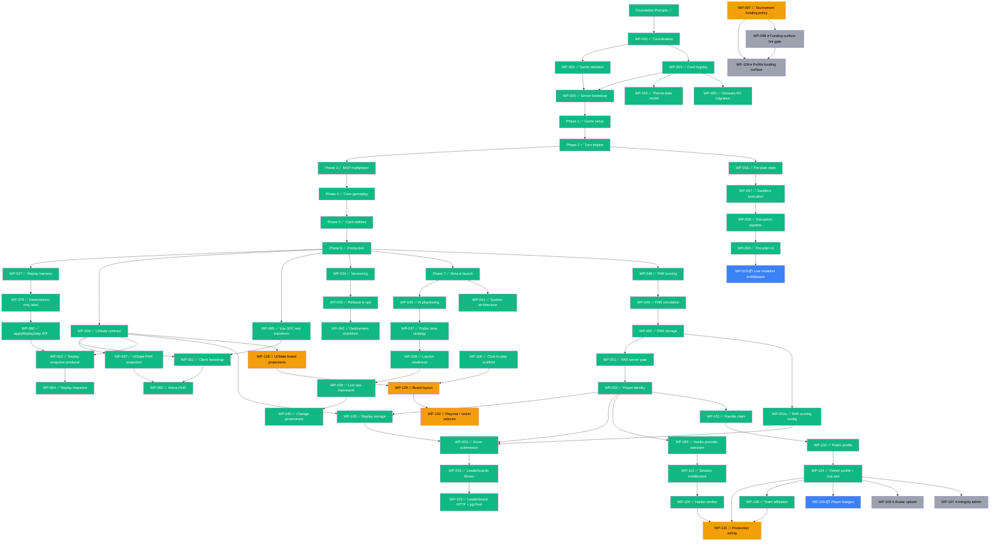

# Legendary Arena -- Development Roadmap

> A modern multiplayer evolution of the Marvel Legendary deck-building card game.
> Built with **boardgame.io**, **TypeScript**, and **Cloudflare R2**.

> **Checklist discipline (this file):** one line per WP; status-first; layer-tagged; no per-WP prose / file lists / commit hashes / decision IDs / test deltas. All audit detail lives in [`docs/ai/work-packets/WORK_INDEX.md`](ai/work-packets/WORK_INDEX.md), the per-WP files under [`docs/ai/work-packets/`](ai/work-packets/), and [`docs/ai/STATUS.md`](ai/STATUS.md). This file is navigation, not a record.
>
> **Status vocabulary (closed set):** `✅ Done` · `🚧 In Progress` · `📝 Drafted` (WP file authored; awaiting execution) · `📦 Queued` (deps met; WP file not yet authored) · `⏸ Blocked` (dep unmet) · `📝 Placeholder` (forward-looking only).
>
> **Last updated:** 2026-05-03 — review-pass 4: full one-line / status-first refactor. Authoritative state: see [`docs/ai/STATUS.md`](ai/STATUS.md). Authoritative dependency / order: see [`docs/ai/work-packets/WORK_INDEX.md`](ai/work-packets/WORK_INDEX.md).

---

## Current Status

**Foundation Prompts** · `00.4` ✅ `00.5` ✅ `01` ✅ `02` ✅
**Work Packets done** · `001..047` ✅ · `048..051` ✅ · `052, 053a, 053, 054, 103` ✅ · `055, 060` ✅ · `056..059` ✅ · `061..065` ✅ · `066, 067, 079, 080` ✅ · `081..085` ✅ · `087, 088` ✅ · `089..094, 100` ✅ · `096` ✅ · `099, 101, 102, 104, 109, 111, 112, 126` ✅ · `113, 114, 115` ✅ · `121..125, 127` ✅
**Open** · `WP-070` 📦 · `WP-097` 📝 · `WP-098` ⏸ · `WP-105` 📦 · `WP-106..108` ⏸ · `WP-128..130` 📝 · `WP-131` 📝 · `WP-042.1` ⏸

**Total** · 123 / 132 ✅ · 5 📝 · 2 📦 · 5 ⏸

For ordering and "what's next", see [Next Unblocked](#next-unblocked) at the bottom.

---

## Foundation Layer

| #       | Name                                  | Layer          | Status |
|---------|---------------------------------------|----------------|--------|
| FP-00.4 | Connection & environment health check | Infrastructure | ✅     |
| FP-00.5 | R2 data & image validation            | Infrastructure | ✅     |
| FP-01   | Render.com backend                    | Server / Infra | ✅     |
| FP-02   | Database migrations                   | Server / Infra | ✅     |

---

## Phase 0 -- Coordination & Contracts ✅

| WP      | Name                       | Layer       | Status |
|---------|----------------------------|-------------|--------|
| 001     | Coordination system        | Docs        | ✅     |
| 002     | boardgame.io game skeleton | Engine      | ✅     |
| 003     | Card registry verification | Registry    | ✅     |
| 004     | Server bootstrap           | Server      | ✅     |
| 043-047 | Governance alignment       | Docs        | ✅     |

---

## Phase 1 -- Game Setup Contracts & Determinism ✅

| WP     | Name                              | Layer  | Status |
|--------|-----------------------------------|--------|--------|
| 005A/B | Match setup & deterministic init  | Engine | ✅     |
| 006A/B | Player state & zones              | Engine | ✅     |

---

## Phase 2 -- Core Turn Engine ✅

| WP     | Name                       | Layer  | Status |
|--------|----------------------------|--------|--------|
| 007A/B | Turn structure & loop      | Engine | ✅     |
| 008A   | Core move contracts        | Engine | ✅     |
| 008B   | Core move implementation   | Engine | ✅     |

---

## Phase 3 -- MVP Multiplayer Infrastructure ✅

Phase 3 exit gate closed 2026-04-11 (D-1320).

| WP     | Name                       | Layer       | Status |
|--------|----------------------------|-------------|--------|
| 009A/B | Rule hooks & execution     | Engine      | ✅     |
| 010    | Victory & loss conditions  | Engine      | ✅     |
| 011    | Match creation & lobby     | Engine      | ✅     |
| 012    | Match listing & join       | Server      | ✅     |
| 013    | Persistence boundaries     | Engine      | ✅     |

---

## Phase 4 -- Core Gameplay Loop ✅

| WP   | Name                                 | Layer  | Status |
|------|--------------------------------------|--------|--------|
| 014A | Villain reveal & trigger pipeline    | Engine | ✅     |
| 014B | Villain deck composition             | Engine | ✅     |
| 015  | City & HQ zones                      | Engine | ✅     |
| 016  | Fight & recruit moves                | Engine | ✅     |
| 017  | KO, wounds & bystander capture       | Engine | ✅     |
| 018  | Attack & recruit point economy       | Engine | ✅     |
| 019  | Mastermind fight & tactics           | Engine | ✅     |
| 020  | VP scoring & win summary             | Engine | ✅     |

---

## Phase 5 -- Card Mechanics & Abilities ✅

| WP  | Name                                  | Layer  | Status |
|-----|---------------------------------------|--------|--------|
| 021 | Hero card text & keywords (hooks)     | Engine | ✅     |
| 022 | Execute hero keywords (MVP)           | Engine | ✅     |
| 023 | Conditional hero effects              | Engine | ✅     |
| 024 | Scheme & mastermind ability execution | Engine | ✅     |
| 025 | Keywords: patrol, ambush, guard       | Engine | ✅     |
| 026 | Scheme setup instructions             | Engine | ✅     |

---

## Phase 6 -- Verification & Production ✅

Closed 2026-04-19; tag `phase-6-complete` at `c376467`. PAR pipeline (WP-048..051) landed during this era — see [Scoring & PAR Pipeline](#scoring--par-pipeline) below for full detail.

| WP      | Name                                 | Layer        | Status |
|---------|--------------------------------------|--------------|--------|
| 027     | Replay harness                       | Engine       | ✅     |
| 028     | UIState contract                     | Engine       | ✅     |
| 029     | Spectator permissions & view models  | Engine       | ✅     |
| 030     | Campaign / scenario framework        | Engine       | ✅     |
| 031     | Production hardening                 | Engine       | ✅     |
| 032     | Network sync                         | Engine       | ✅     |
| 033     | Content authoring toolkit            | Engine       | ✅     |
| 034     | Versioning & save migration          | Engine / Ops | ✅     |
| 035     | Release & ops playbook               | Ops          | ✅     |
| 042     | Deployment checklists                | Ops / Docs   | ✅     |
| 066     | Registry viewer image/data toggle    | Viewer       | ✅     |
| 067     | UIState PAR + progress projection    | Engine UI    | ✅     |
| 079     | Replay harness determinism-only label | Engine      | ✅     |
| 080     | Replay harness step-level API        | Engine       | ✅     |

> **WP-042 vs WP-042.1 (disambiguator).** WP-042 is intentionally scope-reduced per D-4201; the four PostgreSQL seeding sections are partitioned to a sibling sequel WP-042.1 (Governance Drafts). WP-042 is **complete**; WP-042.1 is **blocked** on FP-03 revival. Not a partial undo.

---

## UI Implementation Chain (Phase 6) ✅

| WP  | Name                          | Layer            | Status |
|-----|-------------------------------|------------------|--------|
| 065 | Vue SFC test transform        | Shared tooling   | ✅     |
| 061 | Gameplay client bootstrap     | Client (arena)   | ✅     |
| 062 | Arena HUD & scoreboard        | Client (arena)   | ✅     |
| 063 | Replay snapshot producer      | Engine + CLI     | ✅     |
| 064 | Game log & replay inspector   | Client (arena)   | ✅     |

---

## Content Layer ✅

| WP  | Name                              | Layer    | Status |
|-----|-----------------------------------|----------|--------|
| 055 | Theme data model                  | Registry | ✅     |
| 060 | Keyword & rule glossary R2 migration | Registry | ✅  |

---

## Pre-Planning System (parallel-safe with Phase 4+)

Sandboxed speculative planning for waiting players. Design docs: [`DESIGN-CONSTRAINTS-PREPLANNING.md`](ai/DESIGN-CONSTRAINTS-PREPLANNING.md) · [`DESIGN-PREPLANNING.md`](ai/DESIGN-PREPLANNING.md).

| WP  | Name                          | Layer    | Status |
|-----|-------------------------------|----------|--------|
| 056 | State model & lifecycle       | Pre-Plan | ✅     |
| 057 | Sandbox execution             | Pre-Plan | ✅     |
| 058 | Disruption pipeline           | Pre-Plan | ✅     |
| 059 | UI integration                | Client   | ✅     |
| 070 | Live mutation middleware      | Client   | 📦 Queued (WP-059 ✅ + WP-090 ✅) |

---

## Post-Phase-6 Hygiene ✅

| WP  | Name                                     | Layer            | Status |
|-----|------------------------------------------|------------------|--------|
| 081 | Registry build pipeline cleanup          | Registry / Build | ✅     |
| 082 | Glossary schema, labels, rulebook deep-links | Registry + Viewer | ✅ |
| 083 | Fetch-time schema validation             | Viewer + Registry | ✅    |
| 084 | Delete unused auxiliary metadata         | Registry / Build | ✅     |
| 085 | Vision alignment audit orchestrator      | Audit / Tooling  | ✅     |

> Ad-hoc INFRA (not a WP): **EC-110 ✅** Validate-Registry CI path fix at `4e53e9f`.

---

## Phase 7 -- Beta, Launch & Live Ops ✅

| WP  | Name                                  | Layer        | Status |
|-----|---------------------------------------|--------------|--------|
| 036 | AI playtesting & balance simulation   | Simulation   | ✅     |
| 037 | Public beta strategy                  | Engine + Docs | ✅    |
| 038 | Launch readiness & go-live checklist  | Ops / Docs   | ✅     |
| 039 | Post-launch metrics & live ops        | Ops / Docs   | ✅     |
| 040 | Growth governance & change budget     | Governance + Engine types | ✅ |
| 041 | System architecture definition        | Governance / Docs | ✅   |

---

## Scoring & PAR Pipeline ✅

Single canonical owner of the PAR/leaderboard chain. WP-048 landed during the Phase 6 era; WP-049..051 closed 2026-04-23.

| WP  | Name                                  | Layer            | Status |
|-----|---------------------------------------|------------------|--------|
| 048 | PAR scenario scoring & leaderboards   | Engine Scoring   | ✅     |
| 049 | PAR simulation engine                 | Tooling / Sim    | ✅     |
| 050 | PAR artifact storage & indexing       | Tooling / Data   | ✅     |
| 051 | PAR publication & server gate         | Server / Enforce | ✅     |

Reference: [`docs/12-SCORING-REFERENCE.md`](12-SCORING-REFERENCE.md) · [`docs/12.1-PAR-ARTIFACT-INTEGRITY.md`](12.1-PAR-ARTIFACT-INTEGRITY.md).

---

## Beta-Launch Pillar ✅

| WP   | Name                                              | Layer           | Status |
|------|---------------------------------------------------|-----------------|--------|
| 052  | Player identity, replay ownership & access control | Server / Identity | ✅   |
| 053a | PAR artifact carries full ScenarioScoringConfig    | Engine + Server | ✅     |
| 053  | Competitive score submission & verification        | Server / Compete | ✅    |
| 054  | Public leaderboards library (Library-only)         | Server          | ✅     |
| 103  | Server-side replay storage & loader (predecessor)  | Server / Replay | ✅     |

---

## Engine Hardening ✅

| WP  | Name                          | Layer  | Status |
|-----|-------------------------------|--------|--------|
| 087 | Engine type hardening (PlayerId alias) | Engine | ✅ |
| 088 | Setup module hardening (buildCardKeywords + villain pre-index) | Engine | ✅ |

---

## Client Integration Cluster ✅

| WP  | Name                                       | Layer            | Status |
|-----|--------------------------------------------|------------------|--------|
| 089 | Engine PlayerView wiring                   | Engine           | ✅     |
| 090 | Live match client wiring                   | Client (arena)   | ✅     |
| 091 | Loadout builder in registry viewer         | Registry + Viewer | ✅    |
| 092 | Lobby loadout intake (JSON → create match) | Client (arena)   | ✅     |
| 093 | Match-setup rule-mode envelope (governance) | Governance      | ✅     |
| 094 | Viewer hero FlatCard key uniqueness        | Viewer           | ✅     |
| 100 | Interactive gameplay surface (click-to-play scaffold) | Client (arena) | ✅ |

> Open follow-up (deferred placeholder, not yet a WP): D-9001 records two bugs in `apps/server/scripts/join-match.mjs`. CLI-only scope; can land standalone or be deleted if obsoleted by the lobby UI.

---

## Auth Stack & Profile Surface

| WP  | Name                                      | Layer                | Status |
|-----|-------------------------------------------|----------------------|--------|
| 099 | Auth provider selection — Hanko (governance) | Governance / Policy | ✅     |
| 101 | Handle claim flow & global uniqueness      | Server / Identity    | ✅     |
| 102 | Public player profile page (read-only)     | Server + Client      | ✅     |
| 104 | Owner profile data model & /me edit        | Server + Client      | ✅     |
| 109 | Team affiliation (cooperative cohorts)     | Server + Client      | ✅     |
| 111 | UIState card display projection (engine-side) | Engine UI         | ✅     |
| 112 | Session token validation middleware (broker-agnostic) | Server / Auth | ✅ |
| 126 | Hanko session verifier                     | Server / Auth        | ✅     |
| 131 | Authenticated routes production wiring     | Server / Auth        | 📝 Drafted 2026-05-03 |

---

## Engine + Server Wiring & Leaderboard HTTP ✅

| WP  | Name                                          | Layer        | Status |
|-----|-----------------------------------------------|--------------|--------|
| 113 | Engine-server registry wiring + ID format lock | Engine + Server | ✅  |
| 114 | Registry viewer URL-parameterized setup preview | Viewer       | ✅    |
| 115 | Public leaderboard HTTP endpoints + pg.Pool bootstrap | Server | ✅      |

---

## Registry Viewer Enhancements ✅

| WP  | Name                                        | Layer  | Status |
|-----|---------------------------------------------|--------|--------|
| 121 | Card zoom slider                            | Viewer | ✅     |
| 122 | Henchman flattenSet emission fix            | Viewer | ✅     |
| 123 | cardType widening + set.other[] dispatch    | Viewer | ✅     |
| 124 | Theme zoom slider                           | Viewer | ✅     |
| 125 | Card abilities effect-tag filter            | Viewer | ✅     |
| 127 | Grid tile team & ability text (threshold-gated) | Viewer | ✅ |

---

## Phase 8 -- Interactive Board Layout

| WP  | Name                                  | Layer           | Status |
|-----|---------------------------------------|-----------------|--------|
| 128 | UIState board projections             | Engine UI       | 📝 Drafted 2026-05-03 |
| 129 | Board layout (desktop / mobile)       | Client (arena)  | 📝 Drafted 2026-05-03 |
| 130 | Playmat / reskin selector             | Client (arena)  | 📝 Drafted 2026-05-03 (deferrable) |

---

## Phase 9 -- Profile Surface Follow-ups

| WP  | Name                                  | Layer        | Status |
|-----|---------------------------------------|--------------|--------|
| 105 | Player badges                         | Server + Client | 📦 Queued (WP-104 ✅) |
| 106 | Avatar upload pipeline                | Server + R2  | ⏸ Blocked (R2-governance D-entry) |
| 107 | Profile integrity / anti-cheat surface | Server / Admin | ⏸ Blocked (admin-auth WP) |
| 108 | Profile funding surface               | Server + Client | ⏸ Blocked (WP-097 + WP-098 + payment-integration WP) |

---

## Phase 10 -- Debugging, Testing & Troubleshooting

Forward-looking phase. Promote a candidate to a real WP only when a concrete production-debugging need motivates it; premature observability tooling is its own form of churn.

| ID | Name                                   | Layer            | Status |
|----|----------------------------------------|------------------|--------|
| Future-WP-A | Match replay snapshot diff tool        | Engine + CLI    | 📝 Placeholder |
| Future-WP-B | OpsCounters histogram aggregator       | Server / Ops    | 📝 Placeholder |
| Future-WP-C | Engine determinism replay-verifier service | Server      | 📝 Placeholder |
| Future-WP-D | Production error telemetry (server-side only) | Server   | 📝 Placeholder |
| Future-WP-E | Performance profiler harness (engine, test-time) | Engine | 📝 Placeholder |
| Future-WP-F | End-to-end smoke suite (live match through full turn) | Client + Server | 📝 Placeholder |
| Future-WP-G | Disconnect / reconnect stress suite    | Server + Client | 📝 Placeholder |
| Future-WP-H | Synthetic load generator (multi-match concurrency) | Scripts | 📝 Placeholder |
| Future-WP-I | Durable boardgame.io match storage (survive deploy / restart) | Server / Infra | 📦 Queued |

> **Future-WP-I (durable match storage).** The game `Server()` is built with no `db:` option, so boardgame.io falls back to in-memory match storage; the server auto-deploys on every push to `main`, so each deploy restarts the process and discards every in-progress match — clients then freeze on their last state. Fix: back match state with durable storage (the existing Postgres or an equivalent adapter), paired with the WP-116 disconnect / reconnect work. Carries an architecture-invariant reconciliation (the "`G` is never persisted" line) to settle when the WP is authored. Planned ~2 weeks out, after core-set hero coverage progresses.

*2026-06-20 — re-landed **Future-WP-I** (durable boardgame.io match storage): the node was authored 2026-06-16 (commit `30040c49`) on a branch whose second commit never merged, so it was missing from the live roadmap; root cause of the 2026-06-16 play.legendary-arena.com freeze (in-memory bgio storage + auto-deploy restart wiping live matches). Forward-looking / not yet authored.*

---

## Governance Drafts

| WP    | Name                                  | Layer            | Status |
|-------|---------------------------------------|------------------|--------|
| 097   | Tournament funding policy             | Governance / Docs | 📝 Drafted 2026-04-25 |
| 098   | Funding surface lint-gate trigger (00.3 §20) | Governance / Lint | ⏸ Blocked (WP-097 execution) |
| 042.1 | PostgreSQL seeding checklist sections (sequel to WP-042) | Ops / Docs | ⏸ Blocked (FP-03 revival per D-4201) |

---

## Dependency Overview

> **Parallel-safe packets** (informational): WP-003 / WP-005A/B / WP-030 / WP-055 / WP-060 / WP-056..058 are parallel-safe with their nominal phases. The full Phase 6 sub-chains (UI · scoring · replay · ops) all closed by 2026-04-19 (`phase-6-complete` tag at `c376467`).

---

## Architectural Invariants

- Determinism is non-negotiable -- randomness only via `ctx.random.*`
- Engine owns truth -- clients send intents, never outcomes
- `G` is never persisted -- only `MatchSnapshot` is saved
- Moves never throw -- only `Game.setup()` is allowed to
- Zones store only `CardExtId` strings
- Every phase / turn transition has a `// why:` comment
- PAR artifacts are immutable trust surfaces -- write-once, never overwritten
- Scoring semantics are an immutable surface -- no changes without major version bump

---

## Project Baselines (canonical -- single source; do not restate elsewhere)

- **Phase 3 Gate:** Closed (D-1320)
- **Phase 6 Gate:** Closed 2026-04-19 — tag `phase-6-complete` at `c376467`
- **Engine test baseline:** `604 / 132 / 0` (post-WP-111 + WP-113)
- **Server test baseline:** `124 / 0 / 54` (post-WP-126; pre-WP-131)
- **DECISIONS.md range:** `D-4801..D-13104` reserved (WP-097 → D-9701; WP-098 → D-9801; WP-131 → D-13101..D-13104)
- **EC range:** `EC-001..EC-134` (EC-131/132/133 reserved by board-layout chain WP-128/129/130; EC-134 reserved by WP-131)

Per-WP baseline shifts (e.g. `server 73/9/0 → 82/10/0`) live only in the per-WP files and `WORK_INDEX.md` — those record landing-time deltas, not the live baseline.

---

## Next Unblocked (ordered)

1. **WP-131** — drafted; all deps satisfied; awaiting Lint Gate + pre-flight.
2. **Phase 8 chain WP-128 → WP-129 → WP-130** — drafted; awaiting Lint Gate. WP-130 deferrable.
3. **WP-105** — queued (WP-104 dep cleared 2026-05-02); WP file not yet authored.
4. **WP-070** — queued (WP-059 ✅ + WP-090 ✅); WP file + EC not yet authored.
5. **WP-097 → WP-098** — pre-flight bundles pending; WP-098 blocked on WP-097 execution.
6. **Phase 10 placeholders** — promote a candidate to a real WP only when a concrete production-debugging need motivates it.
7. **WP-042.1** — unblocks when Foundation Prompt 03 is revived.

---

## Governance System

| Document | Role |
|----------|------|
| [`.claude/CLAUDE.md`](../.claude/CLAUDE.md) | Root coordination (loaded every session) |
| [`docs/ai/ARCHITECTURE.md`](ai/ARCHITECTURE.md) | Architectural decisions & boundaries |
| [`docs/ai/work-packets/WORK_INDEX.md`](ai/work-packets/WORK_INDEX.md) | Authoritative per-WP audit log |
| [`docs/ai/STATUS.md`](ai/STATUS.md) | Authoritative current state |
| [`docs/ai/DECISIONS.md`](ai/DECISIONS.md) | Immutable decisions ledger |
| [`docs/ai/execution-checklists/EC_INDEX.md`](ai/execution-checklists/EC_INDEX.md) | EC-001..EC-134 index |
| [`.claude/rules/*.md`](../.claude/rules/) | 7 layer-specific enforcement rules |
| [`docs/12-SCORING-REFERENCE.md`](12-SCORING-REFERENCE.md) | PAR scoring formula & leaderboard rules |
| [`docs/ai/REFERENCE/03A-PHASE-3-MULTIPLAYER-READINESS.md`](ai/REFERENCE/03A-PHASE-3-MULTIPLAYER-READINESS.md) | Phase 3 exit gate (closed) |

---

*Last updated: 2026-05-03 — review-pass 4: full one-line / status-first refactor matching [`docs/05-ROADMAP-MINDMAP.md`](05-ROADMAP-MINDMAP.md). Per-WP detail relocated to [`WORK_INDEX.md`](ai/work-packets/WORK_INDEX.md) and [`STATUS.md`](ai/STATUS.md).*
