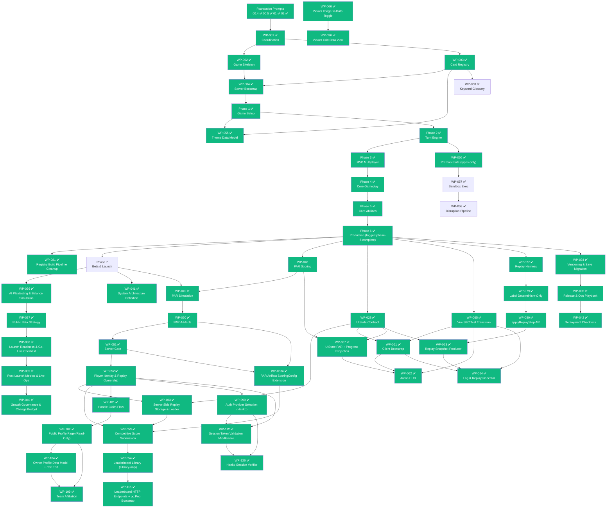

# Legendary Arena -- Development Roadmap

> A modern multiplayer evolution of the Marvel Legendary deck-building card game.
> Built with **boardgame.io**, **TypeScript**, and **Cloudflare R2**.

**Last updated:** 2026-05-03 (**WP-126 / EC-130 — External Authentication Integration (Hanko Session Verifier) landed**) — Single `EC-130:` commit at `2aa7690` lands 12 files: 5 new under `apps/server/src/auth/hanko/` (the D-9904 module path lock) + 3 modified config/reference (`render.yaml` + `.env.example` HANKO_* declarations + 1 new `Library-only` catalog row per D-11804) + 4 governance ledgers. The new directory hosts the broker-specific `SessionVerifier` that the WP-112 orchestrator's caller-injected provider pattern was designed to receive: `hankoVerifier.types.ts` (config + closed-set `HANKO_IDP_TO_AUTH_PROVIDER` lookup with seven keys + WP-112 re-exports), `hankoVerifier.logic.ts` (`createHankoSessionVerifier(config)` factory + 8-step `verify(token)` closure), `hankoVerifier.logic.test.ts` (17 cases), `jwksCache.logic.ts` (per-instance cache with single-flight refresh + one-shot retry + graceful degradation + insertion-time `Object.freeze`), `jwksCache.logic.test.ts` (8 cases). **Four executor-time DECISIONS land in numeric order**: D-12601 (built-ins-only path — RS256 verification via Node v22 `node:crypto.createPublicKey({ format: 'jwk' })` + `node:crypto.createVerify('RSA-SHA256')`; zero new npm dependency; `apps/server/package.json` and `pnpm-lock.yaml` UNCHANGED) + D-12602 (4-field `HankoVerifierConfig` shape + 3 env vars `HANKO_TENANT_BASE_URL` / `HANKO_EXPECTED_AUDIENCE` / `HANKO_JWKS_REFRESH_INTERVAL_MS`; `tenantBaseUrl` is the tenant-scoped origin per Hanko Cloud's `/{tenant_id}/.well-known/jwks.json` shape; verifier appends suffix programmatically) + D-12603 (per-instance JWKS cache; default refresh interval 300_000 ms; single-flight refresh; one-shot retry; failed-refresh preserves cache; aliasing-defended via `Object.freeze` at insertion per copilot Issue #17; single-site default-substitution at the verifier factory body) + D-12604 (federation claim = `amr` array per Hanko's documented JWT shape; closed-set object-literal `HANKO_IDP_TO_AUTH_PROVIDER` lookup `{'ext:google':'google', 'ext:discord':'discord', 'pwd':'email', 'passkey':'email', 'otp':'email', 'totp':'email', 'security_key':'email'}`; two-pass priority scan with federated values winning over native; no string-prefix check, no regex; citations: Hanko docs `https://docs.hanko.io/guides/session-management` + Hanko source `backend/flow_api/flow/shared/hook_determine_amr_values.go` literal `amr = append(amr, "ext:"+thirdPartyProvider)` + Hanko source `backend/thirdparty/provider.go` switch-case constants for `google`/`discord`). **D-11201 status flips Active → Resolved** per its body's "Status flips to `Resolved` once WP-126 lands". **F-1..F-7 Future-Auth Gates PASS by construction**: F-1 no `'hanko'` literal as `auth_provider` value anywhere; F-2 every `@teamhanko/*` import (none under built-ins-only) + every `hanko.io` URL contained inside `apps/server/src/auth/hanko/`; F-3 no `randomUUID` in `auth/hanko/`; F-4 zero diff against `server.mjs` / leaderboards / profile / sessionToken.logic.ts / accountLookup.logic.ts; F-5 zero diff against `apps/server/package.json`; F-6 replacement-safety preserved (deleting `auth/hanko/` + the catalog row + the env vars requires zero WP-112 / WP-052 / WP-099 file change); F-7 Vision Alignment cites §3 / §11 / §14 / §15 + NG-1 / NG-3 / NG-6 with no-conflict + N/A determinism. **Single-parameter `Result<T>` lock preserved (PS-1)** — the verifier emits `SessionVerificationErrorCode` strings into the structurally-typed `code` field via `as never` mirroring `sessionToken.logic.test.ts:84`'s settled pattern; orchestrator translates at the existing `sessionToken.logic.ts:191-193` cast site, untouched. Server test baseline `99/0/54 → 124/0/54` (+25 logic-pure tests, all always-runs). Engine baseline `604/0` UNCHANGED. **Companion** `SPEC: WP-126 / EC-130 — pre-flight PS-1..PS-4 reconciliation` at `1e9c629` lands in-place reconciliation (PS-1 single-param Result lock, PS-2 fetcher injection seam, PS-3 single-site default substitution, PS-4 JWKS aliasing defense — 251 inserts across WP-126.md + EC-130.checklist.md). Production wiring stays deferred — `requireAuthenticatedSession` continues to fail-closed with `'session_verifier_not_configured'` until a future request-handler WP wires `configureSessionValidation({ verifier: createHankoSessionVerifier(config), accountResolver, database })` per D-11204 + D-11201 staging. **Original 2026-04-26 footer preserved below.** ---- 2026-04-26 (**Beta-Launch Pillar half-shipped + WP-103 replay loader landed + WP-109 / EC-109 drafted**) — Three of the four Beta-Launch Pillar packets executed: WP-052 ✅ player identity & replay ownership at `cf4e111` 2026-04-25 (EC-052, execution `fd769f1`; `apps/server/src/identity/`; D-5201..D-5203 + D-8701; migrations `004_create_players_table.sql` + `005_create_replay_ownership_table.sql`; server 19/3/0 → 31/5/0) + WP-053a ✅ PAR artifact `ScenarioScoringConfig` extension at `d896690` 2026-04-25 (EC-053a, execution `e5b9d15`; engine 513/115/0 → 522/116/0; `data/scoring-configs/<scenario_key>.json` authoring origin per D-5306a; INFRA hook fix `fbbedb5` accepting lowercase letter suffix in EC-### prefix) + WP-053 ✅ competitive score submission & verification at `26e122f` 2026-04-26 (EC-053, execution `56e8134`, A0 SPEC v1.5 `27d3004` adding Vision Alignment block + `IF NOT EXISTS` migration idempotency; `apps/server/src/competition/`; migration `007_create_competitive_scores_table.sql`; D-5301..D-5305; server 38/6/0 → 47/7/0). WP-103 ✅ server-side replay storage & loader at `f74d180` 2026-04-25 (EC-111, execution `fe7db3e`; `apps/server/src/replay/`; migration `006_create_replay_blobs_table.sql` with `text replay_hash PRIMARY KEY` + `jsonb replay_input`; D-10301..D-10303; server +5 tests / +1 suite; predecessor for WP-053 — closes EC-053 §Before Starting line 21 hard prerequisite). WP-096 ✅ registry viewer grid data view at `811114a` 2026-04-25 (EC-096, execution `4fe8382`; `CardDataTile.vue` + `CardGrid.vue` consumes `useCardViewMode` directly per WP-066 "global toggle" intent; D-9601 `Set`/`setAbbr` divergence from sidebar). **Governance drafts 2026-04-25** at `c33d42b`: WP-097 / EC-097 (Tournament Funding Policy — Open Collective primary + PayPal supplemental; D-9701) + WP-098 / EC-098 (Funding Surface Gate Trigger — `00.3 §20`; blocked on WP-097 execution) + WP-099 / EC-099 (Auth Provider Selection — Hanko; D-9901..D-9905; `apps/server/src/auth/hanko/` module path) + WP-101 / EC-101 (Handle Claim Flow — migration slot `007_add_handle_to_players.sql`; locked regex `^[a-z][a-z0-9_]{2,23}$` + 15-entry reserved set; no-tombstone policy). **WP-102 + WP-104..108 placeholder rows 2026-04-25** at `75186ce` (public profile page + 5 follow-up placeholders pending WP-101). **VISION §25 amendment 2026-04-26** at `00f0a38` (badges issuer model + boundary freeze; D-0006 / D-0007 / D-1004) + **PROPOSAL-BADGES.md addendum polish** at `4d419a4` (A1-A6). **WP-109 / EC-109 drafted 2026-04-26 (this session, uncommitted)** — Team Affiliation (Profile-Level Cooperative Cohorts): variable team size 3/4/5 declared at creation and immutable; sub cap = `min(2, teamSize − 2)`; validity rule `liveMembers ≥ teamSize − 2 AND liveMembers + liveSubs ≥ teamSize − 1`; vision-aligned per §3 / §4 / §23(b) / §25; D-0005 preserved (no comparison surface); DESIGN-RANKING.md §12 deferral honored; lint-PASS; blocked on WP-104 placeholder. Prior 2026-04-24 footer preserved below for context. ---- 2026-04-24 (**Phase 7 closed + first browser gameplay client landed**) — Phase 7 main sequence completed when WP-041 ✅ system architecture definition shipped at `0e8e8b1` under EC-041 alongside the PAR pipeline closure: WP-049 ✅ PAR simulation engine at `021555e` under EC-049 → WP-050 ✅ PAR artifact storage & indexing at `ccdf44e` under EC-050 → WP-051 ✅ PAR publication & server gate contract at `ce3bffb` under EC-051 (all 2026-04-23). Engine hardening pass landed 2026-04-23: WP-087 ✅ engine type hardening at `73aeada` (`PlayerId` alias; `readonly` deferred per D-8702) + WP-088 ✅ setup module hardening at `d183991` (engine 507/114/0; repo-wide 672/128/0; `buildCardKeywords` runtime guards + villain pre-index + output ordering + D-8802). Client integration cluster shipped 2026-04-24: WP-089 ✅ engine PlayerView wiring (clients receive audience-filtered `UIState` not raw `LegendaryGameState`) + WP-090 ✅ live match client wiring at `54b266a` under EC-090 (first browser gameplay client; `apps/arena-client/` lobby view + create/join + `boardgame.io/client` SocketIO; D-9001 records CLI credentials drift) + WP-091 ✅ loadout builder in registry viewer (D-9101; `packages/registry/src/setupContract/` zod schema + third "Loadout" tab in viewer; +18 setupContract tests) + WP-092 ✅ lobby loadout intake at `cb982ff` under EC-092 (D-9201; arena-client 77/3/0 → 109/5/0; WP-090 manual form preserved byte-for-byte under `<details>` collapse) + WP-093 ✅ match-setup rule-mode envelope field (D-9301; governance-only — zero code changes; optional `heroSelectionMode` with v1 enum `["GROUP_STANDARD"]`; preserves 9-field composition lock) + WP-094 ✅ viewer hero FlatCard key uniqueness at `eac678c` (single-file viewer fix — `flattenSet` key suffix `card.slot` → `card.slug`). **WP-059 deferral lifted 2026-04-24** — WP-028 (UI State Contract) shipped 2026-04-14 and WP-061 settled the framework on Vue 3 + Vite + Pinia (executed 2026-04-17 at `2e68530`); WP-059 + EC-059 drafted 2026-04-24, awaiting Prompt Lint Gate (00.3) and pre-flight bundle. **WP-052/053/054 contract tightening pass 2026-04-24** at `729f056` (pre-execution surgical clarifications across the player-identity / score-submission / leaderboard pillar — `PlayerIdentity` discriminated union; idempotent retries return `wasExisting: true`; `SUBMISSION_REJECTION_REASONS` runtime list; PAR drift guard; leaderboard `totalEligibleEntries` filter alignment + global `rank` + display-name fail-closed). **WP-055 / EC-055 doc polish 2026-04-24** at `b24b589` (post-completion Music Field Semantics non-normative block + array-order-is-intentional constraint + pre-flight grep checklist + post-mortem purpose). Prior 2026-04-23 footer preserved below for context. ---- 2026-04-23 (**Phase 7 launch-readiness quartet complete — WP-039 landed**) — **WP-056 landed 2026-04-20 at commit `eade2d0` under EC-056** — pre-planning types-only core: new `packages/preplan/` package (`package.json` + `tsconfig.json` + `src/preplan.types.ts` + `src/index.ts`) exporting four public types (`PrePlan`, `PrePlanSandboxState`, `RevealRecord`, `PrePlanStep`) consumed by WP-057/058 as types only; D-5601 new top-level `preplan` code category; RS-2 zero-test lock; type-only import of `@legendary-arena/game-engine`; no runtime wiring into the engine. **WP-057 landed 2026-04-20 at commit `8a324f0` under EC-057** — pre-plan sandbox execution: first runtime consumer of WP-056 types; client-local Fisher-Yates PRNG (`speculativePrng.ts`), sandbox factory (`preplanSandbox.ts`), five speculative operations (`speculativeOperations.ts`), and `PREPLAN_STATUS_VALUES` canonical readonly array + drift-detection (`preplanStatus.ts`) deferred from WP-056; full-spread aliasing discipline (WP-028 precedent) on every return; uniform null-on-inactive contract; preplan 0/0/0 → 23/4/0; engine 436/109/0 UNCHANGED; governance close `7414656`; 01.6 post-mortem at `docs/ai/post-mortems/01.6-WP-057-preplan-sandbox-execution.md`. **WP-058 landed 2026-04-20 at commit `bae70e7` under EC-058** — pre-plan disruption pipeline: `isPrePlanDisrupted` + `invalidatePrePlan` + `computeSourceRestoration` + `buildDisruptionNotification` + `executeDisruptionPipeline` across `disruption.types.ts` + `disruptionDetection.ts` + `disruptionPipeline.ts`; `PREPLAN_EFFECT_TYPES` canonical readonly array + compile-time drift-check (`preplanEffectTypes.ts`) deferred from WP-056; first implementation of DESIGN-CONSTRAINT #3 ledger-sole rewind authority; first-mutation-wins status guard; preplan 23/4/0 → 52/7/0; engine 436/109/0 UNCHANGED; governance close `00687c5`; A-058-01..05 amendments; 01.6 post-mortem at `docs/ai/post-mortems/01.6-WP-058-preplan-disruption-pipeline.md`. **WP-081 landed 2026-04-20 at commit `ea5cfdd` under EC-081** — subtractive registry build pipeline cleanup: three broken operator scripts deleted (`normalize-cards.ts`, `build-dist.mjs`, `standardize-images.ts`) + `packages/registry/package.json` `scripts.build` trimmed to `"tsc -p tsconfig.build.json"` + one redundant step removed from `.github/workflows/ci.yml` job `build` + six README.md anchor regions rewritten + `docs/03-DATA-PIPELINE.md` "Legacy Scripts" subsection deleted; D-8101 (delete-not-rewrite; no monorepo consumer of old `dist/*.json` artifacts — runtime path is `metadata/sets.json` + `metadata/{abbr}.json` from R2) + D-8102 (`registry:validate` as single CI validation step); first green `pnpm --filter @legendary-arena/registry build` since WP-003 landed; engine 436/109/0 UNCHANGED; repo-wide 536/0 UNCHANGED. Prior history preserved: WP-027..033 landed 2026-04-14/15/16; EC-103/104 landed 2026-04-16/17; WP-065 at `bc23913` under EC-065; WP-061 at `2e68530` under EC-067; **WP-048 landed 2026-04-17 at commit `2587bbb` under EC-048** — PAR scoring infrastructure; **WP-067 landed 2026-04-17 at commit `1d709e5` under EC-068** — UIState PAR breakdown + progress counters with D-6701 safe-skip; **WP-062 landed 2026-04-18 at commit `7eab3dc` under EC-069** (merged at `3307b12`) — Arena HUD component tree; **WP-079 landed 2026-04-19 at commit `1e6de0b` under EC-073** — JSDoc-only narrowing of replay harness as determinism-only per D-0205 follow-up; **WP-080 landed 2026-04-19 at commit `dd0e2fd` under EC-072** — `applyReplayStep` step-level API; **WP-063 landed 2026-04-19 at commit `97560b1` under EC-071** — `ReplaySnapshotSequence` + `apps/replay-producer/` CLI; **WP-064 landed 2026-04-19 at commit `76beddc` under EC-074** — client replay-consumption surface + D-6401 keyboard focus pattern; **WP-034 landed 2026-04-19 at commit `5139817` under EC-034** — `packages/game-engine/src/versioning/` (three version axes + `VersionedArtifact<T>` + `checkCompatibility` / `migrateArtifact` / `stampArtifact`; engine 427→436); **WP-035 landed 2026-04-19 at commit `d5935b5` under EC-035** — `packages/game-engine/src/ops/` engine subtree + `docs/ops/RELEASE_CHECKLIST.md` + `DEPLOYMENT_FLOW.md` + `INCIDENT_RESPONSE.md` (D-3501..D-3504); **WP-042 landed 2026-04-19 at commit `c964cf4` under EC-042** — `docs/ai/deployment/r2-data-checklist.md` (full §A.1–§A.7) + `docs/ai/deployment/postgresql-checklist.md` (scope-reduced to §B.1/§B.2/§B.6/§B.7 per D-4201) + D-4202/D-4203 governance. **Phase 6 tagged `phase-6-complete` at governance-close commit `c376467`** (19 WPs landed; engine 436/109/0; repo-wide 526/0 at phase close; WP-042.1 deferred per D-4201 + WP-066 unreviewed carried forward to Phase 7 backlog). **2026-04-21 delivery wave** (five WPs + one ad-hoc INFRA): **WP-060** ✅ glossary R2 migration at `412a31c` under EC-106 (123 keywords + 20 rules to R2; non-blocking fetch with empty-Map fallback; D-6001..D-6007 including D-6002 historical-neighbor glossary-wiring lock; governance close `cd811eb`); **WP-082** ✅ glossary schema/labels/rulebook deep-links at `752fcca` under EC-107 (first `.strict()` use in `packages/registry/src/schema.ts`; uploads v23-hyperlinks rulebook PDF to R2 at version-pinned URL; required `label` + optional `pdfPage` on every entry; A-082-01 `./schema` subpath export precedent; D-8201..D-8206; +10 registry tests → repo-wide 588 → 596; governance close `0acdf3c`); **EC-110** ad-hoc Validate-Registry CI path fix at `4e53e9f` (not a WP; `validate.ts` defaults via `fileURLToPath(import.meta.url)`; surfaced two upstream data defects repaired via three `INFRA:` commits); **WP-036** ✅ AI playtesting & balance simulation at `539b543` under EC-036 (first Phase-7 WP; D-3601 simulation code category + D-3602 same-pipeline-as-humans + D-3603 random-policy MVP baseline + D-3604 two-independent-PRNG-domain seed reproducibility; A-036-02 amendment; governance close `61df4c0`); **WP-084** ✅ auxiliary-metadata deletion at `b250bf1` under EC-109 (subtractive — five auxiliary Zod schemas + five `data/metadata/*.json` + `card-types-old.json` + Phase-2 validate block + viewer drifted-duplicate `localRegistry.ts` + legacy `Validate-R2-old.ps1` deleted; D-8401..D-8407 including D-8403 `*-old.*` repo-smell rule, D-8406 viewer drifted-duplicate rule, D-8407 legacy-ps1 deletion; 596/0 preserved; A-084-01 amendment; governance close `4cc9ded`); **WP-083** ✅ fetch-time Zod validation at `601d6fc` under EC-108 (adds `ViewerConfigSchema` (`.strict()`) + `ThemeIndexSchema` to `packages/registry/src/schema.ts`; `registryClient` + `themeClient` retrofitted to `.safeParse(...)` at fetch boundary with first-Zod-issue rendering; A-083-04 `./theme.schema` subpath export; D-8301..D-8305; 596/0 preserved; governance close `7f054e1`). **Current baseline: engine 436/109/0 UNCHANGED; repo-wide 596/0.** -- **Authoritative source:** [`docs/ai/work-packets/WORK_INDEX.md`](ai/work-packets/WORK_INDEX.md)

---

## Current Status

**Foundation Prompts**
`00.4` ✅ `00.5` ✅ `01` ✅ `02` ✅

**Work Packets**
`WP-001` ✅ `WP-002` ✅ `WP-003` ✅ `WP-004` ✅ `WP-005A` ✅ `WP-005B` ✅ `WP-006A` ✅ `WP-006B` ✅ `WP-007A` ✅ `WP-007B` ✅ `WP-008A` ✅ `WP-008B` ✅ `WP-009A` ✅ `WP-009B` ✅ `WP-010` ✅ `WP-011` ✅ `WP-012` ✅ `WP-013` ✅ `WP-014A` ✅ `WP-014B` ✅ `WP-015` ✅ `WP-016` ✅ `WP-017` ✅ `WP-018` ✅ `WP-019` ✅ `WP-020` ✅ `WP-021` ✅ `WP-022` ✅ `WP-023` ✅ `WP-024` ✅ `WP-025` ✅ `WP-026` ✅ `WP-027` ✅ `WP-028` ✅ `WP-029` ✅ `WP-030` ✅ `WP-031` ✅ `WP-032` ✅ `WP-033` ✅ `WP-034` ✅ `WP-035` ✅ `WP-036` ✅ `WP-037` ✅ `WP-038` ✅ `WP-039` ✅ `WP-040` ✅ `WP-041` ✅ `WP-042` ✅ `WP-043` ✅ `WP-044` ✅ `WP-045` ✅ `WP-046` ✅ `WP-047` ✅ `WP-048` ✅ `WP-049` ✅ `WP-050` ✅ `WP-051` ✅ `WP-052` ✅ `WP-053a` ✅ `WP-053` ✅ `WP-054` ✅ `WP-055` ✅ `WP-056` ✅ `WP-057` ✅ `WP-058` ✅ `WP-060` ✅ `WP-061` ✅ `WP-062` ✅ `WP-063` ✅ `WP-064` ✅ `WP-065` ✅ `WP-066` ✅ `WP-067` ✅ `WP-079` ✅ `WP-080` ✅ `WP-081` ✅ `WP-082` ✅ `WP-083` ✅ `WP-084` ✅ `WP-085` ✅ `WP-087` ✅ `WP-088` ✅ `WP-089` ✅ `WP-090` ✅ `WP-091` ✅ `WP-092` ✅ `WP-093` ✅ `WP-094` ✅ `WP-096` ✅ `WP-099` ✅ `WP-101` ✅ `WP-102` ✅ `WP-103` ✅ `WP-104` ✅ `WP-109` ✅ `WP-111` ✅ `WP-112` ✅ `WP-113` ✅ `WP-114` ✅ `WP-115` ✅ `WP-121` ✅ `WP-122` ✅ `WP-123` ✅ `WP-124` ✅ `WP-125` ✅ `WP-126` ✅ `WP-127` ✅ -- `WP-042.1` ⏸ (blocked on FP-03 revival per D-4201) -- **WP-059** 📝 (Drafted 2026-04-24, deferral lifted) -- **WP-097/098** 📝 (Funding policy + lint-gate trigger, pre-flight pending) -- **WP-105..108** 📝 (Profile follow-up placeholders)

**Overall Progress**
108 / 113 items complete (4 FPs + 104 WPs done; WP-059 deferred-but-drafted + WP-097/098 governance drafts + WP-105..108 profile-page follow-up placeholders; WP-042.1 deferred per D-4201). **Beta-Launch Pillar half-shipped 2026-04-25..26:** WP-052 ✅ player identity & replay ownership at `cf4e111` + WP-053a ✅ PAR artifact `ScenarioScoringConfig` extension at `d896690` + WP-053 ✅ competitive score submission & verification at `26e122f` (server 19/3/0 → 47/7/0 across the three landings) + WP-103 ✅ server-side replay storage & loader at `f74d180` (predecessor for WP-053). WP-096 ✅ registry viewer grid data view at `811114a`. **Phase 7 launch-readiness quartet complete 2026-04-22..23:** WP-036 ✅ AI playtesting (`539b543`) → WP-037 ✅ public beta strategy (`160d9b9`) → WP-038 ✅ launch readiness & go-live checklist (`2134f33`, governance close `d4fe447`) → **WP-039 ✅ post-launch metrics & live ops** at `4b1cf5c` (EC-039, governance close `ee5e1d5`, A0 SPEC pre-flight bundle `9e7d9bd`). WP-039 produces `docs/ops/LIVE_OPS_FRAMEWORK.md` (11 top-level sections: §1 Purpose / §2 Foundational Constraints with 8 binary rows / §3 Severity Taxonomy cross-linked to `INCIDENT_RESPONSE.md` / §4 Observability Surface cross-linked to `OpsCounters` / §5 Metric Label Conventions as organizational prose only — not a typed union / §6 Data Collection Rules with 6 binary rows citing D-0901 / §7 Live Ops Cadence daily-weekly-monthly / §8 Change Management allowed-vs-forbidden matrices / §9 Success Criteria with 6 binary rows / §10 Non-Goals with 9 explicit exclusions / §11 Summary) + D-3901 live-ops-reuses-existing-IncidentSeverity-and-OpsCounters-rather-than-parallel-types. Path A resolved all three v1 pre-flight blockers by construction (duplicate `MetricPriority` severity type → dropped; same-version-vs-cross-version replay desync split contradicting `INCIDENT_RESPONSE.md:33` → replay desync classified P1 full stop; parallel `MetricEntry` counter container → dropped, `OpsCounters` reused); documentation-only — engine baseline 444/110/0 + repo-wide 596/0 UNCHANGED through all three commits. WP-038 produces `docs/ops/LAUNCH_READINESS.md` (17 binary readiness gates across 4 categories + single launch authority model) + `docs/ops/LAUNCH_DAY.md` (T-1h → T-0 → T+72h timeline + PAUSE-vs-ROLLBACK + 5-field Freeze Exception Record + 4 verbatim rollback triggers); D-3801 / D-3802 / D-3803 governance decisions; documentation-only — engine baseline 444/110/0 + repo-wide 596/0 UNCHANGED through WP-037, WP-038, and WP-039. WP-085 ✅ vision-alignment audit orchestrator landed at `c836b29` under EC-085. WP-066 ✅ closed at `8c5f28f` 2026-04-22 (no longer carry-forward). **Phase 6 closed on 2026-04-19 — tagged `phase-6-complete` at commit `c376467`.** The ops chain (`WP-034 → WP-035 → WP-042`) landed sequentially on 2026-04-19 and closes the verification / production workstream: `WP-034` at `5139817` under EC-034 (versioning subtree: `EngineVersion` / `DataVersion` / `ContentVersion` + `VersionedArtifact<T>` + `checkCompatibility` / `migrateArtifact` / `stampArtifact`; engine 427→436); `WP-035` at `d5935b5` under EC-035 (ops types subtree + `docs/ops/` playbook: `RELEASE_CHECKLIST.md` + `DEPLOYMENT_FLOW.md` + `INCIDENT_RESPONSE.md`; D-3501..D-3504); `WP-042` at `c964cf4` under EC-042 (deployment checklists: full R2 §A.1–§A.7 + scope-reduced PostgreSQL §B.1/§B.2/§B.6/§B.7 per D-4201; D-4202 UI-rendering-layer exclusion back-pointer + D-4203 Documentation-class invariant). Engine baseline held at 436/109/0 through all three; repo-wide held at 526/0. **Post-Phase-6 content + pre-planning + hygiene (2026-04-20):** WP-055 ✅ theme data model at `dc7010e` under EC-055 (registry 3→13); WP-056 ✅ pre-planning types-only core at `eade2d0` under EC-056 (new `packages/preplan/` package; D-5601 new `preplan` code category; RS-2 zero-test lock; engine 436/109/0 UNCHANGED; repo-wide 526→536 for WP-055); WP-057 ✅ pre-plan sandbox execution at `8a324f0` under EC-057 (first runtime consumer of WP-056 types; Fisher-Yates PRNG + sandbox factory + five speculative operations + `PREPLAN_STATUS_VALUES` canonical array; full-spread aliasing discipline; preplan 0/0/0 → 23/4/0; engine 436/109/0 UNCHANGED; governance close `7414656`); WP-058 ✅ pre-plan disruption pipeline at `bae70e7` under EC-058 (first implementation of DESIGN-CONSTRAINT #3 ledger-sole rewind authority; five public functions across detection / pipeline / effect-types modules; `PREPLAN_EFFECT_TYPES` canonical array + drift-check; preplan 23/4/0 → 52/7/0; engine 436/109/0 UNCHANGED; governance close `00687c5`; A-058-01..05 amendments); WP-081 ✅ registry build pipeline cleanup at `ea5cfdd` under EC-081 (subtractive — 3 broken scripts deleted, CI redundancy removed, six README anchor regions + one DATA-PIPELINE subsection cleaned; D-8101 + D-8102; first green `pnpm --filter @legendary-arena/registry build` since WP-003; 588/0 after Pre-Plan chain settles — held UNCHANGED through WP-081). **Pre-Plan chain complete 2026-04-20** (WP-056 → WP-057 → WP-058 all ✅; WP-059 deferred on UI framework decision). **2026-04-21 delivery wave** (five WPs + one ad-hoc INFRA commit): WP-060 ✅ glossary R2 migration at `412a31c` under EC-106 (123 keywords + 20 rules, non-blocking fetch with empty-Map fallback; D-6001..D-6007); WP-082 ✅ glossary schema/labels/rulebook deep-links at `752fcca` under EC-107 (first `.strict()` use in `packages/registry/src/schema.ts`; uploads v23-hyperlinks rulebook PDF to R2; adds required `label` + optional `pdfPage` to all entries; +10 registry tests → repo-wide 588 → 596 after Pre-Plan chain baseline settled; D-8201..D-8206 + A-082-01 `./schema` subpath export); EC-110 ad-hoc Validate-Registry CI path fix at `4e53e9f` (not a WP; surfaced upstream msp1/shld data defects repaired via three INFRA commits); WP-036 ✅ AI playtesting & balance simulation at `539b543` under EC-036 (first Phase-7 WP; D-3601..D-3604 including two-independent-PRNG-domain determinism); WP-084 ✅ auxiliary-metadata deletion at `b250bf1` under EC-109 (subtractive — five Zod schemas + five data/metadata/*.json + card-types-old.json + Phase-2 validate block + viewer drifted-duplicate `localRegistry.ts` + legacy Validate-R2-old.ps1 deleted; D-8401..D-8407 including D-8403 `*-old.*` repo-smell rule; 596/0 preserved); WP-083 ✅ fetch-time Zod validation at `601d6fc` under EC-108 (ViewerConfigSchema `.strict()` + ThemeIndexSchema added to registry schema.ts; registryClient + themeClient retrofitted to `.safeParse(...)` at fetch boundary with first-Zod-issue rendering; A-083-04 adds `./theme.schema` subpath export; D-8301..D-8305; 596/0 preserved). **Phase 7 entry:** the launch-readiness quartet (WP-036 → WP-037 → WP-038 → WP-039) is complete; next is WP-040 (Growth Governance & Change Budget) — WP-039's `LIVE_OPS_FRAMEWORK.md` §8 Change Management is the direct input surface for WP-040's five change categories (ENGINE | RULES | CONTENT | UI | OPS). Remaining Phase 7 main sequence: WP-040, WP-041, WP-049..051. **Carry-forward backlog:** WP-042.1 (deferred per D-4201, unblocks when Foundation Prompt 03 is revived), WP-066 ✅ closed 2026-04-22 at `8c5f28f` (no longer carry-forward).

---

## Foundation Layer

Infrastructure that everything else builds on.

| #       | Name                                | What It Establishes                                | Status      |
|---------|-------------------------------------|----------------------------------------------------|-------------|
| FP-00.4 | Connection & Environment Health Check | `pnpm check` / `pnpm check:env`                 | ✅ Complete |
| FP-00.5 | R2 Data & Image Validation          | `pnpm validate` -- 4-phase integrity check (40 sets) | ✅ Complete |
| FP-01   | Render.com Backend                  | Server scaffold, PostgreSQL, `render.yaml`         | ✅ Complete |
| FP-02   | Database Migrations                 | Migration runner + seed pipeline                   | ✅ Complete |

---

## Phase 0 -- Coordination & Contracts ✅

Establishes repo-as-memory system and locks contracts.

| WP      | Name                             | Layer              | What It Produces                               | Status      |
|---------|----------------------------------|--------------------|-------------------------------------------------|-------------|
| 001     | Foundation & Coordination System | Documentation      | REFERENCE docs, WORK_INDEX, override hierarchy  | ✅ Complete |
| 002     | boardgame.io Game Skeleton       | Game Engine        | `LegendaryGame`, 4 phases, `validateSetupData`  | ✅ Complete |
| 003     | Card Registry Verification       | Registry           | Fix 2 defects + smoke test                      | ✅ Complete |
| 004     | Server Bootstrap                 | Server             | Wire engine + registry into `Server()`           | ✅ Complete |
| 043-047 | Governance Packets               | Docs / Coordination| Align all foundation prompts with framework      | ✅ Complete |

---

## Phase 1 -- Game Setup Contracts & Determinism ✅

Defines *what* a match is before *how* it plays.

| WP     | Name                             | Layer   | What It Produces                                  | Status      |
|--------|----------------------------------|---------|----------------------------------------------------|-------------|
| 005A/B | Match Setup & Deterministic Init | Engine  | `MatchSetupConfig`, `shuffleDeck`, `Game.setup()`  | ✅ Complete |
| 006A/B | Player State & Zones             | Engine  | `PlayerZones`, `GlobalPiles`, validators            | ✅ Complete |

---

## Content Layer -- Theme Data Model

Engine-agnostic content contracts. Parallel-safe with Phase 2+.

| WP  | Name                      | Layer    | What It Produces                                         | Status |
|-----|---------------------------|----------|----------------------------------------------------------|--------|
| 055 | Theme Data Model          | Registry | `ThemeDefinition` Zod schema, `content/themes/`, examples | ✅ Complete (2026-04-20, EC-055, commit `dc7010e`) |
| 060 | Keyword & Rule Glossary   | Content  | 123 keyword definitions + 20 rule definitions migrated to R2; `useRules` + `useGlossary` retargeted to fetched Maps; non-blocking fetch with `console.warn` + empty-Map fallback; D-6001..D-6007 (including D-6002 historical-neighbor glossary-wiring lock) | ✅ Complete (2026-04-21, EC-106, execution commit `412a31c`; governance close `cd811eb`; repo-wide 536/0 UNCHANGED — hardcoded→fetched migration, no tests added) |

Themes are curated mastermind/scheme/villain/hero combinations recreating
iconic Marvel storylines. WP-055 defines the schema and validation only --
loading, referential integrity, and projection into `MatchSetupConfig` land
as scope items in the first WP that consumes themes at runtime (UI, setup,
etc.), not as standalone packets.

WP-060 migrates 102 keyword definitions and 18 rule definitions from the
predecessor `modern-master-strike` project into `data/metadata/` and R2.
The registry viewer currently hardcodes these; WP-060 replaces hardcoded
definitions with runtime fetch. Parallel-safe with Phase 2+.

---

## Pre-Planning System (Parallel-Safe with Phase 4+)

Sandboxed speculative planning for waiting players. Reduces multiplayer
downtime by eliminating mental backtracking when inter-player effects
disrupt pre-planned turns.

| WP  | Name                     | Layer    | What It Produces                                    | Status |
|-----|--------------------------|----------|-----------------------------------------------------|--------|
| 056 | State Model & Lifecycle  | Pre-Plan | `PrePlan` / `PrePlanSandboxState` / `RevealRecord` / `PrePlanStep` types, lifecycle invariants, `packages/preplan/` (D-5601 new code category; RS-2 zero-test lock; types-only; engine consumed via `import type` only) | ✅ Complete (2026-04-20, EC-056, execution commit `eade2d0`; governance close `cff16e1`; 01.6 template-gap-closure addendum `5bce4a2` — §1 Binary Health Check verified + §7 Test Adequacy N/A per Skip Rule + §9 Forward-Safety all five YES) |
| 057 | Sandbox Execution        | Pre-Plan | Client-local Fisher-Yates PRNG (`speculativePrng.ts`), sandbox factory (`preplanSandbox.ts`), five speculative operations (`speculativeOperations.ts`), `PREPLAN_STATUS_VALUES` canonical readonly array + drift-detection (`preplanStatus.ts`) deferred from WP-056; full-spread aliasing discipline on every return; uniform null-on-inactive contract | ✅ Complete (2026-04-20, EC-057, pre-flight bundle `f12c796`; execution commit `8a324f0`; governance close `7414656`; preplan 0/0/0 → 23/4/0; engine 436/109/0 UNCHANGED; 01.6 post-mortem at `docs/ai/post-mortems/01.6-WP-057-preplan-sandbox-execution.md`) |
| 058 | Disruption Pipeline      | Pre-Plan | `isPrePlanDisrupted` + `invalidatePrePlan` + `computeSourceRestoration` + `buildDisruptionNotification` + `executeDisruptionPipeline` (`disruption.types.ts` + `disruptionDetection.ts` + `disruptionPipeline.ts`); `PREPLAN_EFFECT_TYPES` canonical readonly array + compile-time drift-check (`preplanEffectTypes.ts`) deferred from WP-056; first implementation of DESIGN-CONSTRAINT #3 ledger-sole rewind authority; first-mutation-wins status guard | ✅ Complete (2026-04-20, EC-058, pre-flight bundle `29c66d2`; execution commit `bae70e7`; governance close `00687c5`; amendments A-058-01..05; preplan 23/4/0 → 52/7/0; engine 436/109/0 UNCHANGED; 01.6 post-mortem at `docs/ai/post-mortems/01.6-WP-058-preplan-disruption-pipeline.md`) |
| 059 | UI Integration           | UI       | `usePreplanStore()` Pinia store, `preplanLifecycle.ts` adapter, `<PrePlanNotification />` + `<PrePlanStepList />` Vue 3 components, fixture module; live-mutation middleware deferred | 📝 Drafted 2026-04-24 — deferral lifted (deps cleared) |

**Deferral lifted 2026-04-24:** WP-059's blocker (WP-028 + UI framework decision) cleared
when WP-028 shipped 2026-04-14 and WP-061 settled the UI framework on Vue 3 + Vite +
Pinia (executed 2026-04-17 at `2e68530`). WP-059 + EC-059 drafted 2026-04-24; awaiting
Prompt Lint Gate (00.3) and pre-flight bundle before execution. Integration guidance
in `docs/ai/DESIGN-PREPLANNING.md` §11 remains authoritative.

Design docs:
[`DESIGN-CONSTRAINTS-PREPLANNING.md`](ai/DESIGN-CONSTRAINTS-PREPLANNING.md) |
[`DESIGN-PREPLANNING.md`](ai/DESIGN-PREPLANNING.md)

---

## Phase 2 -- Core Turn Engine ✅

First playable (but incomplete) game loop.

| WP     | Name                 | Layer   | What It Produces                       | Status      |
|--------|----------------------|---------|----------------------------------------|-------------|
| 007A/B | Turn Structure & Loop | Engine | `MATCH_PHASES`, `advanceTurnStage`      | ✅ Complete |
| 008A   | Core Moves Contracts | Engine  | `MoveResult`, `MOVE_ALLOWED_STAGES`, validators | ✅ Complete |
| 008B   | Core Moves Implementation | Engine | `drawCards`, `playCard`, `endTurn` mutations | ✅ Complete |

---

## Phase 3 -- MVP Multiplayer Infrastructure ✅

Minimum viable multiplayer loop. Phase 3 exit gate closed 2026-04-11
(D-1320). All five exit criteria pass: determinism under concurrency,
intent validation, snapshot integrity, engine/server separation, and
failure mode behavior.

| WP      | Name                       | Layer   | What It Produces                            | Status      |
|---------|----------------------------|---------|----------------------------------------------|-------------|
| 009A/B  | Rule Hooks                 | Engine  | 5 triggers, 4 effect types, execution pipeline | ✅ Complete |
| 010     | Victory & Loss Conditions  | Engine  | `evaluateEndgame`, `ENDGAME_CONDITIONS`       | ✅ Complete |
| 011     | Match Creation & Lobby     | Engine  | `LobbyState`, `setPlayerReady`, `startMatchIfReady` | ✅ Complete |
| 012     | Match Listing & Join       | Server  | `list-matches.mjs`, `join-match.mjs` CLI scripts | ✅ Complete |
| 013     | Persistence Boundaries     | Engine  | `PERSISTENCE_CLASSES`, `MatchSnapshot`, `createSnapshot` | ✅ Complete |

---

## Phase 4 -- Core Gameplay Loop ✅

The game finally plays like Legendary. Full MVP combat loop: setup →
play cards → fight villains → recruit heroes → fight mastermind →
endgame → VP scoring. 247 tests passing.

| WP      | Name                                  | Layer   | What It Produces                                       | Status      |
|---------|---------------------------------------|---------|--------------------------------------------------------|-------------|
| 014A    | Villain Reveal & Trigger Pipeline     | Engine  | `revealVillainCard`, card type classification           | ✅ Complete |
| 014B    | Villain Deck Composition              | Engine  | `buildVillainDeck`, henchman/scheme/mastermind cards    | ✅ Complete |
| 015     | City & HQ Zones                       | Engine  | `G.city`, `G.hq`, `pushVillainIntoCity`, escapes       | ✅ Complete |
| 016     | Fight & Recruit Moves                 | Engine  | `fightVillain`, `recruitHero` (no resource gating)     | ✅ Complete |
| 017     | KO, Wounds & Bystander Capture        | Engine  | `G.ko`, `gainWound`, bystander attach/award/resolve    | ✅ Complete |
| 018     | Attack & Recruit Point Economy        | Engine  | `G.turnEconomy`, `G.cardStats`, resource-gated moves   | ✅ Complete |
| 019     | Mastermind Fight & Tactics            | Engine  | `G.mastermind`, `fightMastermind`, victory trigger      | ✅ Complete |
| 020     | VP Scoring & Win Summary              | Engine  | `computeFinalScores`, per-player VP breakdowns          | ✅ Complete |

---

## Phase 5 -- Card Mechanics & Abilities ✅

Individual cards come alive. Hero abilities fire with keywords and
conditions. Scheme twists and mastermind strikes produce real effects.
Board keywords add tactical City friction. Scheme setup instructions
configure the board before the first turn. 314 tests passing.

| WP      | Name                                  | Layer   | What It Produces                                        | Status      |
|---------|---------------------------------------|---------|----------------------------------------------------------|-------------|
| 021     | Hero Card Text & Keywords (Hooks)     | Engine  | `HeroAbilityHook[]`, `HeroKeyword` union, setup builder  | ✅ Complete |
| 022     | Execute Hero Keywords (Minimal MVP)   | Engine  | `executeHeroEffects`, draw/attack/recruit/ko keywords     | ✅ Complete |
| 023     | Conditional Hero Effects              | Engine  | `evaluateCondition`, 4 condition types, AND logic         | ✅ Complete |
| 024     | Scheme & Mastermind Ability Execution | Engine  | `schemeTwistHandler`, `mastermindStrikeHandler`           | ✅ Complete |
| 025     | Keywords: Patrol, Ambush, Guard       | Engine  | `BoardKeyword`, fight cost/blocking/wound-on-entry        | ✅ Complete |
| 026     | Scheme Setup Instructions             | Engine  | `SchemeSetupInstruction`, executor, builder (MVP: `[]`)   | ✅ Complete |

---

## Phase 6 -- Verification, UI & Production ✅ (tagged `phase-6-complete` at `c376467` on 2026-04-19)

Making the game safe to ship.

| WP      | Name                                | Layer          | What It Produces                               | Status |
|---------|--------------------------------------|----------------|-------------------------------------------------|--------|
| 027-033 | Replay through Network Boundaries   | Engine + Ops   | Determinism, UIState, versioning, network types | ✅ Complete |
| 034     | Versioning & Save Migration Strategy | Engine Versioning | `packages/game-engine/src/versioning/` — three version axes, `VersionedArtifact<T>`, `checkCompatibility`, `migrateArtifact`, `stampArtifact`, `migrationRegistry` (MVP frozen empty); D-3401 engine-code-category classification | ✅ Complete (2026-04-19, EC-034, commit `5139817`) |
| 035     | Release, Deployment & Ops Playbook   | Ops            | `packages/game-engine/src/ops/` types subtree (`OpsCounters` / `DeploymentEnvironment` / `IncidentSeverity`) + `docs/ops/RELEASE_CHECKLIST.md` (seven gates) + `DEPLOYMENT_FLOW.md` (four-environment sequential promotion + rollback) + `INCIDENT_RESPONSE.md` (P0–P3 ladder); D-3501..D-3504 | ✅ Complete (2026-04-19, EC-035, commit `d5935b5`) |
| 042     | Deployment Checklists (Data, Database & Infrastructure) | Ops / Docs | `docs/ai/deployment/r2-data-checklist.md` (full §A.1–§A.7) + `docs/ai/deployment/postgresql-checklist.md` (scope-reduced to §B.1 / §B.2 / §B.6 / §B.7 per D-4201; §B.3–§B.5 / §B.8 deferred to WP-042.1) + RELEASE_CHECKLIST back-pointers + ARCHITECTURE cross-reference; D-4201 (scope reduction), D-4202 (UI-rendering-layer exclusion back-pointer), D-4203 (Documentation-class invariant) | ✅ Complete (2026-04-19, EC-042, commit `c964cf4`) |
| 048     | PAR Scenario Scoring & Leaderboards | Engine Scoring | ScenarioKey, ScoreBreakdown, LeaderboardEntry, six D-entries (D-4801–D-4806) | ✅ Complete (2026-04-17, EC-048, commit `2587bbb`) |
| 065     | Vue SFC Test Transform Pipeline     | Shared tooling | `packages/vue-sfc-loader/`, `@vue/compiler-sfc` register hook | ✅ Complete (2026-04-17, EC-065, commit `bc23913`) |
| 061     | Gameplay Client Bootstrap           | Client UI      | `apps/arena-client/` Vue 3 + Pinia skeleton, `UIState` fixtures | ✅ Complete (2026-04-17, EC-067, commit `2e68530`) |
| 067     | UIState Projection of PAR Scoring & Progress Counters | Engine — UI projection | `UIProgressCounters`, optional `UIGameOverState.par`, drift tests, three WP-061 fixture conformance edits, D-6701 PAR safe-skip | ✅ Complete (2026-04-17, EC-068, commit `1d709e5`) |
| 062     | Arena HUD & Scoreboard              | Client UI      | Turn/phase banner, shared scoreboard, PAR delta, player panels, EndgameSummary; generalized D-6512 to P6-30/40 vue-sfc-loader pattern | ✅ Complete (2026-04-18, EC-069, commit `7eab3dc`; merged at `3307b12`) |
| 079     | Label Replay Harness Determinism-Only | Engine — docs only | JSDoc + module-header rewrite on `replay.execute.ts` + `replay.verify.ts` per D-0205 follow-up | ✅ Complete (2026-04-19, EC-073, commit `1e6de0b`) |
| 080     | Replay Harness Step-Level API       | Engine          | `applyReplayStep(gameState, move, numPlayers)` exported; `replayGame` loop refactored to delegate; `MOVE_MAP` remains single source of truth | ✅ Complete (2026-04-19, EC-072, commit `dd0e2fd`) |
| 063     | Replay Snapshot Producer            | Engine + CLI   | `ReplaySnapshotSequence` engine type + `apps/replay-producer/` CLI (first cli-producer-app per D-6301) + golden three-turn-sample fixture triplet | ✅ Complete (2026-04-19, EC-071, commit `97560b1`) |
| 064     | Game Log & Replay Inspector         | Client UI      | `parseReplayJson` consumer-side D-6303 site + `<GameLogPanel />` + `<ReplayInspector />` + `<ReplayFileLoader />` + new D-6401 keyboard focus pattern (first repo stepper precedent) | ✅ Complete (2026-04-19, EC-074, commit `76beddc`) |

### UI Implementation Chain (Phase 6)

The UI chain introduces the first gameplay client and its first consumer
surfaces. Decisions captured during drafting (2026-04-16) and refined
during WP-061 execution (2026-04-17):

- **Vitest forbidden** (lint §7, §12) -- `node:test` is the only permitted
  test runner project-wide. WP-065 established the Vue SFC test transform
  pipeline that makes this work by wrapping `@vue/compiler-sfc` in a
  Node 22 `module.register()` loader hook. ✅ Shipped 2026-04-17 (EC-065).
  Every UI WP that tests `.vue` components depends on WP-065.
- **Gameplay client skeleton** ✅ Shipped 2026-04-17 as `apps/arena-client/`
  (EC-067, commit `2e68530`). Vue 3 + Vite + Pinia SPA; single-state
  `useUiStateStore()` with `snapshot: UIState | null` + `setSnapshot`; typed
  JSON fixtures validated via `satisfies UIState`; `<BootstrapProbe />`
  wiring smoke; DCE-guarded dev `?fixture=` URL harness. Engine import is
  type-only.
- **Intermediate UIState projection WP (WP-067)** ✅ — WP-062 as originally
  drafted depended on `rawScore` / `parScore` / `finalScore` /
  `bystandersRescued` / `escapedVillains` being readable on `UIState`;
  none were. WP-048 ships the scoring types but explicitly produces no UI
  projection ("No UI changes -- scoring produces data, not display").
  WP-067 bridged that gap: added
  `UIState.progress: UIProgressCounters` (non-optional, projection-time
  aggregation), optional `UIGameOverState.par: UIParBreakdown` with
  D-6701 PAR safe-skip when scoring config absent, drift-detection tests,
  and fixture conformance edits. Shipped 2026-04-17 (EC-068, commit
  `1d709e5`) right after WP-048 (`2587bbb`). WP-062 then consumed the
  surface and shipped 2026-04-18 (EC-069, commit `7eab3dc`, merged at
  `3307b12`). Full UI scoring chain (WP-048 → WP-067 → WP-062) closed
  within 24 hours.
- **Floating-window system dropped** -- vision-misaligned (Legendary is a
  cooperative tabletop recreation, not an arena sim).
- **Cosmetic theming deferred** to a future monetization WP; accessibility
  presets (WCAG AA contrast, color-blind-safe palette) were folded into
  WP-061's base CSS ✅ (`--color-foreground`, `--color-background`,
  `--color-focus-ring` with numeric contrast ratios per D-6515) and
  extend into WP-062's HUD components.
- **`<script setup>` vs `defineComponent` under vue-sfc-loader** (trap
  discovered 2026-04-17, precedent P6-30 in 01.4; refined 2026-04-19 by
  WP-064 as P6-46): vue-sfc-loader's separate-compile pipeline
  (`inlineTemplate: false`) does NOT expose `<script setup>` top-level
  bindings on the template's `_ctx`, so any tested `.vue` component
  with setup-scope bindings in its template must use the explicit
  `defineComponent({ setup() { return {...} } })` form (D-6512). The
  precise rule (per P6-46): *"any template binding that is neither a
  `defineProps`-declared prop nor a `defineEmits`-declared emit forces
  `defineComponent({ setup() { return {...} } })` form."* WP-064's
  `<ReplayFileLoader />` was promoted from `<script setup>` mid-execution
  after the same failure WP-061's `<BootstrapProbe />` and WP-062's HUD
  containers documented; `<GameLogPanel />` (props-only template) stays
  in `<script setup>`.
- **Spectator HUD layout** is a future WP (consumes WP-029).
- **`ReplaySnapshotSequence` defined once** in the engine by WP-063 ✅
  and imported as a type by WP-064 ✅ -- the client never regenerates
  `UIState` from moves. Verified at `parseReplayJson` (consumer-side
  D-6303 assertion site) and at `<ReplayInspector />` (drives
  `useUiStateStore().setSnapshot` on index changes; no engine call).
- **D-6401 keyboard focus pattern** (introduced 2026-04-19 by WP-064):
  stepper-style interactive components in `apps/arena-client/` carry
  `tabindex="0"` on the root + mount keyboard listeners on the root
  element + clamp-not-wrap at sequence boundaries. First repo
  precedent (confirmed via WP-061 / WP-062 review — no prior keyboard-
  stepper art). Future stepper components (moves timeline, scenario
  selector, tutorial carousel, spectator-position chooser) inherit
  this pattern.
- **Pinia reactive proxy ≠ raw object** (precedent P6-47 in 01.4):
  Pinia wraps stored values in reactive proxies on assignment, so
  strict reference equality (`assert.equal(store.snapshot, original)`)
  always fails. Future client-app tests assert by content equality
  (deep-equal or `JSON.stringify`) or by display-state side effects.
  WP-064 locks `loadedIndex(store, sequence)` as the canonical
  "which fixture index is currently loaded" helper.

---

## Post-Phase-6 Hygiene (Landed 2026-04-20..21)

Cross-cutting hygiene and retrofit packets that landed after the
`phase-6-complete` tag. These WPs do not belong to any phase — they
restore build-tool and documentation correctness, tighten the fetch
boundary with Zod schemas, extend the glossary surface, and remove
legacy auxiliary-metadata code paths without adding gameplay
behavior. Four WPs landed (+ one ad-hoc INFRA CI fix).

| WP  | Name                              | Layer              | What It Produces                                          | Status |
|-----|-----------------------------------|---------------------|-----------------------------------------------------------|--------|
| 081 | Registry Build Pipeline Cleanup   | Registry / Build Tooling | Subtractive cleanup: delete three broken operator scripts (`normalize-cards.ts`, `build-dist.mjs`, `standardize-images.ts`) + trim `packages/registry/package.json` `scripts.build` to `"tsc -p tsconfig.build.json"` + remove redundant `"Normalize cards"` step from `.github/workflows/ci.yml` job `build` + rewrite six anchor regions of `README.md` + delete `docs/03-DATA-PIPELINE.md` "Legacy Scripts" subsection; D-8101 (delete-not-rewrite; no monorepo consumer of old `dist/*.json` artifacts) + D-8102 (`registry:validate` is single CI validation step); `pnpm --filter @legendary-arena/registry build` exits 0 for the first time since WP-003 landed. Test baseline UNCHANGED through WP-081 (engine 436/109/0; repo-wide 588/0 at end of 2026-04-20 after Pre-Plan chain settled). Zero new code, zero new tests, zero new deps, zero `version` bump, zero `packages/registry/src/**` diff, zero `pnpm-lock.yaml` diff. | ✅ Complete (2026-04-20, EC-081, commit `ea5cfdd`; PS-2 amendment `9fae043` + PS-3 amendment `aab002f` + governance close `61ceb71` + 01.6 post-mortem `ba48982` + PRE-COMMIT-REVIEW artifact `d6911e8`) |
| 082 | Glossary Schema, Labels, and Rulebook Deep-Links | Registry / Content + Viewer | `KeywordGlossary{Entry,}Schema` + `RuleGlossary{Entry,}Schema` added to `packages/registry/src/schema.ts` (first `.strict()` use in that file); backfills required `label` + optional `pdfPage` onto all 123 keywords + 20 rules; uploads `Marvel Legendary Universal Rules v23 (hyperlinks).pdf` (44 MB) to R2 at version-pinned URL; adds `rulebookPdfUrl` to viewer config; `glossaryClient` retrofitted to `.safeParse(...)` at fetch boundary with `[Glossary] Rejected …` full-sentence warning + empty-Map fallback; deletes `titleCase()` heuristic + introduces explicit `HERO_CLASS_LABELS`; rulebook deep-links use RFC 3778 `#page=N` with mandatory `target="_blank"` + `rel="noopener"` (D-8205); A-082-01 locks `./schema` subpath export precedent that A-083-04 later mirrors for themes; D-8201..D-8206. +10 registry tests → repo-wide 588 → 596. | ✅ Complete (2026-04-21, EC-107, commit `752fcca`; governance close `0acdf3c`; A-082-01..03 amendments) |
| 083 | Fetch-Time Schema Validation (Viewer Config + Themes) | Viewer / Registry | Adds `ViewerConfigSchema` (`.strict()`) + `ThemeIndexSchema` + inferred types to `packages/registry/src/schema.ts`; `registryClient` + `themeClient` retrofitted to `.safeParse(...)` at the fetch boundary with first-Zod-issue rendering (`[RegistryConfig] Rejected …` throws; `[Themes] Rejected …` throws on index / warns + skips on individual themes per D-8303 severity policy); four inline TS interfaces deleted; A-083-04 adds `./theme.schema` subpath export to `packages/registry/package.json` (D-8305 locks precedent); D-8301..D-8305 (including D-8302 ViewerConfig-vs-RegistryConfig naming lock + D-8303 severity policy + D-8304 first-Zod-issue rendering convention); `theme.schema.ts` + `theme.validate.ts` untouched (empty `git diff` tripwire); 69 shipped themes validate against `ThemeDefinitionSchema` with fail = 0; 596/0 preserved. | ✅ Complete (2026-04-21, EC-108, commit `601d6fc`; governance close `7f054e1`; A-083-01..04 amendments) |
| 084 | Delete Unused Auxiliary Metadata Schemas and Files | Registry / Build Tooling | Subtractive: five auxiliary Zod schemas (`CardType` / `HeroClass` / `HeroTeam` / `Icon` / `Leads`) + five `data/metadata/*.json` + `card-types-old.json` + Phase-2 `validate.ts` block deleted; viewer dead-code `localRegistry.ts` drifted-duplicate deleted; `00.2-data-requirements.md` rewritten to current state; current-state docs sweep; legacy `Validate-R2-old.ps1` deleted; D-8401..D-8407 including D-8403 `*-old.*` repo-smell rule, D-8406 viewer drifted-duplicate rule, D-8407 legacy-ps1 deletion + D-6002 historical-neighbor glossary-wiring note; 596/0 preserved. | ✅ Complete (2026-04-21, EC-109, commit `b250bf1`; governance close `4cc9ded`; A-084-01 SPEC amendment) |

Ad-hoc INFRA (not a WP): **EC-110 ✅** Validate-Registry CI path fix at
`4e53e9f` — `validate.ts` defaults resolve via
`fileURLToPath(import.meta.url)`; env overrides win; `HEALTH_OUT`
intentionally CWD-relative. Surfaced two pre-existing data defects
(msp1 sentinel ids; shld stringified attack/recruit) repaired upstream
in `modern-master-strike` and regenerated via three `INFRA:` commits;
596/0 preserved.

**Known follow-up** (not yet scoped as a WP): `.env.example` lines
13-17 orphan + `upload-r2.ts` docstring and closing `console.log`
still reference deleted `dist/cards.json` / `dist/registry-info.json`
artifacts. Both are explicitly OOS per WP-081 §Scope (Out) and
documented in session-context-wp081.md §2.4 + §2.6 + §2.9. They are
stale references, not consumers — harmless at runtime, targeted by a
single operator-tooling cleanup WP.

---

## Phase 7 -- Beta, Launch & Live Ops

Ship it, score it, keep it alive.

| WP      | Name                                  | Layer              | What It Produces                              | Status |
|---------|---------------------------------------|---------------------|-----------------------------------------------|--------|
| 036     | AI Playtesting & Balance Simulation   | Simulation         | First Phase-7 WP landed. AI playtesting & balance simulation framework; D-3601 simulation code category + D-3602 same-pipeline-as-humans + D-3603 random-policy MVP baseline + D-3604 two-independent-PRNG-domain seed reproducibility. | ✅ Complete (2026-04-21, EC-036, execution `539b543`; governance close `61df4c0`; A-036-02 amendment) |
| 037     | Public Beta Strategy                  | Engine Contracts + Docs | New `packages/game-engine/src/beta/` subdirectory (D-3701 engine code category, 10th instance) exporting three pure type contracts: `BetaFeedback` (6 required + 1 optional fields), `BetaCohort` (closed 3-member literal union), `FeedbackCategory` (closed 5-member literal union). Two strategy documents under `docs/beta/`: `BETA_STRATEGY.md` (objectives + cohorts + access control + feedback collection model + timeline) + `BETA_EXIT_CRITERIA.md` (4 binary pass/fail categories — Rules correctness, UX clarity, Balance perception, Stability — every criterion cites a specific source signal). D-3702 (invitation-only signal-quality) + D-3703 (three cohorts by expertise and role) + D-3704 (beta uses the same release gates as production). Engine 436→444 (+8) / suites 109→110 (+1) / repo-wide 588→596. | ✅ Complete (2026-04-22, EC-037, execution `160d9b9`; A0 SPEC bundle `a4f5574` pre-landed D-3701 + 02-CODE-CATEGORIES.md update) |
| 038     | Launch Readiness & Go-Live Checklist  | Ops / Launch Control + Docs | Documentation only — no engine modifications. `docs/ops/LAUNCH_READINESS.md` (eight top-level sections covering 4 readiness gate categories with 17 binary pass/fail gates total — Engine & Determinism 4, Content & Balance 4 + warning-acceptance discipline, Beta Exit Criteria 4 consumed from `BETA_EXIT_CRITERIA.md` per D-3803, Ops & Deployment 5; single launch authority model with 3 non-override clauses + 4 required sign-offs; GO/NO-GO decision record schema; boolean aggregation rule). `docs/ops/LAUNCH_DAY.md` (T-1h Final Build Verification → T-0 Soft Launch with explicit PAUSE-vs-ROLLBACK distinction → Go-Live Signal → T+0 to T+72h Post-Launch Guardrails: 72h change freeze, bugfix criteria deterministic + backward compatible + roll-forward safe, Freeze Exception Record's 5 required fields, elevated monitoring cadence, 4 rollback triggers verbatim — invariant violation spike, replay hash divergence, migration failure, client desync). D-3801 (single launch authority — accountability over consensus) + D-3802 (72h freeze — stability observation window) + D-3803 (launch gates inherit from beta exit gates via D-3704). Three-commit topology: A0 SPEC pre-flight bundle (`9ecbe70`) → A EC-038 content + 01.6 post-mortem (`2134f33`) → B SPEC governance close (`d4fe447`). Engine 444/110/0 UNCHANGED + repo-wide 596/0 UNCHANGED (zero new tests). | ✅ Complete (2026-04-22, EC-038, execution `2134f33`; governance close `d4fe447`) |
| 039     | Post-Launch Metrics & Live Ops        | Ops / Observability + Docs  | Documentation only — no engine modifications, no new types, no re-exports, no new tests. `docs/ops/LIVE_OPS_FRAMEWORK.md` (eleven top-level sections: §1 Purpose anchored to 4 load-bearing assumptions / §2 Foundational Constraints with 8 binary rows citing D-0901 / D-0902 / D-1002 / `INCIDENT_RESPONSE.md` / `ops.types.ts` + D-3501 / §3 Severity Taxonomy — reference-only cross-link to `INCIDENT_RESPONSE.md` §Severity Levels; replay desync classified **P1** per `INCIDENT_RESPONSE.md:33` with no same-version vs cross-version split / §4 Observability Surface — reference-only cross-link to `OpsCounters` in `packages/game-engine/src/ops/ops.types.ts`; one-line orientation summary only, no field redefinition / §5 Metric Label Conventions — four organizational-prose labels (System Health / Gameplay Stability / Balance Signals / UX Friction) explicitly **not a typed union, not a code constant**; severity applies per event, not per label / §6 Data Collection Rules — 6 binary rules including §18 prose-vs-grep discipline: §6.6 cites D-0901 rather than enumerating forbidden runtime tokens / §7 Live Ops Cadence — daily / weekly / monthly rhythm with named input surface and binary output per row; out-of-cadence review permitted only for P0/P1 / §8 Change Management — allowed rows: validated content via WP-033, AI-simulation-validated balance tweaks via D-0702/WP-036, semantic-preserving UI updates via D-1002; forbidden rows: rule changes without version increment, unversioned hot-patches, silent behavior changes, changes-justified-solely-by-live-metrics, auto-heal, parallel severity taxonomy, parallel counter container / §9 Success Criteria — 6 binary criteria with named source signals / §10 Non-Goals — 9 explicit exclusions including retention funnels, monetization analytics, marketing analytics, auto-heal, parallel severity taxonomy, parallel counter container, live-metric-driven engine/server/client modifications, metrics collection infrastructure deferred to a future WP / §11 Summary). **D-3901** (Live Ops Reuses Existing `IncidentSeverity` and `OpsCounters` Rather Than Parallel Types) — Path A resolved all three v1 pre-flight blockers by construction: dropped `MetricPriority` (would have duplicated landed `IncidentSeverity`), dropped same-version-vs-cross-version replay desync split (contradicted `INCIDENT_RESPONSE.md:33`), dropped `MetricEntry` (would have created a parallel counter container alongside `OpsCounters`); added `INCIDENT_RESPONSE.md` + `ops.types.ts` to Context (Read First) as **AUTHORITATIVE** so future ops-observability WPs inherit the re-read discipline. Three-commit topology: A0 SPEC pre-flight bundle (`9e7d9bd`: v1 preflight + v2 preflight + copilot check CONFIRM 29/30 PASS + session prompt + Path A rewrites of WP-039 + EC-039) → A EC-039 content + 01.6 post-mortem (`4b1cf5c`: `LIVE_OPS_FRAMEWORK.md` + `docs/ai/post-mortems/01.6-WP-039-post-launch-metrics-live-ops.md`) → B SPEC governance close (`ee5e1d5`: STATUS + WORK_INDEX + EC_INDEX Draft→Done + D-3901). Engine 444/110/0 UNCHANGED + repo-wide 596/0 UNCHANGED (zero new tests). **01.5 NOT INVOKED** (all four trigger criteria absent). **01.6 MANDATORY** (one new long-lived abstraction document). | ✅ Complete (2026-04-23, EC-039, execution `4b1cf5c`; governance close `ee5e1d5`) |
| 040     | Growth Governance & Change Budget     | Governance / Docs + Engine Types | `docs/governance/CHANGE_GOVERNANCE.md` (new) — five change categories (ENGINE / RULES / CONTENT / UI / OPS) with layer-boundary mapping, versionImpact axis, five immutable surfaces, per-release change-budget template, growth-vector policy, per-category review requirements, `exactOptionalPropertyTypes` authoring pattern. `packages/game-engine/src/governance/governance.types.ts` (new) — three readonly metadata types (`ChangeCategory`, `ChangeBudget`, `ChangeClassification`); additive re-exports only, never members of `LegendaryGameState`. **D-4001** (`packages/game-engine/src/governance/` classified as engine code category) + **D-4002** (five change categories map to architectural layer partition) + **D-4003** (content and UI are primary growth vectors) + **D-4004** (five immutable surfaces require major version bump). Engine 444/110/0 + repo-wide 596/0 UNCHANGED (zero new tests). 01.6 MANDATORY (new long-lived abstraction doc + new code-category directory + new type contracts). | ✅ Complete (2026-04-23, EC-040, execution `6faaf3b`; governance close `bd5bec0`) |
| 041     | System Architecture Definition & Authority Model | Governance / Docs | Architecture audit | ✅ Complete (2026-04-23, EC-041, commit `0e8e8b1`) |
| 049     | PAR Simulation Engine                 | Tooling / Simulation | T2 heuristic AI, PAR aggregation, policy tiers | ✅ Complete (2026-04-23, EC-049, commit `021555e`) |
| 050     | PAR Artifact Storage & Indexing       | Tooling / Data       | Immutable versioned artifacts, index, validation | ✅ Complete (2026-04-23, EC-050, commit `ccdf44e`) |
| 051     | PAR Publication & Server Gate         | Server / Enforcement | Pre-release gate, fail-closed competitive check | ✅ Complete (2026-04-23, EC-051, commit `ce3bffb`) |
| 052     | Player Identity, Replay Ownership & Access Control | Server / Identity + Storage | `AccountId` branded type (deliberately distinct from engine `PlayerId` per D-5201 / D-8701), `PlayerAccount`, `findReplayOwnership`, `assignReplayOwnership` (CTE + race-safe `ON CONFLICT … DO UPDATE … RETURNING` idiom), `listAccountReplays` (read-time expiry filter), `deletePlayerData` (single-transaction GDPR), `AUTH_PROVIDERS` + `REPLAY_VISIBILITY_VALUES` canonical readonly arrays + drift tests; migrations `004_create_players_table.sql` + `005_create_replay_ownership_table.sql`; D-5201..D-5203 + D-8701 | ✅ Complete (2026-04-25, EC-052, execution `fd769f1`; governance close `cf4e111`) |
| 053a    | PAR Artifact Carries Full ScenarioScoringConfig | Engine + Server / PAR Contract Extension | Extends `SeedParArtifact` + `SimulationParArtifact` + `ParIndex.scenarios[key]` + `ParGateHit` with `scoringConfig: ScenarioScoringConfig`; new `data/scoring-configs/<scenario_key>.json` authoring origin (D-5306a) + `loadScoringConfigForScenario` / `loadAllScoringConfigs` engine loaders; aggregator gains `scoringConfig` as required input; validator enforces version-equality invariant + one-cycle `parBaseline === scoringConfig.parBaseline` redundancy check (D-5306c); engine 513/115/0 → 522/116/0; server 36/6/0 → 38/6/0; predecessor for WP-053 per D-5306 | ✅ Complete (2026-04-25, EC-053a, execution `e5b9d15`; governance close `d896690`; INFRA hook fix `fbbedb5` accepting lowercase letter suffix in EC-### prefix) |
| 053     | Competitive Score Submission & Verification | Server / Competition | `submitCompetitiveScore(identity, replayHash, database): Promise<SubmissionResult>` 16-step locked flow (guest fail-fast → ownership → owner → visibility → idempotency fast-path → scenario key → PAR gate → replay load → re-execute → state-hash anchor → scoring inputs → raw score → defense-in-depth equality → final score → breakdown → CTE INSERT with `xmax = 0` idiom); `SubmissionRejectionReason` 6-value union + `SUBMISSION_REJECTION_REASONS` canonical readonly array; `CompetitiveScoreRecord` 11 readonly fields; `findCompetitiveScore` + `listPlayerCompetitiveScores` read surfaces; migration `007_create_competitive_scores_table.sql` (`IF NOT EXISTS` + `bigserial submission_id PRIMARY KEY` + `UNIQUE (player_id, replay_hash)` + 10 `-- why:` blocks); lifecycle prohibition locked (no production caller until future request-handler WP); D-5301..D-5305 | ✅ Complete (2026-04-26, EC-053, execution `56e8134`; A0 SPEC v1.5 `27d3004` adding Vision Alignment block + `IF NOT EXISTS` migration idempotency + Funding Surface Gate `§20 — N/A` declaration; governance close `26e122f`; server 38/6/0 → 47/7/0) |
| 054     | Public Leaderboards & Read-Only Web Access (Library-Only) | Server / Read-Only | `apps/server/src/leaderboards/` — three exported async functions: `getScenarioLeaderboard(options, database, deps?)` + `getPublicScoreByReplayHash(replayHash, database)` + `listScenarioKeys(database)`; `PublicLeaderboardEntry` strips D-5201 sensitive fields; `LeaderboardDependencies` injection seam; `PRODUCTION_DEPENDENCIES.checkParPublished = () => null` fail-closed default per D-5201 / D-5306 Option A; lifecycle prohibition locked (no production caller until WP-115 wires the HTTP routes) | ✅ Complete as **library** 2026-05-01 (cherry-picked `f34e917` from side-branch into main; EC-054 row added to api-endpoints.md catalog with three `Library-only` rows per D-11804; library functions wired as HTTP endpoints by WP-115) |
| 099     | Auth Provider Selection — Hanko (Governance) | Governance / Policy (docs-only) | Selects Hanko (open-source, self-hostable, OIDC-compliant, passkey-first) as the authentication broker. Hanko module path locked at `apps/server/src/auth/hanko/` (NOT under `identity/`). The string `'hanko'` MUST NOT appear as an `auth_provider` enum value anywhere. WP-052 `authProvider` enum unchanged at `'email' | 'google' | 'discord'`. `AccountId` source unchanged at `node:crypto.randomUUID()` (server-side). D-9901..D-9905 + F-1..F-7 Future-Auth Gates locked. | ✅ Complete 2026-04-27 (EC-099, `f6cd591`; governance close added D-9901..D-9905) |
| 101     | Handle Claim Flow & Global Uniqueness | Server / Identity | Adds immutable, globally unique, URL-safe `handle` to `legendary.players` via migration `008_add_handle_to_players.sql` (slot 008 — slot 007 taken by WP-053). `handle.types.ts` + `handle.logic.ts` + tests with `claimHandle` (idempotent UPDATE) + `findAccountByHandle` + `getHandleForAccount`. Locked regex `^[a-z][a-z0-9_]{2,23}$`; 15-entry alphabetical reserved set; consecutive-underscore check in code, not regex; no-tombstone policy (deleted handles re-claimable). | ✅ Complete 2026-04-28 (EC-114, Commit A `fb1ca2b`; server 51/8/0 → 63/9/0) |
| 102     | Public Player Profile Page (Read-Only) | Server / Profile + Arena Client | `apps/server/src/profile/` — `getPublicProfileByHandle` returns `PublicProfileView` (4 fields: `handleCanonical` / `displayHandle` / `displayName` / `publicReplays`); 404 body `{"error":"player_not_found"}` verbatim; arena-client `PlayerProfilePage.vue` lazy-loaded as separate chunk. Route registration deferred per D-10202 (long-lived `pg.Pool` lifecycle owned by WP-115). | ✅ Complete 2026-04-28 (EC-117, Commit A `369c0a4`; server 63/9/0 → 71/10/0; D-10201 + D-10202) |
| 104     | Owner Profile Data Model & `/me` Edit | Server / Profile + Arena Client | New `legendary.player_profiles` (1:1 with `legendary.players`, `ON DELETE CASCADE`) + `legendary.player_links` tables via migration `009_create_player_profiles_and_links.sql`. Three owner-only HTTP endpoints (`GET /api/me/profile`, `PATCH /api/me/profile` sparse partial per RFC 7396, `PUT /api/me/links` replace-all-by-list with 10-entry cap). Per-section closed-set privacy enum defaulting to `'private'` per Vision §3 fail-closed posture; HTTPS-only any-host URL CHECK; 6-entry provider allowlist. `'unknown_account'` returns HTTP **401, not 403**. | ✅ Complete 2026-05-02 (EC-128, `cea9108`; server 73/9/0 → 82/10/0; D-10401..D-10408) |
| 109     | Team Affiliation (Profile-Level Cooperative Cohorts) | Server / Teams + Profile + Arena Client | `apps/server/src/teams/` — three new PostgreSQL tables (`legendary.teams` + `legendary.team_member_events` + `legendary.team_audit_log`) with `ON DELETE CASCADE` chain. Eight new HTTP routes under `/api/teams/*`. Variable team size 3 / 4 / 5 declared at creation and immutable. Substitute cap = `min(2, teamSize − 2)`. Validity rule generalized (`liveMembers ≥ teamSize − 2 AND liveMembers + liveSubs ≥ teamSize − 1`). Same-size cohort exclusivity per UNIQUE partial index `(player_id, team_size) WHERE left_at IS NULL`. Column-additive `teamAffiliations[]` projection on both `PublicProfileView` (4 → 5 keys) and `OwnerProfileView` (7 → 8 keys). `TeamId` branded type per `AccountId` precedent. Single-transaction multi-row create-team. **No scoring, no rankings, no comparison surface** — DESIGN-RANKING.md §12 deferral honored. | ✅ Complete 2026-05-03 (EC-115, `7fe59a1`; server 82/10/0 → 99/11/0; D-10901..D-10908) |
| 111     | UIState Card Display Projection (Engine-Side) | Engine / UI Projection | `G.cardDisplayData: Readonly<Record<CardExtId, UICardDisplay>>` sibling snapshot built once at setup from registry data (`name`, `imageUrl`, `cost: number \| null`); projected through `buildUIState` as additive `display` fields on `UICityCard` / `UIMastermindState` plus optional parallel arrays `UIHQState.slotDisplay?` and `UIPlayerState.handDisplay?`. Sibling to `G.cardStats` (WP-018) / `G.villainDeckCardTypes` (WP-014B) / `G.cardKeywords` (WP-025); read only from `uiState.build.ts`; gameplay reads `G.cardStats` only (presentation-vs-gameplay separation lock — grep-enforced). | ✅ Complete 2026-04-29 (EC-118, `f842f71`; engine 570/126/0 → 604/132/0; D-11101..D-11106) |
| 112     | Session Token Validation Middleware (Broker-Agnostic) | Server / Auth Orchestrator | `apps/server/src/auth/` — `requireAuthenticatedSession(req, options): Promise<Result<AccountId>>` + `SessionVerifier` interface + `findAccountByAuthProviderSub` lookup + `AccountResolver` caller-injected provider pattern. Closed-union `SessionVerificationErrorCode` (4 values) + `SessionValidationErrorCode` (6 values, public). Translation at exactly one site (`sessionToken.logic.ts:191-193`). Fail-closed default per D-11204 — every authenticated request returns 500 with `code: 'session_verifier_not_configured'` until production wiring lands. | ✅ Complete 2026-05-02 (EC-112, `d0fefa3`; server 56/0/32 → 73/0/36; D-11201..D-11204) |
| 113     | Engine-Server Registry Wiring + Match-Setup ID Format Lock | Engine + Server | Closes WP-100 silent-empty-deck failure. Set-qualified ID format `<setAbbr>/<slug>` LOCKED on all five entity-ID fields (`schemeId` / `mastermindId` / `villainGroupIds` / `henchmanGroupIds` / `heroDeckIds`); bare slugs / display names / flat-card keys rejected. `parseQualifiedId(input)` rejects malformed shapes. Validator + builder agree on the single source of truth. Empirical collision evidence: 23 hero / 11 mastermind / 4 villain group / 2 scheme slug collisions across loaded sets. | ✅ Complete 2026-04-27 (EC-113, `2a00193`; engine 524/117/0 → 570/126/0; server 47/7/0 → 51/8/0; D-10014) |
| 114     | Registry Viewer URL-Parameterized Setup Preview | Registry Viewer | URL-driven setup preview at `cards.barefootbetters.com/?schemeId=...&mastermindId=...`; reuses `validateMatchSetupDocument()` against the loaded `CardRegistry`; "Copy Setup Link" button on `LoadoutBuilder.vue`; auto-switches to Loadout tab on first mount only when URL params are present (one-shot). | ✅ Complete 2026-04-30 (EC-116, `c059199`; registry-viewer 8/2/0 → 22/4/0; D-11401..D-11404) |
| 115     | Public Leaderboard HTTP Endpoints + pg.Pool Bootstrap | Server / Leaderboards + DB | `apps/server/src/db/database.ts` — long-lived `pg.Pool` lifecycle anchor (max=10 / idle=30s / connect=5s per D-11502); three HTTP endpoints under `/api/leaderboards/*` consuming the WP-054 library functions; `Cache-Control: no-store` on every response per D-11504; rate-limit deferred per D-11503. | ✅ Complete 2026-05-01 (EC-119, `35572df` cherry-pick + governance; D-11501..D-11506) |
| 121     | Registry Viewer: Card Zoom Slider | Registry Viewer | Keyboard-accessible "Card Size" slider in the cards-view filter bar; `--card-grid-min-width` CSS variable; `useCardSize.ts` composable; persisted to `localStorage['cardGridSize']`; range 80–260, default 130, step 10. | ✅ Complete 2026-05-01 (EC-122, `e3c6af7`; D-12101) |
| 122     | Viewer Henchman flattenSet Emission Fix | Registry Viewer | Fixes silent-zero-emission bug — viewer's `flattenSet()` expected nested `cards` sub-array per henchman group; actual data shape across all 40 sets is flat. Replaces with flat treatment + locked key shape `${abbr}-henchman-${slug}`. | ✅ Complete 2026-05-01 (EC-123, `a5c1653`; D-12201) |
| 123     | Viewer cardType Widening + `set.other[]` Dispatch | Registry Viewer | Closes type-projection drift surfaced by WP-086. `FlatCard.cardType` widens from 9-value union to plain `string`; `CardQuerySchema.cardType` widens to `z.string().optional()`; viewer `flattenSet()`'s `// Other` block rewritten to dispatch on each `set.other[]` entry's `cardType` field. | ✅ Complete 2026-05-01 (EC-125, `fbb5174`; D-12301) |
| 124     | Registry Viewer: Theme Zoom Slider | Registry Viewer | Parallel to WP-121's cards-side slider; `useThemeSize.ts` composable mirrors `useCardSize.ts` line-for-line with theme-prefixed names; range 80–260, default 150, step 10. | ✅ Complete 2026-05-01 (EC-126, `078e234`; D-12401) |
| 125     | Registry Viewer: Card Abilities Effect-Tag Filter | Registry Viewer | Curated effect-tag chip ribbon driven by `data/metadata/card-abilities.json`. Schema additions to `packages/registry/src/schema.ts` (`CardAbilityMatcherSchema` `.strict()` with `type: z.literal("regex")` single-literal lock; `CardAbilityEntrySchema` with slug regex `/^[a-z][a-z0-9-]*$/`; `CardAbilitiesIndexSchema`). Ten initial effect-tag entries. OR-semantics within the chip set; AND with every other filter. | ✅ Complete 2026-05-01 (EC-127, Commit A; D-12501) |
| 126     | External Authentication Integration (Hanko Session Verifier) | Server / Auth Broker Adapter | `apps/server/src/auth/hanko/` (the D-9904 module-path lock) — `createHankoSessionVerifier(config): SessionVerifier` factory + 8-step `verify(token)` closure; per-instance JWKS cache with single-flight refresh + one-shot retry + graceful degradation + `Object.freeze` at insertion (D-12603); built-ins-only RS256 verification via Node v22 `node:crypto` (D-12601 — zero new npm dependency); 4-field `HankoVerifierConfig` + 3 env vars `HANKO_TENANT_BASE_URL` / `HANKO_EXPECTED_AUDIENCE` / `HANKO_JWKS_REFRESH_INTERVAL_MS` (D-12602); federation claim = `amr` array per Hanko docs; closed-set object-literal `HANKO_IDP_TO_AUTH_PROVIDER` lookup with two-pass priority scan (D-12604). D-11201 status flips Active → Resolved. F-1..F-7 Future-Auth Gates PASS by construction. Production wiring stays deferred — `requireAuthenticatedSession` continues to fail-closed with `'session_verifier_not_configured'` until a future request-handler WP wires `configureSessionValidation({ verifier: createHankoSessionVerifier(config), accountResolver, database })`. | ✅ Complete 2026-05-03 (EC-130, `2aa7690`; SPEC reconciliation `1e9c629`; server 99/0/54 → 124/0/54; D-12601..D-12604) |
| 127     | Registry Viewer: Grid Tile Team & Ability Text (Threshold-Gated) | Registry Viewer | Two threshold-gated additions (`cardSize.value >= 190px`) on `CardDataTile.vue`: a `Team` row inserted between existing `Class` and `Cost` rows + an `Ability` block appended below `</dl>`. Below threshold the WP-096 baseline is byte-identical. New `cardTileThresholds.ts` single-export module preserves D-12101's locked `useCardSize.ts` surface verbatim. | ✅ Complete 2026-05-02 (EC-129, `1323266`; D-9601 amendment in place) |

---

## Engine Hardening & Client Integration (Landed 2026-04-23..24)

Cross-cutting hardening and client-integration packets that landed after
the Phase 7 launch-readiness pillar. None of these belong to a numbered
phase — they tighten engine type contracts, wire the first browser
gameplay client to the boardgame.io server, and add a loadout-builder /
lobby-intake flow for match creation. Eight WPs landed.

| WP  | Name                              | Layer              | What It Produces                                          | Status |
|-----|-----------------------------------|---------------------|-----------------------------------------------------------|--------|
| 087 | Engine Type Hardening: `PlayerId` Alias + Setup-Only Array `readonly` | Engine | Type-only hardening pass; `readonly` deferral per D-8702 (scope-narrowed) | ✅ Complete (2026-04-23, EC-087, commit `73aeada`) |
| 088 | Setup Module Hardening: `buildCardKeywords` Runtime Guards, Villain Pre-Index, Output Ordering | Engine | Runtime guards in `buildCardKeywords`; villain pre-index; output ordering invariants; D-8802 freshly-constructed `BoardKeyword[]` per WP-028 cardKeywords contract | ✅ Complete (2026-04-23, EC-088, commit `d183991`; A0 SPEC bundle `88580a9`; engine 507/114/0; repo-wide 672/128/0) |
| 089 | Engine PlayerView Wiring                | Engine             | `LegendaryGame.playerView = buildPlayerView`; clients receive audience-filtered `UIState`, never raw `LegendaryGameState`; pure / never-throwing; spectator handling | ✅ Complete (2026-04-24, EC-089) |
| 090 | Live Match Client Wiring                | Client             | First browser gameplay client; lobby view + create/join; `boardgame.io/client` SocketIO wiring; query-string routing; preserves `?fixture=` regression path; D-9001 records CLI credentials drift (deferred placeholder) | ✅ Complete (2026-04-24, EC-090, commit `54b266a`) |
| 091 | Loadout Builder in Registry Viewer     | Registry + Viewer   | `packages/registry/src/setupContract/` zod schema + `validateMatchSetupDocument()`; third "Loadout" tab in `apps/registry-viewer`; download / upload / paste schema-valid MATCH-SETUP JSON; D-9101; +18 setupContract tests | ✅ Complete (2026-04-24, EC-091) |
| 092 | Lobby Loadout Intake (JSON → Create Match) | Client          | `parseLoadoutJson()` shape-guard parser; "Create match from loadout JSON (recommended)" affordance; WP-090 manual form preserved byte-for-byte under `<details>`; D-9201; arena-client 77/3/0 → 109/5/0 | ✅ Complete (2026-04-24, EC-092, commit `cb982ff`) |
| 093 | Match-Setup Rule-Mode Envelope Field (Governance) | Governance | Optional `heroSelectionMode` envelope field; v1 enum `["GROUP_STANDARD"]`; reserves `"HERO_DRAFT"` in prose; preserves 9-field composition lock; D-9301; zero code changes | ✅ Complete (2026-04-24, EC-093) |
| 094 | Viewer Hero FlatCard Key Uniqueness    | Registry Viewer     | Single-file viewer-side bug fix — `flattenSet` key suffix `card.slot` → `card.slug`; resolves duplicate Vue v-for keys for wwhk Caiera / Miek The Unhived / Rick Jones (cards appearing in every search result) | ✅ Complete (2026-04-24, commit `eac678c`) |

**Engine baseline progression through the hardening pass:** 444/110/0 (post-WP-040)
→ 507/114/0 / repo-wide 672/128/0 (post-WP-088). Subsequent client-integration WPs
left the engine baseline UNCHANGED; arena-client baseline grew 77/3/0 → 109/5/0
through WP-092.

**Open follow-up (deferred placeholder, not yet a WP):** D-9001 records two bugs in
`apps/server/scripts/join-match.mjs` — script omits `playerID` from POST body; reads
`result.credentials` after join when canonical field is `result.playerCredentials`.
CLI-only scope; can land standalone or be deleted if obsoleted by the lobby UI.

---

## Beta-Launch Pillar Execution & Predecessors (Landed 2026-04-25..26)

Three of the four Beta-Launch Pillar packets shipped, plus a server-side
replay-loader predecessor (WP-103) that closes EC-053's hard prerequisite,
plus a registry-viewer follow-up (WP-096) that completes WP-066's
"global toggle" intent. Server baseline grew 19/3/0 (post-WP-051) →
**47/7/0** across the three identity / replay / submission landings.

| WP   | Name                                  | Layer              | What It Produces                                          | Status |
|------|---------------------------------------|---------------------|-----------------------------------------------------------|--------|
| 052  | Player Identity, Replay Ownership & Access Control | Server / Identity + Storage | `apps/server/src/identity/` — `AccountId` branded type (deliberately distinct from engine `PlayerId` per D-5201 / D-8701); `PlayerAccount` / `GuestIdentity` 7- and 3-field `Object.keys` drift tests; `assignReplayOwnership` race-safe CTE + `ON CONFLICT (player_id, replay_hash) DO UPDATE … RETURNING` idiom; `listAccountReplays` read-time expiry filter; `deletePlayerData` single-PostgreSQL-transaction GDPR; `AUTH_PROVIDERS` (`['email','google','discord']`) + `REPLAY_VISIBILITY_VALUES` (`['private','link','public']`) canonical readonly arrays + drift tests; migrations `004_create_players_table.sql` + `005_create_replay_ownership_table.sql` (idempotent `IF NOT EXISTS` + UNIQUE constraints). Server baseline `19/3/0 → 31/5/0` (+12 tests / +2 suites; 6 `{ skip: 'requires test database' }` when `TEST_DATABASE_URL` unset). D-5201..D-5203 + D-8701. | ✅ Complete (2026-04-25, EC-052, execution `fd769f1`; governance close `cf4e111`) |
| 053a | PAR Artifact Carries Full ScenarioScoringConfig | Engine + Server / PAR Contract Extension | Predecessor for WP-053 per D-5306 (Option A landed via this WP's A0 SPEC). Extends `SeedParArtifact` + `SimulationParArtifact` + `ParIndex.scenarios[key]` + `ParGateHit` with `scoringConfig: ScenarioScoringConfig`; introduces `data/scoring-configs/<scenario_key>.json` as authoring origin (D-5306a) + `loadScoringConfigForScenario` / `loadAllScoringConfigs` engine loaders; aggregator (WP-049) gains `scoringConfig` as required input; validator (WP-050) checks structural validity + version-equality invariant + (one cycle per D-5306c) `parBaseline === scoringConfig.parBaseline` redundancy with `errorType: 'par_baseline_redundancy_drift'`. Engine `513/115/0 → 522/116/0` (+9 tests / +1 suite); server `36/6/0 → 38/6/0` (+2 tests). INFRA `fbbedb5` accepts lowercase letter suffix in EC-### prefix to land `EC-053a:` commits. | ✅ Complete (2026-04-25, EC-053a, execution `e5b9d15`; governance close `d896690`) |
| 053  | Competitive Score Submission & Verification | Server / Competition | `apps/server/src/competition/` — `submitCompetitiveScore(identity, replayHash, database): Promise<SubmissionResult>` 16-step locked flow (guest fail-fast → ownership check → owner verify → visibility filter → idempotency fast-path at 4b → scenario-key derive → PAR gate `checkParPublished` → replay load → re-execute via `replayGame` → state-hash anchor → scoring inputs → raw score → defense-in-depth equality vs replay finalState → final score → breakdown → CTE INSERT with `xmax = 0` idiom). `SubmissionRejectionReason` 6-value union + `SUBMISSION_REJECTION_REASONS` canonical readonly array; `CompetitiveScoreRecord` 11 readonly fields; `findCompetitiveScore` + `listPlayerCompetitiveScores` read surfaces. Migration `007_create_competitive_scores_table.sql` (`CREATE TABLE IF NOT EXISTS` + `bigserial submission_id PRIMARY KEY` + `bigint player_id REFERENCES legendary.players(player_id)` + `UNIQUE (player_id, replay_hash)` + 10 `-- why:` blocks). Lifecycle prohibition LOCKED — none of the three competition functions called from production wiring; future request-handler WP owns the consumer surface. Server `38/6/0 → 47/7/0` (+9 tests / +1 suite). D-5301..D-5305. | ✅ Complete (2026-04-26, EC-053, A0 SPEC v1.5 `27d3004`, execution `56e8134`; governance close `26e122f`) |
| 103  | Server-Side Replay Storage & Loader   | Server / Replay Storage | `apps/server/src/replay/` — `storeReplay(replayHash, replayInput, db): Promise<void>` content-addressed immutable insert via locked SQL `INSERT … ON CONFLICT (replay_hash) DO NOTHING` + `loadReplay(replayHash, db): Promise<ReplayInput \| null>` returning deserialized `ReplayInput` from `pg`'s `jsonb` codec; no `Result<T>` wrapper (infra failures throw; application-side failure modes don't exist for write-by-hash idempotent / read-by-hash null-on-miss). Migration `006_create_replay_blobs_table.sql` (`text replay_hash PRIMARY KEY` per D-10302 — content-addressed; `jsonb replay_input` per D-10303; no `updated_at` — content-addressed rows are immutable). Predecessor for WP-053 — closes EC-053 §Before Starting line 21 hard prerequisite (no mocks accepted). Server baseline `31/5/0 → 36/6/0` (+5 tests / +1 suite); engine baseline `513/115/0` unchanged. D-10301..D-10303. EC retargeted EC-103 → EC-111 per PS-1 (filename collision with viewer EC-103 a11y/CI gating). | ✅ Complete (2026-04-25, EC-111, execution `fe7db3e`; governance close `f74d180`) |
| 096  | Registry Viewer: Grid Data View Mode  | Registry Viewer     | Corrective follow-up to WP-066 / EC-066. Two production files in `apps/registry-viewer/src/components/`: new `CardDataTile.vue` (tile-sized cousin of `CardDataDisplay.vue` — eight locked `FlatCard` fields rendered in order under AND-semantics omission with `@media print` parity) + modified `CardGrid.vue` (consumes `useCardViewMode` directly per WP-066 "global toggle" intent; branches inside `.img-wrap` on `viewMode`; `.tile-info` footer renders unconditionally; grid track + 3:4 swap-area dimensions byte-identical). Six labelled rows byte-identical to sidebar; seventh row uses compact `Set` / `setAbbr` per D-9601 (130px-min `.img-wrap` cannot accommodate full set names like `"Marvel Studios: What If…?"` without ellipsis defenses or grid reflow). Ability text intentionally omitted from tile (sidebar remains place for full ability text). | ✅ Complete (2026-04-25, EC-096, execution `4fe8382`; governance close `811114a`) |

---

## Governance & Profile-Page Drafts (2026-04-25..26)

Drafted-but-not-executed packets and Vision/proposal updates that landed
on the governance trunk in parallel with the Beta-Launch Pillar
executions. None of these introduce code yet; each requires its own
pre-flight session before execution.

| WP   | Name                                  | Layer              | Status |
|------|---------------------------------------|---------------------|--------|
| 097  | Tournament Funding Policy (Governance) | Governance / Policy (docs-only) | 📝 Drafted 2026-04-25 (`c33d42b`) — Open Collective primary + PayPal supplemental; locked authorized labels (`Support Tournaments` / `Tournament Funding` / `Donate`); 5 disallowed funding models; D-9701; EC-097 docs-only checklist authored alongside |
| 098  | Funding Surface Gate Trigger (`00.3 §20`) | Governance / Lint Gate | 📝 Drafted 2026-04-25 (`c33d42b`) — adds §20 between §19 and Final Gate, structurally parallel to §17 Vision Alignment; **Blocked on WP-097 execution** (D-9701 must exist before §20 cites it); D-9801 |
| 099  | Auth Provider Selection (Hanko)       | Governance / Policy (docs-only) | 📝 Drafted 2026-04-25 (`c33d42b`) — selects Hanko (open-source, self-hostable, OIDC-compliant, passkey-first); Hanko module path locked at `apps/server/src/auth/hanko/` (NOT under `identity/`); WP-052 `authProvider` enum unchanged at `'email' \| 'google' \| 'discord'`; D-9901..D-9905 |
| 101  | Handle Claim Flow & Global Uniqueness | Server / Identity (extends `legendary.players`) | 📝 Drafted 2026-04-25 (`c33d42b`) — adds immutable, globally unique, URL-safe `handle` via new migration `007_add_handle_to_players.sql`; locked regex `^[a-z][a-z0-9_]{2,23}$`; 15-entry alphabetical reserved set; no-tombstone policy (deleted handles re-claimable); `requireAuthenticatedSession` provider deferred to future WP-112 (renumbered from "WP-100" per D-10002) |
| 102  | Public Profile Page                   | App (read surface)  | 📝 Drafted 2026-04-25 (`75186ce`) — design-locked; needs pre-flight (Express + arena-client paths) + WP-101 landing |
| 104..108 | Profile-page follow-up placeholders | App (mixed)         | 📝 Placeholder rows 2026-04-25 (`75186ce`) — pending WP-101 |
| 109  | Team Affiliation (Profile-Level Cooperative Cohorts) | Server (persistence) + App (read surfaces) | 📝 Drafted 2026-04-26 (this session, uncommitted) — variable team size 3 / 4 / 5 declared at creation and immutable; sub cap = `min(2, teamSize − 2)`; validity rule `liveMembers ≥ teamSize − 2 AND liveMembers + liveSubs ≥ teamSize − 1`; vision-aligned per §3 / §4 / §23(b) / §25; D-0005 preserved (no comparison surface); DESIGN-RANKING.md §12 deferral honored; lint-PASS; **Blocked on WP-104** (placeholder row) |

**Vision & proposal updates 2026-04-26:** VISION §25 amendment + boundary
freeze at `00f0a38` (badges issuer model; D-0006 / D-0007 / D-1004) +
PROPOSAL-BADGES.md addendum polish at `4d419a4` (A1-A6 surgical
refinements). DESIGN-RANKING.md was modified earlier this session (working
tree, uncommitted) — unrelated to WP-109; user edit.

---

## Scoring & PAR Pipeline

The competitive scoring system spans multiple phases and layers:

```
Scoring Reference (12-SCORING-REFERENCE.md)
  ↓
WP-048: Scoring contracts (Engine)
  ↓
WP-049: Simulation calibration (Tooling) ← WP-036 (AI framework)
  ↓
WP-050: Immutable artifact storage (Data)
  ↓
WP-051: Server gate enforcement (Server)
  ↓
Competitive Leaderboards
```

Key documents: `docs/12-SCORING-REFERENCE.md`, `docs/12.1-PAR-ARTIFACT-INTEGRITY.md`

---

## Dependency Overview



**Parallel-safe packets:** WP-003 (alongside 002), WP-005A/B (no dep on 004), WP-030 (parallel to 031), WP-055 ✅ / WP-060 ✅ (parallel with Phase 2+), WP-056 ✅ / WP-057 ✅ / WP-058 ✅ (parallel with Phase 4+; Pre-Plan chain 3/3 closed 2026-04-20). The full UI chain (WP-048 ✅, WP-061 ✅, WP-062 ✅, WP-063 ✅, WP-064 ✅, WP-065 ✅, WP-067 ✅) plus the replay-harness sub-chain (WP-079 ✅, WP-080 ✅) plus the ops chain (WP-034 ✅ → WP-035 ✅ → WP-042 ✅) are all complete; **Phase 6 closed on 2026-04-19 with tag `phase-6-complete` at `c376467`**. The scoring side (WP-048 → WP-067 → WP-062) closed 2026-04-17/18; the replay side (WP-079 → WP-080 → WP-063 → WP-064) closed 2026-04-19; the ops side (WP-034 → WP-035 → WP-042) closed 2026-04-19. **Post-Phase-6 (2026-04-20):** WP-055 ✅ theme data model at `dc7010e`, WP-056 ✅ pre-planning types-only core at `eade2d0`, WP-057 ✅ pre-plan sandbox execution at `8a324f0`, WP-058 ✅ pre-plan disruption pipeline at `bae70e7` (Pre-Plan chain 3/3 complete; WP-059 UI integration deferred on UI framework decision), WP-081 ✅ registry build pipeline cleanup at `ea5cfdd` (first green registry build since WP-003). **2026-04-21 delivery wave:** WP-060 ✅ glossary R2 migration at `412a31c` under EC-106, WP-082 ✅ glossary schema/labels/rulebook deep-links at `752fcca` under EC-107 (+10 registry tests; repo-wide 588 → 596), EC-110 ad-hoc Validate-Registry CI path fix at `4e53e9f` (not a WP), WP-036 ✅ AI playtesting & balance simulation at `539b543` under EC-036 (first Phase-7 WP), WP-084 ✅ auxiliary-metadata deletion at `b250bf1` under EC-109 (subtractive), WP-083 ✅ fetch-time Zod validation at `601d6fc` under EC-108 (fetch-boundary retrofit). All six landings preserved engine baseline 436/109/0 UNCHANGED; repo-wide converged at 596/0. **2026-04-22:** WP-037 ✅ public beta strategy at `160d9b9` (engine 436→444 / suites 109→110 / repo-wide 588→596) + WP-038 ✅ launch readiness & go-live checklist at `2134f33` (documentation-only; 444/110/0 + 596/0 UNCHANGED). **2026-04-23:** WP-039 ✅ post-launch metrics & live ops at `4b1cf5c` (governance close `ee5e1d5`; documentation-only — 11-section `docs/ops/LIVE_OPS_FRAMEWORK.md`; Path A reuses `IncidentSeverity` + `OpsCounters`; D-3901; 444/110/0 + 596/0 UNCHANGED). **Phase 7 launch-readiness quartet closed 2026-04-23** (WP-036 → WP-037 → WP-038 → WP-039). **WP-040 ✅ growth governance & change budget at `6faaf3b`** (EC-040; governance close `bd5bec0`) **also landed 2026-04-23** — first code-landing Phase-7 WP after the launch-readiness quartet; consumes `LIVE_OPS_FRAMEWORK.md` §8 Change Management directly; adds `docs/governance/CHANGE_GOVERNANCE.md` + `packages/game-engine/src/governance/governance.types.ts` (three readonly metadata types); D-4001..D-4004; engine 444/110/0 + repo-wide 596/0 UNCHANGED. Next Phase 7 main-sequence item is WP-041 (System Architecture Definition & Authority Model). **2026-04-25..26 Beta-Launch Pillar half-shipped:** WP-052 ✅ at `cf4e111` + WP-053a ✅ at `d896690` + WP-053 ✅ at `26e122f` (server 19/3/0 → 47/7/0 across the three landings) + WP-103 ✅ at `f74d180` (predecessor for WP-053) + WP-096 ✅ at `811114a` (registry viewer grid data view; corrective follow-up to WP-066). **Governance drafts 2026-04-25** (`c33d42b`): WP-097/098/099/101 (funding policy + lint gate + auth provider + handle claim flow); **WP-102 + WP-104..108 placeholder rows** at `75186ce`. **WP-109 / EC-109 drafted 2026-04-26** (this session, uncommitted) — Team Affiliation; lint-PASS; blocked on WP-104. **VISION §25 amendment + boundary freeze** at `00f0a38` (badges issuer model; D-0006 / D-0007 / D-1004) + **PROPOSAL-BADGES.md addendum polish** at `4d419a4` (A1-A6).

---

## Architectural Invariants

- Determinism is non-negotiable -- randomness only via `ctx.random.*`
- Engine owns truth -- clients send intents, never outcomes
- `G` is never persisted -- only `MatchSnapshot` is saved
- Moves never throw -- only `Game.setup()` is allowed to
- Zones store only `CardExtId` strings
- Every phase/transition has a `// why:` comment
- PAR artifacts are immutable trust surfaces -- write-once, never overwritten
- Scoring semantics are an immutable surface -- no changes without major version bump

---

## Governance System

| Document | Role |
|----------|------|
| `.claude/CLAUDE.md` | Root coordination (loaded every session) |
| `docs/ai/ARCHITECTURE.md` | Architectural decisions & boundaries |
| `docs/ai/work-packets/WORK_INDEX.md` | Execution order & status |
| `.claude/rules/*.md` | 7 layer-specific enforcement rules |
| `docs/ai/execution-checklists/EC-*.md` | WP-backed ECs + ad-hoc R-EC (registry hygiene) and EC-101+ (viewer) series; see `EC_INDEX.md` for status |
| `docs/ai/DECISIONS.md` | Immutable decisions |
| `docs/12-SCORING-REFERENCE.md` | PAR scoring formula & leaderboard rules |
| `docs/ai/REFERENCE/03A-PHASE-3-MULTIPLAYER-READINESS.md` | Phase 3 exit gate (closed) |

*Last updated: 2026-04-26 (**Beta-Launch Pillar half-shipped + WP-103 replay loader landed + WP-109 / EC-109 drafted**) — Three of the four Beta-Launch Pillar packets executed across 2026-04-25..26: WP-052 ✅ player identity & replay ownership (EC-052, execution `fd769f1`, governance close `cf4e111`; `apps/server/src/identity/`; `AccountId` deliberately distinct from engine `PlayerId` per D-5201 / D-8701; race-safe `assignReplayOwnership` CTE; migrations `004_create_players_table.sql` + `005_create_replay_ownership_table.sql`; `AUTH_PROVIDERS` + `REPLAY_VISIBILITY_VALUES` canonical readonly arrays + drift tests; server 19/3/0 → 31/5/0 with 6 `{ skip: 'requires test database' }` when `TEST_DATABASE_URL` unset; D-5201..D-5203 + D-8701) → WP-053a ✅ PAR artifact `ScenarioScoringConfig` extension (EC-053a, execution `e5b9d15`, governance close `d896690`; predecessor for WP-053 per D-5306; extends `SeedParArtifact` + `SimulationParArtifact` + `ParIndex.scenarios[key]` + `ParGateHit` with non-optional `scoringConfig`; `data/scoring-configs/<scenario_key>.json` authoring origin per D-5306a; engine 513/115/0 → 522/116/0; INFRA hook fix `fbbedb5` accepts lowercase letter suffix in EC-### prefix to land `EC-053a:` commits) → WP-053 ✅ competitive score submission & verification (EC-053, A0 SPEC v1.5 `27d3004`, execution `56e8134`, governance close `26e122f`; `apps/server/src/competition/`; 16-step locked submission flow with idempotency fast-path + CTE `xmax = 0` idiom; `SUBMISSION_REJECTION_REASONS` canonical readonly array; migration `007_create_competitive_scores_table.sql` with `CREATE TABLE IF NOT EXISTS` + `bigserial submission_id PRIMARY KEY` + `UNIQUE (player_id, replay_hash)`; lifecycle prohibition LOCKED — no production caller until future request-handler WP; server 38/6/0 → 47/7/0; D-5301..D-5305). WP-103 ✅ server-side replay storage & loader (EC-111, execution `fe7db3e`, governance close `f74d180`; `apps/server/src/replay/`; content-addressed `INSERT … ON CONFLICT (replay_hash) DO NOTHING`; migration `006_create_replay_blobs_table.sql` with `text replay_hash PRIMARY KEY` per D-10302 + `jsonb replay_input` per D-10303; predecessor for WP-053 closing EC-053 §Before Starting line 21 hard prerequisite; server 31/5/0 → 36/6/0; EC retargeted EC-103 → EC-111 per PS-1 filename collision with viewer EC-103). WP-096 ✅ registry viewer grid data view (EC-096, execution `4fe8382`, governance close `811114a`; corrective follow-up to WP-066 / EC-066; `CardDataTile.vue` + `CardGrid.vue` consumes `useCardViewMode` directly per WP-066 "global toggle" intent; D-9601 `Set` / `setAbbr` divergence from sidebar; AND-semantics omission with `@media print` parity). **Governance drafts 2026-04-25 at `c33d42b`:** WP-097 / EC-097 (Tournament Funding Policy — Open Collective primary + PayPal supplemental; D-9701) + WP-098 / EC-098 (Funding Surface Gate Trigger — `00.3 §20`; blocked on WP-097 execution; D-9801) + WP-099 / EC-099 (Auth Provider Selection — Hanko at `apps/server/src/auth/hanko/`; D-9901..D-9905) + WP-101 / EC-101 (Handle Claim Flow — migration slot `007_add_handle_to_players.sql`; locked regex `^[a-z][a-z0-9_]{2,23}$` + 15-entry reserved set; no-tombstone policy). **WP-102 + WP-104..108 placeholder rows 2026-04-25 at `75186ce`** (public profile page + 5 follow-up placeholders pending WP-101). **VISION §25 amendment 2026-04-26 at `00f0a38`** (badges issuer model + boundary freeze; D-0006 / D-0007 / D-1004) + **PROPOSAL-BADGES.md addendum polish at `4d419a4`** (A1-A6 surgical refinements). **WP-109 / EC-109 drafted 2026-04-26 (this session, uncommitted)** — Team Affiliation (Profile-Level Cooperative Cohorts); variable team size 3 / 4 / 5 declared at creation and immutable (per D-1004 boundary freeze); sub cap = `min(2, teamSize − 2)`; validity rule `liveMembers ≥ teamSize − 2 AND liveMembers + liveSubs ≥ teamSize − 1`; vision-aligned per §3 / §4 / §23(b) / §25; D-0005 preserved (no comparison surface); DESIGN-RANKING.md §12 deferral honored; lint-PASS; **blocked on WP-104** (placeholder row). **Tally updates:** Phase 7 row gained WP-052 ✅ + WP-053a ✅ + WP-053 ✅ rows (denominator extended from 9 to 12 — adds WP-053a as a new row, denominator is 12/12 ✅ once WP-053 committed counted; existing rows for WP-052/053 flipped from ⬜ Ready to ✅ Complete; new WP-053a row inserted between WP-053 and WP-054); new "Beta-Launch Pillar Execution & Predecessors" section added covering WP-052 / WP-053a / WP-053 / WP-103 / WP-096; new "Governance & Profile-Page Drafts" section added covering WP-097/098/099/101/102 + WP-104..108 placeholders + WP-109 (uncommitted); grand total 88/92 → 92/96; remaining 3 → 1 (WP-054 only — plus drafts WP-059 + WP-097/098/099/101/102 + WP-104..108 placeholders + WP-109; WP-042.1 deferred). Mermaid graph gained WP-052 / WP-053a / WP-053 / WP-103 / WP-096 / WP-066 nodes + edges + green styling; inline status strip gained `WP-052 ✅ WP-053a ✅ WP-053 ✅ WP-096 ✅ WP-103 ✅` and narrowed `WP-052..054 ⬜` to `WP-054 ⬜`. Phase 6 tag `phase-6-complete` at `c376467` still stands; Phase 7 closure stands. Back-sync-only edit; no underlying work changed. **Original 2026-04-23 footer preserved below for context.** ---- 2026-04-23 (**Phase 7 launch-readiness quartet back-sync — WP-039 landed**) — WP-039 ✅ post-launch metrics & live ops at `4b1cf5c` (EC-039; A0 SPEC pre-flight bundle `9e7d9bd` with v1+v2 preflights + copilot check CONFIRM 29/30 PASS + Path A rewrites of WP-039 and EC-039 + session prompt; Commit A `4b1cf5c` lands `docs/ops/LIVE_OPS_FRAMEWORK.md` 11-section framework doc + `docs/ai/post-mortems/01.6-WP-039-post-launch-metrics-live-ops.md` 14-section post-mortem; Commit B governance close `ee5e1d5` appends **D-3901** live-ops-reuses-existing-IncidentSeverity-and-OpsCounters-rather-than-parallel-types, flips WP-039 checkbox with 2026-04-23 date, moves EC-039 Draft → Done with Done-counter 11 → 12; Path A resolved all three v1 pre-flight blockers by construction — dropped `MetricPriority` duplicate severity type, dropped same-version-vs-cross-version replay desync split contradicting `INCIDENT_RESPONSE.md:33`, dropped `MetricEntry` parallel counter container; §3 Severity Taxonomy cross-links to `INCIDENT_RESPONSE.md` without restating the P0-P3 table (Verification Step 9 grep for "Immediate rollback" returned 0); §4 Observability Surface cross-links to `OpsCounters` in `ops.types.ts` without redefining the four counter fields; §5 Metric Label Conventions are organizational prose only — not a typed union, not a code constant; one pre-Commit-A reality reconciliation documented in post-mortem §10.1 — the `MetricCategory` identifier in §5 meta-prose tripped Verification Step 5 even though the prose was advocating against the type; paraphrased to "code-level union" with zero semantic change. Engine 444/110/0 + repo-wide 596/0 UNCHANGED through all three commits (zero new tests; 01.5 NOT INVOKED; 01.6 MANDATORY satisfied by the post-mortem). **Tally updates:** Overall Progress 72/79 → 73/79. Phase 7 table split row `039-041` into a ✅ WP-039 row + pending `040-041` row. Inline status strip gained `WP-039 ✅` and narrowed `WP-039..041 ⬜` → `WP-040..041 ⬜`. Mermaid graph gained `WP039` node + `WP038 → WP039` edge + green styling. Unblocks WP-040 (Growth Governance & Change Budget) which consumes `LIVE_OPS_FRAMEWORK.md` §8 Change Management directly for its five change categories (ENGINE | RULES | CONTENT | UI | OPS). Back-sync-only edit; no underlying work changed. **Original 2026-04-22 trio footer preserved below for context.** ---- 2026-04-22 (**Phase 7 launch-readiness trio back-sync** — WP-036 ✅ AI playtesting (`539b543`, EC-036) + WP-037 ✅ public beta strategy (`160d9b9`, EC-037; new `packages/game-engine/src/beta/` D-3701; `BetaFeedback` + `BetaCohort` + `FeedbackCategory` contracts; `docs/beta/BETA_STRATEGY.md` + `docs/beta/BETA_EXIT_CRITERIA.md` strategy-doc-pair; D-3702/3703/3704; engine 436→444 / suites 109→110; repo-wide 588→596) + **WP-038** ✅ launch readiness & go-live checklist (`2134f33`, EC-038; governance close `d4fe447`; documentation-only — `docs/ops/LAUNCH_READINESS.md` 17 binary readiness gates across 4 categories + single launch authority model with 3 non-override clauses + 4 required sign-offs + GO/NO-GO boolean aggregation rule; `docs/ops/LAUNCH_DAY.md` T-1h → T-0 → T+72h timeline + PAUSE-vs-ROLLBACK distinction + 5-field Freeze Exception Record + 4 verbatim rollback triggers; D-3801 single-launch-authority + D-3802 72h-stability-observation-window + D-3803 launch-gates-inherit-from-beta-exit-gates; engine 444/110/0 + repo-wide 596/0 UNCHANGED). Inline status strip gained `WP-037 ✅ WP-038 ✅`, narrowed `WP-037..041 ⬜` to `WP-039..041 ⬜`, and flipped WP-066 ⬜ → ✅ (closed at `8c5f28f` 2026-04-22). Phase 7 table split row `037-041 Pending` into a ✅ WP-037 row + ✅ WP-038 row + pending `039-041` row. Mermaid graph gained `WP037` and `WP038` nodes with `WP036 → WP037 → WP038` chain edges and green styling. Overall progress 70/79 → 72/79. Phase-6 tag `phase-6-complete` at `c376467` still stands; all 2026-04-22 work is Phase-7 entry continuation. Earlier roadmap-back-sync history retained: 2026-04-22 first back-sync absorbed the 2026-04-21 delivery wave (WP-036 / WP-060 / WP-082 / WP-083 / WP-084 + ad-hoc EC-110); 2026-04-22 Pre-Plan reconciliation flipped WP-057/058 from ⬜ to ✅. **Original 2026-04-20 footer preserved below for context.** ---- **Post-Phase-6 content + pre-planning + hygiene pass** — three WPs landed 2026-04-20 on the governance-trunk branch chain after the `phase-6-complete` tag: WP-055 content, WP-056 pre-planning types, WP-081 build-hygiene. **WP-055** ✅ at `dc7010e` under EC-055 — `ThemeDefinitionSchema` + sub-schemas in `packages/registry/src/theme.schema.ts`; `validateTheme` / `validateThemeFile` in `theme.validate.ts`; 10 `node:test` cases (registry 3→13 / 1→2 / 0 fail; repo-wide 526→536; engine 436/109/0 UNCHANGED). **WP-056** ✅ at `eade2d0` under EC-056 — new `packages/preplan/` package (types-only core) exporting `PrePlan` / `PrePlanSandboxState` / `RevealRecord` / `PrePlanStep`; D-5601 new top-level `preplan` code category; RS-2 zero-test lock; engine consumed via `import type` only; governance close `cff16e1`; 01.6 template-gap-closure addendum `5bce4a2` (§1 Binary Health Check verified, §7 Test Adequacy N/A per Skip Rule, §9 Forward-Safety all five YES); engine 436/109/0 UNCHANGED; repo-wide 536/0 UNCHANGED. **WP-081** ✅ at `ea5cfdd` under EC-081 — subtractive registry build pipeline cleanup: three broken operator scripts deleted (`normalize-cards.ts`, `build-dist.mjs`, `standardize-images.ts`) + `packages/registry/package.json` `scripts.build` trimmed to `"tsc -p tsconfig.build.json"` + one redundant CI step removed + six README anchor regions rewritten (PS-2 extended to §F.6 to close the negative-guarantee AC) + `docs/03-DATA-PIPELINE.md` "Legacy Scripts" subsection deleted (PS-3 extension); D-8101 (delete-not-rewrite; no monorepo consumer) + D-8102 (`registry:validate` is the single CI validation step); first green `pnpm --filter @legendary-arena/registry build` since WP-003 landed; 01.6 post-mortem `ba48982` verdict WP COMPLETE + PRE-COMMIT-REVIEW retrospective artifact `d6911e8` verdict Safe to commit as-is; engine 436/109/0 UNCHANGED; repo-wide 536/0 UNCHANGED; zero `packages/registry/src/**` diff; zero `pnpm-lock.yaml` diff; zero `version` bump. Phase 6 tag `phase-6-complete` at `c376467` still stands; post-tag work is cross-cutting hygiene + Phase 7 entry (pre-planning + content) that does not retroactively reopen Phase 6. Overall 60/74 → 63/76. Prior 2026-04-19 Phase 6 closure history retained (ops chain WP-034 → WP-035 → WP-042; replay sub-chain WP-027 → WP-079 → WP-080 → WP-063 → WP-064; scoring side WP-048 → WP-067 → WP-062). Precedent-log entries through P6-51 live in `docs/ai/REFERENCE/01.4-pre-flight-invocation.md`. **2026-04-22 back-sync (commit `ad0e120`):** WP-057 ✅ and WP-058 ✅ rows, mermaid nodes, inline status strip, parallel-safe list, Post-Phase-6 paragraph, and main Last-updated header corrected from ⬜/pending — authoritative status per `WORK_INDEX.md:1431, :1445` has been Done since 2026-04-20 executions `8a324f0` + `bae70e7` (governance closes `7414656` + `00687c5`); Pre-Planning System table rows 057 / 058 flipped ⬜ Ready → ✅ Complete; tally 63/76 → 65/76; Pre-Plan chain 1/3 → 3/3. **2026-04-22 delivery-wave reconciliation (follow-up SPEC):** absorbed the 2026-04-21 delivery wave (WP-036 / WP-060 / WP-082 / WP-083 / WP-084 + ad-hoc EC-110 INFRA) into 05-ROADMAP.md — tally 65/76 → 70/79 matching the mindmap; inline status strip gained `WP-036 ✅ WP-060 ✅ WP-082 ✅ WP-083 ✅ WP-084 ✅` and dropped `WP-060 ⬜` + narrowed `WP-036..041 ⬜` to `WP-037..041 ⬜`; Content Layer table row 060 flipped ⬜ Ready → ✅ Complete (EC-106 `412a31c`, close `cd811eb`); Post-Phase-6 Hygiene section title `(Landed 2026-04-20)` → `(Landed 2026-04-20..21)`, preamble rewritten to cover all four hygiene WPs, table extended with new rows for WP-082 (EC-107 `752fcca`), WP-083 (EC-108 `601d6fc`), WP-084 (EC-109 `b250bf1`), plus a trailing EC-110 ad-hoc INFRA paragraph; Phase 7 table split row `036-041 AI Playtesting through Architecture Audit` into a ✅ WP-036 row (EC-036 `539b543`, close `61df4c0`) and a pending `037-041` row; mermaid chain graph gained `WP-036 ✅ AI Playtesting & Balance Simulation` node off `Phase7` and the `WP060` node gained its ✅ marker; parallel-safe paragraph updated to list all six 2026-04-21 landings with commit hashes; Phase-6-tag epilogue in main header extended with a full 2026-04-21 delivery-wave paragraph ending with **current baseline: engine 436/109/0 UNCHANGED; repo-wide 596/0**. Back-sync-only edit; no underlying work changed. Each flip is traceable to its authoritative execution commit + governance-close commit already present on the history graph.)*
