# Development Workflow — Develop-From-Anywhere Loop

> **Descriptive operational reference — NOT a normative contract.** This file
> documents *how* a change travels from idea to production for
> legendary-arena.com. It is subordinate to the authority chain
> (`.claude/CLAUDE.md` → `docs/ai/ARCHITECTURE.md` → `.claude/rules/*.md`) and
> defines no rules of its own. For the deploy/runtime infrastructure see
> [`01-render-infrastructure.md`](01-render-infrastructure.md); for the WP/EC
> execution mechanics see [`01.0a-wp-drafting-phase.md`](01.0a-wp-drafting-phase.md)
> and [`01.0b-wp-execution-phase.md`](01.0b-wp-execution-phase.md).

## The loop at a glance

```mermaid
flowchart LR
    subgraph surfaces["Your surfaces"]
        laptop["Laptop<br/>primary workstation<br/>Claude Code + local gates"]
        workstation["Home Workstation<br/>always-on AI + dev box<br/>Claude Code + local LLMs"]
        phone["Phone<br/>review + merge PRs<br/>remote control surface"]
    end

    claude["Claude<br/>Code: builds to WP/EC<br/>CI: nightly triage agent"]
    github["GitHub<br/>branch to PR to main<br/>CI gates + governance ledger"]

    subgraph deploy["Deploy (auto on merge)"]
        render["Render<br/>server + Postgres"]
        cloudflare["Cloudflare<br/>Pages + R2"]
    end

    live["Live<br/>legendary-arena.com"]

    surfaces -->|drive| claude
    claude -->|commit + PR| github
    github -->|merge to main| deploy
    deploy -->|ship| live
    github -. "nightly triage to new WPs" .-> claude

    classDef optional stroke-dasharray:6;
    class workstation optional;
```



> The **dashed** Home Workstation node is the operator's personal layer — it is
> **not** in any committed config (`render.yaml`, `.env.example`). Every solid
> node is part of the committed, reproducible stack.

## Actors

| Actor | Role | Where it lives |
|---|---|---|
| **Laptop** | Primary workstation — Claude Code in the repo, local `pnpm` gates (`test` / `typecheck` / `build`), dev servers, WP/EC drafting and execution. | Local dev machine |
| **Home Workstation** *(personal)* | Always-on execution environment — runs Claude Code sessions, long-running dev servers, background jobs, and local AI models (future 7B–70B). Survives laptop shutdown and acts as a personal cloud VM. Accessed remotely via Tailscale + Remote Desktop / SSH. | Operator-managed workstation |
| **Tailscale Network** *(personal)* | Private encrypted network connecting laptop, phone, and workstation. Enables remote access without port forwarding. Devices behave as if on a shared LAN using stable private IPs / names. | Operator-managed |
| **Phone** | Mobile control surface — review CI, **approve & merge PRs**, monitor deploys, and remotely control workstation sessions via Tailscale. It drives and approves; it does not author. | GitHub mobile / Remote Desktop / claude.ai mobile |
| **Claude** | Two distinct roles: **Claude Code** (laptop or workstation) builds to the locked WP/EC contract and runs local gates; **Claude-in-CI** is the autonomous nightly Inspector triage agent (`.github/workflows/inspection-nightly.yml`). | Workstation + Laptop + GitHub Actions |
| **GitHub** | The spine — branch → PR → squash-merge `main`; holds the committed governance ledger (`WORK_INDEX` / `EC_INDEX` / `DECISIONS` / `STATUS`); runs CI; **merge to `main` triggers deploy.** | github.com |
| **Render** | Deploys the boardgame.io game server + managed PostgreSQL on commit to `main`; migrations run once per deploy in `buildCommand`. | `legendary-arena-server` + `legendary-arena-db` |
| **Cloudflare** | Pages hosts front-ends; R2 hosts card images (`images.legendary-arena.com`). | Pages + R2 |

## A change's round trip (idea → live)

1. **Start it**
   - On the **laptop** for hands-on work
   - Or on the **home workstation** (local or remote via Tailscale)
   - Or triggered from the **phone** when away from desk
2. **Claude Code builds it**
   - Runs on laptop or workstation
   - Builds to the WP/EC contract
   - Runs local gates (`test`, `typecheck`, `build`)
   - Commits with two-commit topology:
     - `EC-NNN:` implementation
     - `SPEC:` governance close
3. **GitHub takes it**
   - Branch → PR → CI
   - CI includes:
     - Build/Deploy checks
     - Commit hygiene
     - Registry validation
     - Nightly sweep + inspection workflows
4. **Approve from the phone**
   - Review PR and CI results
   - Merge via GitHub UI (phone-friendly)
5. **It ships automatically**
   - `main` → Render rebuild + migrations
   - Cloudflare rebuilds front-ends + serves assets via R2
   - Live across `*.legendary-arena.com`
6. **It feeds itself**
   - Nightly Claude CI runs Inspector triage — findings are tagged
     **P0/P1/P2** (same rubric as the per-PR Inspector: P0 breaks
     prod / data / determinism, P1 real bugs or undocumented spec
     deviations, P2 nits). P0/P1 gate the merge and head the generated WP
     backlog; severity is the prioritization signal, not a flat list.
   - WP auto-verification loop (WP-231/233)
   - New findings generate new WPs → re-enter loop at step 1

## Remote Execution Model (Tailscale + Workstation)

The home workstation acts as the primary always-on execution node.

```
Phone / Laptop
    ↓ (Tailscale private network)
Home Workstation
    ├── Claude Code sessions
    ├── Dev servers
    └── Local AI models (optional)
```

- Remote control methods:
  - **Remote Desktop** → full UI control
  - **SSH** → terminal-first workflows
- No public ports exposed; all traffic flows through encrypted Tailscale mesh
- Sessions and dev servers survive laptop shutdown

## AI Layer (Personal Infrastructure)

> Not part of committed stack; purely operator-controlled.

The workstation may host:

- **Claude Code** as primary orchestrator
- **Local AI models** (future):
  - Small models (7B–14B) for experimentation
  - Large models (70B+) for heavy reasoning (hardware permitting)
- **Hosted cheap tier — OpenRouter** (`https://openrouter.ai`): the
  no-GPU alternative to local models. One OpenAI-compatible endpoint
  fronting many models at a fraction of frontier-API cost; trades local
  privacy (calls leave the machine) for zero hardware. Same
  operator-discretionary, unverified-draft-input posture as the local
  tier — neither is in Claude Code's automated loop.

```
Claude Code (orchestrator)
    ↓
Local models (execution engines)
    ↓
GitHub / Deploy pipeline
```

This layer reduces dependency on external APIs, supports long-running autonomous
workflows, and enables experimentation with agent orchestration beyond CI.

## Notes

- **Claude is two things, not one:** local pair programmer *and* autonomous CI agent. The nightly triage agent works with no one at a keyboard.
- **The workstation is a personal cloud VM:** persistent, always-on, remotely accessible via Tailscale.
- **The phone is an approval + control surface:** PR merge + remote session steering — not authoring.
- **The loop is self-feeding:** nightly triage produces the next work packets automatically.
- **Committed vs personal layers:**
  - Committed: GitHub, Render, Cloudflare, CI, governance
  - Personal: Workstation, Tailscale network, local AI models
- If the workstation ever becomes part of **committed infrastructure** (e.g., scheduled agents, model-backed APIs), it must be defined in repo config (`render.yaml`, `.env.example`) and documented in both this file and [`01-render-infrastructure.md`](01-render-infrastructure.md).
