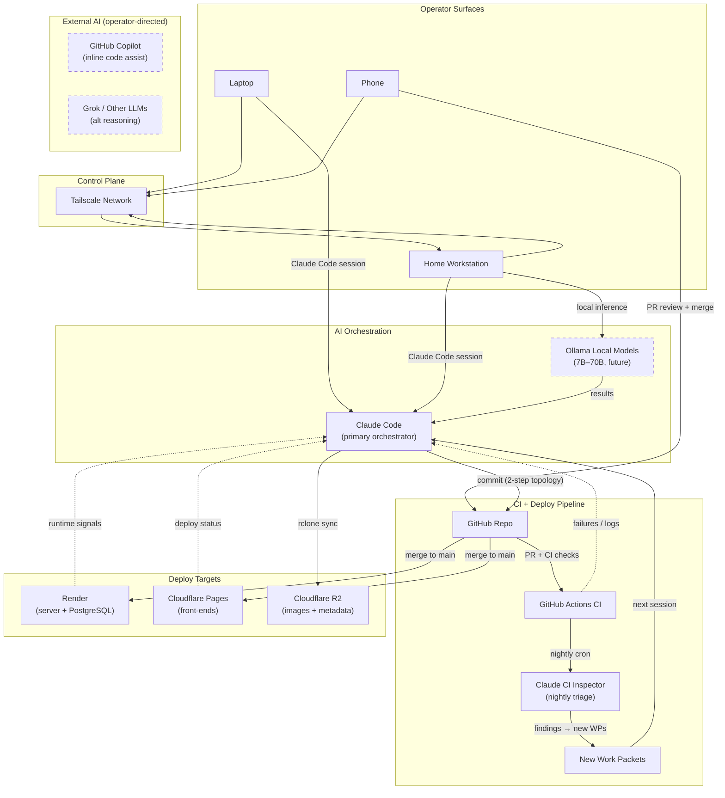
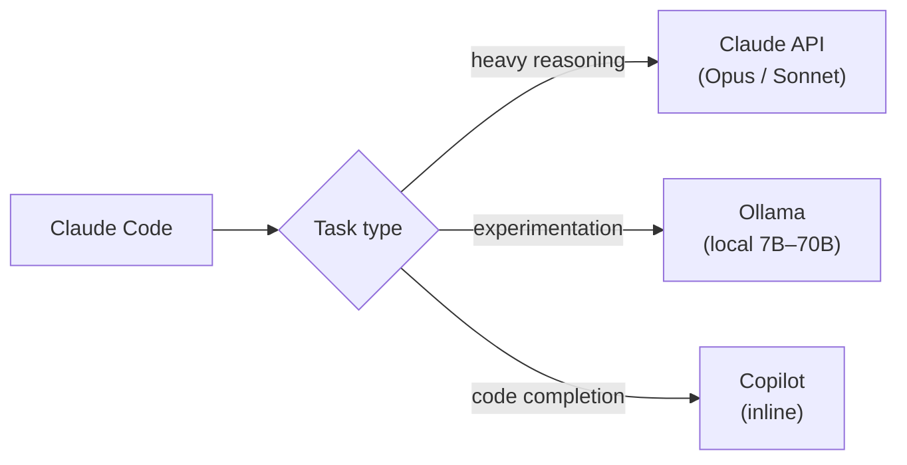

## Summary

The develop-from-anywhere loop describes how a change travels from idea
to production for `legendary-arena.com`. Three operator surfaces (laptop,
home workstation, phone) drive Claude Code sessions that build to
**WP/EC** contracts (Work Packet — scoped unit of work; Execution
Checklist — the quick-reference compliance contract for that WP), commit
to GitHub, and deploy automatically via Render and Cloudflare on merge to
`main`. A nightly CI triage agent closes the loop by generating new work
packets from sweep results.

The home workstation is a personal cloud-grade dev + AI server: always-on,
remotely accessible via Tailscale, and ready for local AI models. It
replaces the need for a cloud VM (DigitalOcean, etc.) with a stronger,
cheaper, fully operator-controlled machine.

This document is structured around the **Four C's framework** (Nate Herk,
"AI Operating System" — see References): Context, Connections,
Capabilities, and Cadence. Each section of the workflow maps to one or
more of these layers.

## Quick Start (new machine → first deploy)

Copy-paste sequence to go from a fresh Windows machine to a working
dev environment. Assumes Windows 10/11 Pro with internet access.

```powershell
# 1. Install prerequisites
winget install Tailscale.Tailscale
winget install OpenJS.NodeJS --version 22.16.0
npm install -g pnpm@latest
npm install -g @anthropic-ai/claude-code

# 2. Authenticate
claude auth login

# 3. Clone and build
cd C:\dev
git clone https://github.com/barefootbetters/legendary-arena.git
cd legendary-arena
pnpm install

# 4. Copy .env from existing machine (one time)
# scp user@laptop-tailscale-ip:C:/path/to/legendary-arena/.env .

# 5. Validate everything
pnpm check           # probes all 11 env vars + external services
pnpm test            # run all tests
pnpm -r build        # build all packages

# 6. Open Tailscale, sign in, verify devices visible
# 7. Enable Remote Desktop: Settings → System → Remote Desktop → ON
```

If `pnpm check` passes and tests are green, the machine is ready.

## Mechanics

### Actors

| Actor | Role |
|---|---|
| **Laptop** | Primary workstation — Claude Code, local `pnpm` gates (`test` / `typecheck` / `build`), dev servers. |
| **Home Workstation** *(personal)* | Always-on execution environment — Claude Code sessions, dev servers, background jobs, future local AI models (7B–70B). Accessed via Tailscale + Remote Desktop / SSH. |
| **Tailscale Network** *(personal)* | Private encrypted mesh connecting laptop, phone, and workstation. No port forwarding; stable private IPs / names. |
| **Phone** | Mobile control surface — PR review + merge, deploy monitoring, remote session steering via Tailscale. Does not author. |
| **Claude** | Two roles: **Claude Code** (laptop or workstation) builds to WP/EC contract; **Claude-in-CI** runs the nightly Inspector triage agent. |
| **GitHub** | Branch → PR → squash-merge `main`; holds the governance ledger; runs CI; merge triggers deploy. |
| **Render** | Game server + managed PostgreSQL; deploys on commit to `main`. |
| **Cloudflare** | Pages hosts front-ends; R2 hosts card images (`images.legendary-arena.com`). |

### Round trip (idea to live)

1. **Start it** — on the laptop, home workstation (local or via Tailscale), or phone.
2. **Claude Code builds it** — builds to the WP/EC contract, runs local gates, commits with two-commit topology (`EC-NNN:` implementation + `SPEC:` governance close).
3. **GitHub takes it** — branch → PR → CI (build/deploy, commit hygiene, registry validation, nightly sweep + inspection workflows).
4. **Approve from the phone** — merge PR via GitHub UI (phone-friendly).
5. **It ships automatically** — `main` → Render rebuild + migrations; Cloudflare rebuilds front-ends + R2 serves assets. Live across `*.legendary-arena.com`.
6. **It feeds itself** — nightly Claude CI Inspector triage; WP auto-verification loop (WP-231/233); new findings generate new WPs → re-enter at step 1.

### Remote execution model

The home workstation acts as the always-on execution node. All remote
access flows through the Tailscale private mesh — no public ports exposed.

- **Remote Desktop** for full UI control
- **SSH** for terminal-first workflows
- Sessions and dev servers survive laptop shutdown

### AI layer (personal infrastructure)

Not part of the committed stack. The workstation may host Claude Code as
primary orchestrator and local AI models (future: 7B–14B for
experimentation, 70B+ for heavy reasoning). This reduces external API
dependency and enables long-running autonomous workflows.

### AI system flow



> **Dashed** nodes are future or operator-discretionary — not part of the
> committed orchestration loop.

**Key architectural points:**

- **Claude Code is the single orchestrator.** All implementation work
  flows through it — WP/EC execution, local gates, commits, deploys.
  It does not delegate to Copilot or Grok; those are separate tools the
  operator may use independently for inline assists or alternative
  reasoning.

- **Dual AI layer (current + future).** Today: Claude Code (API-based)
  is the only AI in the loop. Future: Ollama on the workstation adds
  local inference for experimentation, long-running tasks, and reduced
  API dependency. The orchestrator-to-local-model relationship is
  Claude Code calling Ollama, not the reverse.

- **Closed feedback loop.** The system is self-sustaining:
  `Claude Code → GitHub → CI → Inspector → new WPs → Claude Code`.
  Yesterday's deploy becomes today's backlog via nightly triage.

- **External AI is operator-directed, not orchestrated.** GitHub Copilot
  (inline code suggestions) and other LLMs (Grok, ChatGPT, etc.) are
  tools the operator reaches for directly. They are not part of the
  automated pipeline and Claude Code does not route tasks to them.

**Future: AI routing (when local models are operational):**



This routing is aspirational. Today all AI tasks go through Claude Code's
API. When Ollama is operational on the workstation, the operator can
choose which model handles which class of task — but the routing is
manual (operator choice), not automated.

## Four C's Assessment

Framework source: Nate Herk, "I Turned Claude Opus 4.8 Into My Entire
AI Operating System" (see References). The Four C's define what an AI
operating system needs: Context (what the AI knows), Connections (what
data it can reach), Capabilities (what it can do), and Cadence (what
runs without being asked). The companion Three M's framework (Mindset,
Method, Machine) governs how the operator thinks and builds — see the
video and AIS-OS repo for the full treatment.

### Context — what Claude knows

Context is the foundation layer. A fresh Claude Code session should be
able to answer business and architectural questions without research.

**What legendary-arena has today:**

| Artifact | What it provides |
|---|---|
| `.claude/CLAUDE.md` | Project identity, tech stack, key commands, authority hierarchy, operating posture |
| `.claude/rules/*.md` | Architecture enforcement, code style, work packet discipline |
| `.claude/skills/legendary-*/SKILL.md` | Layer-specific rules loaded on demand (game-engine, registry, persistence, server) |
| `docs/ai/ARCHITECTURE.md` | Authoritative system architecture, layer boundaries, data flow |
| `docs/01-VISION.md` | Product vision, non-negotiable truths, financial sustainability model |
| `docs/ai/DECISIONS.md` | Design decision log with rationale (D-NNNN entries) |
| `docs/ai/work-packets/WORK_INDEX.md` | Execution spine — which WPs exist, status, dependencies |
| `~/.claude/CLAUDE.md` | User-level instructions (tone, preferences, operating norms) |
| Auto-memory (`~/.claude/projects/*/memory/`) | Persistent cross-session memory (feedback, project state, references) |

**Assessment:** Context is the strongest layer. Claude Code sessions
start with full business context, architectural constraints, and
accumulated feedback. The governance stack (CLAUDE.md → ARCHITECTURE.md
→ rules → WPs) acts as the "foundation file" the Four C's framework
calls for.

### Connections — what Claude can reach

Connections determine what live data the AI can access without manual
pasting.

**What legendary-arena has today:**

| Connection | Mechanism | Status |
|---|---|---|
| Git repo (code, docs, governance) | Local filesystem | Active |
| GitHub (PRs, issues, CI status) | `gh` CLI | Active |
| PostgreSQL (game data) | `DATABASE_URL` in `.env` | Active |
| Cloudflare R2 (card images, metadata) | `rclone` CLI | Active |
| Cloudflare Pages (front-end deploys) | GitHub integration (auto) | Active |
| Render (server deploys) | GitHub integration (auto) | Active |
| Card data JSON (40 sets) | Local filesystem (`data/cards/`) | Active |
| Hanko (auth service) | JWKS endpoint via `.env` | Active |
| Claude Code MCP servers | Browser (Claude in Chrome), visualize | Active |

**What's not connected yet:**

| Connection | Gap |
|---|---|
| Slack / Discord | No team chat integration |
| Email (Brevo) | No programmatic access from Claude sessions |
| Analytics / dashboards | No live metrics feed into Claude context |
| Calendar | No scheduling integration |
| Local AI models (Ollama) | Future — workstation setup prerequisite |

**Assessment:** Connections are solid for the core dev loop (code, CI,
deploy, database, assets). The gaps are in business operations —
marketing, comms, analytics — which matter more as the business grows.

### Capabilities — what Claude can do

Capabilities are what the AI executes — scripts, APIs, multi-step
workflows triggered by short phrases.

**What legendary-arena has today:**

| Capability | Trigger | What it does |
|---|---|---|
| WP/EC execution | Claude Code session + EC checklist | Full work packet implementation with governance close |
| Local gates | `pnpm test` / `typecheck` / `build` | Pre-push quality enforcement |
| Health checks | `pnpm check` / `pnpm check:domains` | Probe all external dependencies + subdomains |
| Card data pipeline | `scripts/convert-cards/` | Convert raw card data to engine-ready JSON |
| Architecture inventory | `pnpm wiki-viewer:inventory` | Generate architecture snapshot for ewiki |
| Wiki build | `pnpm wiki-viewer:build` | Project wiki source → Hugo static site |
| R2 asset sync | `rclone sync` | Push card images + metadata to CDN |
| Claude Code skills | `/legendary-game-engine`, `/legendary-registry`, etc. | Layer-specific rules and context on demand |
| Code review | `/code-review` | Automated diff review at configurable depth |
| Agent workflows | Agent tool + Workflow tool | Multi-agent orchestration for complex tasks |

**Assessment:** Capabilities are strong for engineering work. The system
can take a work packet from draft to deployed code in a single session.
Gaps are in business automation — no email workflows, no financial
reporting triggers, no customer-facing automation.

### Cadence — what runs without being asked

Cadence is the autonomous layer — scheduled work that produces outputs
with no operator at the keyboard.

**What legendary-arena has today:**

| Automation | Schedule | What it does |
|---|---|---|
| Nightly Inspector triage | Cron (`.github/workflows/inspection-nightly.yml`) | Runs sweep over codebase, generates findings, creates WPs |
| Architecture inventory | Weekly Monday 06:00 UTC (`.github/workflows/architecture-inventory.yml`) | Regenerates `wiki/architecture-inventory.md`, opens PR on diff |
| Auto-deploy (Render) | On merge to `main` | Rebuilds server, runs migrations |
| Auto-deploy (Cloudflare Pages) | On merge to `main` | Rebuilds front-ends |
| WP auto-verification (WP-231/233) | Part of nightly sweep | Closes verified findings, surfaces new ones |

**What's not automated yet:**

| Automation | Gap |
|---|---|
| Scheduled Claude Code agents | No recurring local-machine agents (beyond CI) |
| Email / newsletter automation | Brevo pipeline exists but not Claude-triggered |
| Financial reporting | No automated revenue / royalty tracking |
| Dependency updates | No automated `pnpm update` + test cycle |
| Uptime monitoring | `pnpm check` is manual; no scheduled probe |

**Assessment:** Cadence exists in CI (nightly triage, weekly inventory,
auto-deploy) but not on operator machines. The workstation enables a
new cadence layer — scheduled Claude Code agents that run locally, not
just in GitHub Actions. This is the highest-leverage gap to close.

### Four C's — maturity summary

| Layer | Maturity | Next step |
|---|---|---|
| **Context** | Strong | Maintain — governance stack is comprehensive |
| **Connections** | Solid for dev, gaps in business ops | Connect Brevo, analytics, calendar as business grows |
| **Capabilities** | Strong for engineering | Add business automation capabilities (email, reporting) |
| **Cadence** | CI-only | Extend to workstation-based scheduled agents |

### Three M's — operating principles (from Nate Herk)

The Three M's govern how the operator thinks and builds on top of the
Four C's infrastructure.

**Mindset:**

- Before any task, ask "how could AI assist here?" — not binary, just
  degree of leverage.
- Decompose roles into tiny automatable tasks, not monolithic
  responsibilities. Build one piece, validate, advance.
- Never passively accept AI outputs. Request alternatives and reasoning.
  Prevents "dark code" (automations you can't explain).
- Expect a ~20% productivity dip for 1–2 weeks during adjustment, then
  it typically doubles.

**Method:**

- **Find the constraint:** "If 500 new players arrived tomorrow, what
  breaks first?" (bottleneck) and "What would bring 500 players
  tomorrow?" (growth gap).
- **EAD — Eliminate, Automate, Delegate.** In that order. The
  **60/30/10 rule**: 60% fully automated, 30% AI-assisted with human
  review, 10% stays manual.
- **Autonomy spectrum:** L0 Manual → L1 Suggested → L2 Drafted →
  L3 Supervised → L4 Autonomous. Default to the lowest level sufficient.
- **Tie to KPIs:** Every automation must move a measurable metric in
  one of three buckets: customer acquisition, customer value, or cost
  reduction.

**Machine (build + operate):**

- **Lego Principle:** Smallest possible modular units. Single input →
  single output. Deterministic steps before AI layers.
- **BIKE Method (phased rollout):** Training wheels → guided → watched →
  hands-off. Start at 10% volume, monitor weekly, add 20% more.
- **Intern Rule:** Treat AI like a new employee — own accounts (never
  impersonates humans), read-only access first, write permissions
  earned after proving reliability.
- **Kill Switch:** Shut down automations that consistently need patches,
  produce poor quality, or cost more than they save.

## Workstation Setup Guide

Step-by-step setup to turn a Windows workstation into a personal
cloud-grade dev + AI server: always-on, remotely accessible, Claude Code
execution node, AI-model ready.

### Phase 1 — Base system prep

**Windows edition.** Must be **Windows 10/11 Pro**. Remote Desktop hosting
does not work on Home edition. Check via `Settings → System → About →
Edition`. Upgrade to Pro if needed.

**Always-on power settings.** Go to `Power & Sleep Settings`:

- Sleep → **Never**
- Screen → optional (turn off to save power)

**Disable forced shutdown.** In `Control Panel → Power Options → Advanced`:

- Disable "turn off hard disk"
- Disable hibernation (optional)

### Phase 2 — Tailscale network

Tailscale replaces all complicated networking — no port forwarding, no
dynamic DNS, no firewall holes.

1. Install Tailscale on the workstation from
   `https://tailscale.com/download`
2. Sign in (Google / Microsoft / etc.)
3. Install Tailscale on **phone** and **laptop** using the **same account**
4. Verify: all devices visible in the Tailscale dashboard; workstation
   shows a `100.x.x.x` IP

**Pass condition:** all devices visible in Tailscale; can ping between them.

### Phase 3 — Remote Desktop

1. On the workstation: `Settings → System → Remote Desktop` → turn ON
2. Note the Tailscale IP (`100.x.x.x`) or PC name
3. Ensure your Windows user has a password and is allowed for remote login

**Connect from phone or laptop:**

- iPhone / Android → install **Microsoft Remote Desktop** app
- Laptop → built-in Remote Desktop Connection or the app
- Enter the Tailscale IP (e.g., `100.101.102.103`)

**Pass condition:** you see the Windows desktop from your phone and can
control mouse + keyboard.

### Phase 4 — Dev tools + Claude Code

```powershell
# verify or install prerequisites
node -v          # must be v22+
git --version
pnpm -v          # or: npm install -g pnpm

# install Claude Code
npm install -g @anthropic-ai/claude-code
claude auth login

# clone and build the repo
git clone https://github.com/barefootbetters/legendary-arena.git
cd legendary-arena
pnpm install
pnpm test
pnpm -r build
```

**Pass condition:** Claude Code runs, repo builds, tests pass.

### Phase 5 — Persistent sessions

Options for keeping sessions alive after disconnecting from Remote Desktop:

- **Option A — Keep RDP session open.** Simplest; the session persists on
  disconnect (Windows keeps it running).
- **Option B — WSL + tmux.** More robust for long-running Claude workflows.
  Install WSL (`wsl --install`), then use `tmux` inside the Linux
  environment. Claude Code runs inside the tmux session and survives
  disconnects cleanly.

### Phase 6 — Environment + API keys

The `.env` file contains machine-specific secret state: API keys, database
URLs, service credentials. It is **never committed** — only `.env.example`
is tracked in the repo.

**Three-layer secret model:**

| Layer | Secret source | Used by |
|---|---|---|
| Local execution | `.env` in the repo checkout | Claude Code, `pnpm test`, dev servers |
| CI / GitHub | GitHub Actions secrets | CI workflows, nightly triage agent |
| Deploy (Render / Cloudflare) | Platform-managed env vars | Production server, Pages builds |

Each layer has its own secret surface. `.env` is local execution only —
CI and deploy never read it.

**Copy `.env` to the workstation:**

- **Secure copy** (recommended): `scp .env user@workstation-tailscale-ip:/path/to/legendary-arena/`
- **Manual transfer**: USB drive or password manager

**Validate the setup:**

```powershell
pnpm check
```

This runs the full connection health check (see
[Operational Health Checks](operational-health-checks.md)) — validates all
11 required env vars, probes every external service (PostgreSQL, Hanko,
R2, GitHub, Render), and checks toolchain versions. If `pnpm check`
passes, the workstation is correctly configured.

**Pass condition:** `pnpm check` reports all checks passed.

**If keys were copied insecurely** (email, chat, plain text), regenerate
them immediately at each service's dashboard.

### Phase 7 — Local AI models (optional)

Local open-source models run on the workstation via Ollama. This layer
is optional and future-facing — Claude Code remains the primary
orchestrator. Local models add private inference, batch/long-running
capacity, and reduced API dependency.

**Install and smoke-test:**

1. Install Ollama from `https://ollama.com`
2. Pull and run a starter model: `ollama run qwen2.5-coder:7b`
3. Confirm the API is up: `curl http://localhost:11434/api/tags`

**Pass condition:** model responds in the terminal and `/api/tags`
lists it.

#### Model selection (open source)

Pick models by task. Model releases move fast — check
`https://ollama.com/library` for current versions and tags. Sizes
below are the `:Nb` parameter counts; all run quantized (Q4) by default.

| Task | Recommended models | Notes |
|---|---|---|
| **Coding / refactor** | `qwen2.5-coder` (7B / 14B / 32B), `deepseek-coder-v2` | Strongest open coding models; 14B is the sweet spot for most GPUs |
| **General reasoning** | `llama3.1:8b`, `qwen2.5` (7B / 14B), `gemma2:9b` | Balanced quality vs. speed |
| **Heavy reasoning** | `llama3.3:70b`, `qwen2.5:72b`, `deepseek-r1` | Needs a high-VRAM GPU; chain-of-thought models are slower |
| **Fast / drafting** | `llama3.2:3b`, `phi3`, `gemma2:2b` | Run on CPU or modest GPU; good for quick passes |
| **Embeddings** | `nomic-embed-text`, `mxbai-embed-large` | For local semantic search / RAG experiments |
| **Vision** | `llama3.2-vision`, `llava` | Image description / OCR-style tasks |

Start with `qwen2.5-coder:7b` (coding) and `llama3.1:8b` (general).
Add a 70B model only if the GPU supports it.

#### Hardware sizing

Rough VRAM needed per model tier (Q4 quantization). System RAM should
be at least the model's on-disk size; without enough VRAM, Ollama
spills to CPU and runs far slower.

| Model size | VRAM (GPU) | Realistic on |
|---|---|---|
| 1–3B | ~2–4 GB | Any modern GPU, or CPU-only |
| 7–8B | ~6–8 GB | RTX 3060 / 4060 (8 GB) and up |
| 13–14B | ~10–16 GB | RTX 4070 Ti / 4080 (12–16 GB) |
| 32B | ~20–24 GB | RTX 4090 / 3090 (24 GB) |
| 70B+ | ~40–48 GB | Dual-GPU, A6000, or CPU-offload (slow) |

CPU-only inference works for the 1–8B tier but is much slower; use it
for batch/overnight jobs, not interactive sessions.

#### Sharing local-model results back to Claude Code

Local models are not in Claude Code's automated loop — they produce raw
output the operator (or Claude Code) consumes. Three handoff patterns,
simplest first. All treat local-model output as **unverified draft
input**: a 7B model's claim is not a citation, and the repo's
determinism / citation rules still apply before anything lands.

**Pattern A — File handoff (recommended default).** The local model
writes to a gitignored scratch file; Claude Code reads it next turn.
Deterministic, no live coupling, fits the "files are the interface"
model.

```powershell
# Operator runs the local model, drops output to a scratch file
ollama run qwen2.5-coder:14b "List failure modes in zoneOps.ts" > scratch/ollama-out.md
```

Then in a Claude Code session: *"Read `scratch/ollama-out.md` and fold
the valid points into the WP draft."* Claude Code reads the file, keeps
what survives review, and discards the rest.

**Pattern B — Script-driven via the API.** For repeatable or batch work,
a script in `scripts/` queries Ollama's OpenAI-compatible endpoint
(`http://localhost:11434/v1/chat/completions`) and writes structured
output. Claude Code can both run the script (PowerShell / Bash tool) and
read its output.

```powershell
# Example: query Ollama, write JSON for Claude Code to consume
$body = @{ model = "qwen2.5-coder:14b"; messages = @(@{ role = "user"; content = "..." }) } | ConvertTo-Json
Invoke-RestMethod -Uri http://localhost:11434/v1/chat/completions -Method Post -Body $body -ContentType application/json |
  ConvertTo-Json -Depth 10 > scratch/ollama-result.json
```

**Pattern C — Direct invocation by Claude Code.** Because Claude Code
runs shell commands, it can call Ollama itself and capture stdout — no
manual handoff. Most integrated; the model must be pulled and the
session must reach `localhost:11434` (or the workstation's Ollama over
Tailscale).

```powershell
# Claude Code runs this via its PowerShell tool and reads the output directly
ollama run llama3.1:8b "Summarize the diff in apps/server/src/server.mjs"
```

To make local models a first-class tool, expose Ollama as an MCP server
in Claude Code's config — then Claude can route specific subtasks to a
local model the same way it uses any other tool. This is operator
discretion, not automated routing (see the
[AI system flow](#ai-system-flow) future-routing note).

> **Governance:** scratch outputs are gitignored and never committed —
> same posture as `docs/ai/invocations/` scratchpads. Add a `scratch/`
> entry to `.gitignore` before using these patterns. Local-model output
> informs work; it does not author it.

**Pass condition:** a local model produces output, and Claude Code can
read it from a scratch file (Pattern A) or invoke the model directly
(Pattern C).

### Security hardening

**Required:**

- Strong Windows password
- Windows Firewall enabled
- System kept updated

**Recommended (Tailscale):**

- Enable MFA on your Tailscale account
- Enable device approval

**Never do:**

- Do NOT open port 3389 (RDP) to the internet
- Do NOT use public IP for RDP access
- Tailscale replaces all of this safely — all traffic is encrypted
  end-to-end through the mesh

**If exposing Ollama across machines** (Pattern C over Tailscale): bind
Ollama to the Tailscale interface, not `0.0.0.0`. Set
`OLLAMA_HOST=<workstation-tailscale-ip>:11434` so the API is reachable
only inside the mesh — never bind it to a public interface.

### Final checklist

| Check | Required |
|---|---|
| Windows Pro installed | Yes |
| Tailscale connected (all devices) | Yes |
| Remote Desktop works from phone | Yes |
| Claude Code runs | Yes |
| `.env` copied and `pnpm check` passes | Yes |
| Repo builds successfully | Yes |
| System set to never sleep | Yes |
| Ollama installed + model pulled | Optional |
| Local-model → Claude Code handoff tested (`scratch/` gitignored) | Optional |

## Multi-Machine Setup

### Source of truth

GitHub is the single source of truth. Every other location is a working
copy or a deployment target.

```
                GitHub (source of truth)
                        ↑ ↓
            ┌───────────┴───────────┐
            │                       │
         Laptop                Workstation
      (authoring)            (execution)
            │                       │
            └────── Tailscale ──────┘
                  (control plane)
                        │
                      Phone
                  (approval surface)
```

### What lives where

| Location | What it holds | Sync mechanism |
|---|---|---|
| **GitHub** | Authoritative repo — code, governance ledger, CI config, wiki source | `git push` / `git pull` |
| **Laptop** | Git clone + `.env` + `node_modules` | `git pull` / `git push` to GitHub |
| **Home Workstation** | Git clone + `.env` + `node_modules` + Ollama models | `git pull` / `git push` to GitHub |
| **Phone** | No repo clone — GitHub mobile app + Remote Desktop | Reads GitHub directly |
| **Render** | Production server + managed PostgreSQL | Auto-deploy on merge to `main` |
| **Cloudflare Pages** | Front-end builds (play, cards, ewiki) | Auto-deploy on merge to `main` |
| **Cloudflare R2** | Card images + metadata | `rclone sync` from operator machine |
| **GitHub Actions** | CI runners + nightly triage agent | Triggered by push / PR / cron |

### Filesystem layout

Both the laptop and workstation use the same layout. The repo structure
IS the directory structure — there's nothing to design beyond where you
clone it.

**Workstation** (recommended):

```
C:\dev\
├── legendary-arena\           ← git clone
│   ├── .claude/               ← Claude Code config, skills, rules
│   ├── apps/                  ← server, dashboard, arena-client, wiki-viewer, registry-viewer
│   ├── packages/              ← game-engine, registry, preplan, vue-sfc-loader
│   ├── docs/                  ← governance, architecture, vision, ops
│   ├── wiki/                  ← ewiki source (projected into wiki-viewer at build time)
│   ├── data/                  ← card JSON, metadata, migrations
│   ├── scripts/               ← operational scripts (check-connections, convert-cards, etc.)
│   ├── .env                   ← machine-specific secrets (NEVER committed)
│   ├── .env.example           ← committed template
│   └── pnpm-lock.yaml
│
└── legendary-arena-com\       ← marketing repo clone (if needed)
```

**Laptop** (current — on pCloud):

```
C:\pcloud\BB\DEV\
└── legendary-arena\           ← git clone (same repo, different path)
```

The laptop repo currently lives on pCloud. A migration to a local path
(off pCloud) is planned but deferred. pCloud sync creates `[conflicted N]`
duplicate files and has caused `.git` refs corruption — the workstation
should NOT use pCloud for the repo clone.

### Sync rules

Machines sync exclusively through git. No manual file copying, no pCloud
sync, no shared drives.

| Action | Correct | Wrong |
|---|---|---|
| Get latest code | `git pull` | Copy files between machines |
| Share a change | `git push` → `git pull` on other machine | USB / email / pCloud sync |
| Move `.env` to new machine | `scp` or password manager (one time) | Commit to repo / pCloud |
| Resolve divergence | `git merge` or `git rebase` | Manually pick files |

Both machines can have different branches checked out, different
`node_modules` state, and different `.env` values. They are independent
working copies of the same repo, not mirrors of each other.

### Platform services

Each platform manages its own configuration and secrets independently.

**GitHub** — repo hosting + CI:

- Repo: `barefootbetters/legendary-arena`
- CI workflows in `.github/workflows/`
- Secrets configured in repo Settings → Secrets and variables → Actions
- Nightly triage agent runs as a scheduled workflow

**Render** — server + database:

- Service: `legendary-arena-server` (declared in `render.yaml`)
- Database: `legendary-arena-db` (managed PostgreSQL)
- Env vars configured in the Render dashboard (Environment tab)
- Auto-deploys on merge to `main`; migrations run in `buildCommand`

**Cloudflare Pages** — front-ends:

- Projects: `legendary-arena-play`, `legendary-arena-cards`,
  `legendary-arena-wiki`
- Env vars configured per-project in Pages → Settings → Environment variables
- Auto-deploys on merge to `main` (via GitHub integration)
- Custom domains: `play.legendary-arena.com`, `cards.legendary-arena.com`,
  `ewiki.legendary-arena.com`

**Cloudflare R2** — static assets:

- Bucket: `legendary-images`
- Public URL: `images.legendary-arena.com` (card images),
  `data.barefootbetters.com` (metadata)
- Synced via `rclone` from operator machine, not from CI
- Custom domain configured in R2 bucket settings

**Tailscale** — private network:

- Connects laptop, workstation, and phone
- No configuration in the repo — purely operator-managed
- Admin console at `login.tailscale.com`

### What pCloud is and isn't

pCloud is a **backup layer**, not a sync mechanism and not a source of
truth.

| Use | OK? |
|---|---|
| Backing up local files, archives, large assets | Yes |
| Storing Ollama model files | Yes |
| Active development workspace for git repos | No — causes conflicts and `.git` corruption |
| Syncing code between machines | No — use `git push` / `git pull` |
| Editing files directly in pCloud | No — use a local clone |

### Branch and PR policy

| Rule | Value |
|---|---|
| Branch naming | `claude/<wp-slug>` for WP work, `docs/<slug>` for docs, `fix/<slug>` for hotfixes |
| Merge strategy | Squash-merge to `main` (single commit per PR) |
| Required CI checks | Build, test, commit hygiene, registry validation |
| Commit topology (WP work) | Two commits: `EC-NNN:` implementation + `SPEC:` governance close |
| Commit topology (non-WP) | Single commit with `INFRA:` or `SPEC:` prefix — no two-commit requirement |
| Emergency hotfix | Single-commit `fix/` branch, `INFRA:` prefix, squash-merge directly. Skip EC/SPEC topology. If the fix touches engine logic, open a reconciliation `SPEC:` PR within 24 hours documenting what changed and why. |
| `pnpm check` | Local operator gate — not a CI merge gate. Run after machine setup and before investigating production issues. |

**Commit prefix rules** (enforced by pre-commit hook):

| Prefix | When to use |
|---|---|
| `EC-NNN:` | Work packet implementation (must have a matching EC) |
| `SPEC:` | Governance close, WP/EC drafting, doc-only changes |
| `INFRA:` | Infrastructure, tooling, CI, non-WP operational changes |

### Secrets rotation

**Rotation cadence:** No fixed schedule. Rotate immediately on:

- Suspected compromise (key in logs, chat, email, public repo)
- Employee offboarding (if applicable)
- Service breach notification from a provider

**Rotation order** (highest impact first):

1. `DATABASE_URL` — rotate the PostgreSQL password in Render, update
   `.env` on all machines, verify with `pnpm check`
2. `ANTHROPIC_API_KEY` — regenerate at `console.anthropic.com`, update
   `.env`, re-auth Claude Code (`claude auth login`)
3. `JWT_SECRET` — rotate in Render env vars; active sessions invalidate
   on next server restart
4. GitHub tokens — regenerate in GitHub Settings → Developer settings →
   Personal access tokens
5. Cloudflare API tokens — regenerate in Cloudflare dashboard →
   My Profile → API Tokens
6. `rclone` R2 credentials — regenerate in Cloudflare R2 → Manage R2
   API Tokens, update `rclone.conf`

**Verification after rotation:** Run `pnpm check` on every machine with
the updated `.env`. All probes must pass. If a deploy surface uses the
rotated secret (Render, GitHub Actions), trigger a manual deploy or CI
run to confirm.

### Version pinning

| Tool | Minimum | Pinned where | Upgrade path |
|---|---|---|---|
| Node.js | v22+ | `pnpm check` validates major version | `winget upgrade OpenJS.NodeJS`; run `pnpm test` after |
| pnpm | v8+ | `pnpm check` validates major version | `npm install -g pnpm@latest`; run `pnpm install --frozen-lockfile` to verify lockfile compatibility |
| boardgame.io | `0.50.x` (locked) | `package.json` + `pnpm check` verifies exact range | Do NOT upgrade without a DECISIONS.md entry — API surface changes are breaking |
| Hugo | `0.135.0 Extended` | `apps/wiki-viewer/.hugo-version` | Update `.hugo-version` + test with `pnpm wiki-viewer:build`; needs DECISIONS entry |
| rclone | v1.60+ | Not pinned; `pnpm check` verifies binary exists | `winget upgrade Rclone.Rclone`; verify with `rclone lsd r2:legendary-images` |
| Tailscale | Latest | Auto-updates by default | No action needed |

**Upgrade rule:** Never upgrade a pinned tool mid-WP. Upgrade between
work packets on a clean `main`, run the full test suite, and commit the
version bump as its own `INFRA:` change.

### Cadence ownership

| System | Runner | Check | Frequency | Failure response |
|---|---|---|---|---|
| Nightly Inspector triage | GitHub Actions | Workflow completes green | Daily | Investigate in next operator session |
| Architecture inventory | GitHub Actions | PR generated on diff | Weekly (Mon 06:00 UTC) | Non-blocking; check Actions tab |
| Auto-deploy (Render) | Render | Deploy status: Live | On merge to `main` | Check Render Events log; revert PR if needed |
| Auto-deploy (Pages) | Cloudflare | Build status: Success | On merge to `main` | Check Pages Deployments log; revert PR if needed |
| Uptime probes | Operator | `pnpm check` all green | Manual (run after deploys, incidents, machine setup) | Fix before proceeding |
| Subdomain health | Operator | `pnpm check:domains` no FAILs | Manual (run after DNS/TLS changes) | Follow `dns:`/`tls:` diagnostics |

No SLA beyond "investigate in next operator session" — this is a
one-person operation. If cadence jobs gain external consumers or uptime
commitments, formalize response times then.

### Deploy rollback

Each deploy surface has a deterministic rollback path.

| Surface | Fail signal | Rollback action | Verification |
|---|---|---|---|
| **Render** (server) | Health check fails, migration error, 5xx spike | Revert the PR on GitHub → merge revert to `main` → Render auto-redeploys | `curl $GAME_SERVER_URL/health` returns 200 |
| **Cloudflare Pages** (front-ends) | Build failure, missing assets, blank page | Revert the PR → merge to `main` → Pages auto-rebuilds | Site loads at `play.legendary-arena.com` |
| **Cloudflare R2** (images/metadata) | Missing or corrupted assets | Re-run last known good `rclone sync` from operator machine | `pnpm check` R2 probe passes |
| **GitHub Actions** (CI/triage) | Workflow fails or produces bad output | Fix the workflow file or inputs → push to `main` | Workflow re-runs green |

**Rollback rule:** Always revert via a new PR to `main` (which triggers
a clean redeploy), never via Render/Cloudflare dashboard rollback buttons
— those create drift between the repo and deployed state.

## Interactions

- **Committed stack:** GitHub, Render, Cloudflare, CI, governance — all
  reproducible from repo config.
- **Personal layer:** Workstation, Tailscale, local AI models — operator-managed,
  not in any committed config (`render.yaml`, `.env.example`).
- **Governance docs:** the workflow is subordinate to the authority chain
  (`.claude/CLAUDE.md` → `docs/ai/ARCHITECTURE.md` → `.claude/rules/*.md`)
  and defines no rules of its own.
- **Deploy infrastructure:** for Render and Cloudflare specifics, see
  [01-render-infrastructure.md](../docs/ai/REFERENCE/01-render-infrastructure.md).
- **WP/EC execution:** for the drafting and execution mechanics, see
  [01.0a-wp-drafting-phase.md](../docs/ai/REFERENCE/01.0a-wp-drafting-phase.md)
  and [01.0b-wp-execution-phase.md](../docs/ai/REFERENCE/01.0b-wp-execution-phase.md).

## Troubleshooting

| Symptom | Likely cause | Command | Pass condition |
|---|---|---|---|
| `pnpm check` fails on PostgreSQL | Wrong `DATABASE_URL` or DB unreachable | Check `.env`; `psql $DATABASE_URL -c "SELECT 1"` | Returns `1` |
| `pnpm check` fails on Hanko JWKS | `HANKO_TENANT_BASE_URL` wrong or Hanko down | `curl $HANKO_TENANT_BASE_URL/.well-known/jwks.json` | Returns JSON with keys |
| `pnpm check` fails on R2 | Cloudflare bot rules blocking or `R2_PUBLIC_URL` wrong | Check Cloudflare Security → Bots dashboard | `pnpm check` R2 row green |
| `pnpm check` fails on game server | Server not running or `GAME_SERVER_URL` wrong | `curl $GAME_SERVER_URL/health` | HTTP 200, JSON body |
| `pnpm test` fails | Code issue or missing `node_modules` | `pnpm install && pnpm test` | Exit 0, all tests pass |
| `pnpm -r build` fails | TypeScript errors or missing deps | `pnpm install && pnpm -r build` | Exit 0, no errors |
| Claude Code won't authenticate | API key expired or missing | `claude auth login` | Auth success message |
| Git push rejected | Branch behind `main` or hook failure | Read hook error; `git pull --rebase origin main` | Push succeeds |
| Render deploy fails | Build error or migration failure | Render dashboard → Events → latest deploy log | Deploy status: Live |
| Cloudflare Pages deploy fails | Build error or env var missing | Pages dashboard → Deployments → latest build log | Build status: Success |
| RDP won't connect | Tailscale offline, wrong IP, or Home edition | Check Tailscale dashboard; verify Windows Pro | Desktop visible from client |
| `[conflicted N]` files appear | pCloud sync collision with git | Delete conflicted copies; `git status` | Clean working tree |
| `pnpm check:domains` shows FAIL | DNS/TLS misconfigured for subdomain | Read `dns:` / `tls:` diagnostic lines | All live rows show `[OK]` |
| Nightly triage didn't run | GitHub Actions cron skipped | Actions tab; `gh workflow run inspection-nightly.yml` | Workflow completes green |

For detailed probe diagnostics, see
[Operational Health Checks](operational-health-checks.md).

## Edge Cases

- **Windows Home edition blocks RDP hosting.** Remote Desktop as a host
  requires Pro. If the workstation runs Home, upgrade before proceeding.
- **Tailscale requires same account.** All devices must sign in with the
  same Tailscale account to see each other on the mesh.
- **RDP sessions persist on disconnect.** When you disconnect from Remote
  Desktop, Windows keeps the session running — processes, Claude Code
  sessions, and dev servers continue. This is the desired behavior.
- **WSL recommended for long Claude sessions.** Native PowerShell sessions
  can be interrupted by Windows updates or RDP reconnects. WSL + tmux
  provides a more resilient execution environment.
- **Missing `.env` is silent until runtime.** Without `.env`, Claude Code
  sessions fail, API calls fail, and builds break. Always run `pnpm check`
  after setting up a new machine. See
  [Operational Health Checks](operational-health-checks.md) for the full
  probe suite.
- **Wrong `.env` (production vs local).** Copying the wrong environment's
  `.env` can point at the wrong database or break deploy assumptions.
  `pnpm check` validates `EXPECTED_DB_NAME` when set, catching this class
  of error.
- **Never commit `.env`.** The repo's `.gitignore` excludes it. If keys
  were copied insecurely (email, chat, plain text), regenerate at each
  service's dashboard immediately.
- **If the workstation becomes committed infrastructure** (e.g., scheduled
  agents, model-backed APIs), it must be defined in repo config and
  documented in both the REFERENCE doc and `01-render-infrastructure.md`.
- **Claude is two things, not one** — the local pair programmer and the
  autonomous CI agent are distinct execution contexts with different
  permissions and scopes.

## References

- [docs/ai/REFERENCE/development-workflow.md](../docs/ai/REFERENCE/development-workflow.md) — authoritative REFERENCE doc (workflow loop overview)
- [docs/ai/REFERENCE/01-render-infrastructure.md](../docs/ai/REFERENCE/01-render-infrastructure.md) — deploy/runtime infrastructure
- [docs/ai/REFERENCE/01.0a-wp-drafting-phase.md](../docs/ai/REFERENCE/01.0a-wp-drafting-phase.md) — WP drafting phase
- [docs/ai/REFERENCE/01.0b-wp-execution-phase.md](../docs/ai/REFERENCE/01.0b-wp-execution-phase.md) — WP execution phase
- [.github/workflows/inspection-nightly.yml](../.github/workflows/inspection-nightly.yml) — nightly Inspector triage agent
- Tailscale — `https://tailscale.com`
- Ollama — `https://ollama.com`
- Nate Herk, "I Turned Claude Opus 4.8 Into My Entire AI Operating System" — `https://www.youtube.com/watch?v=0WDkwMxj13s` (Four C's + Three M's frameworks)
- AIS-OS starter kit — `https://github.com/nateherkai/AIS-OS` (`/onboard`, `/audit`, `/level-up` skills)
